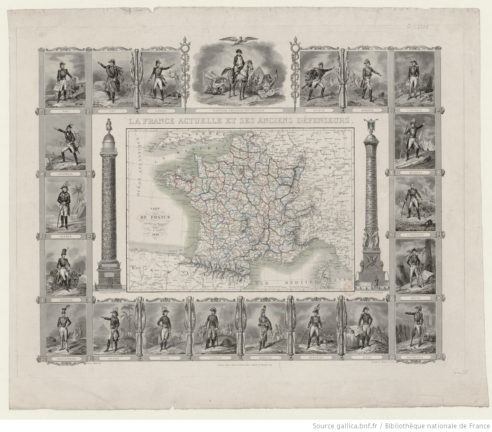
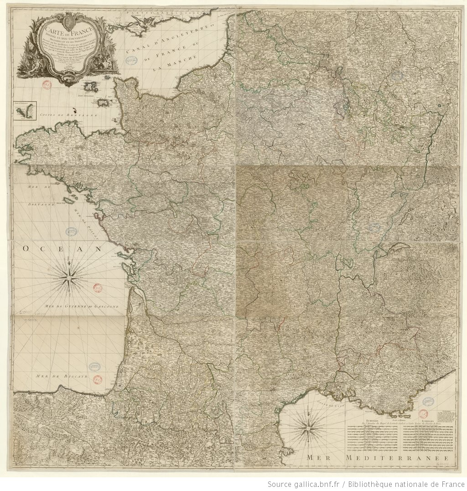
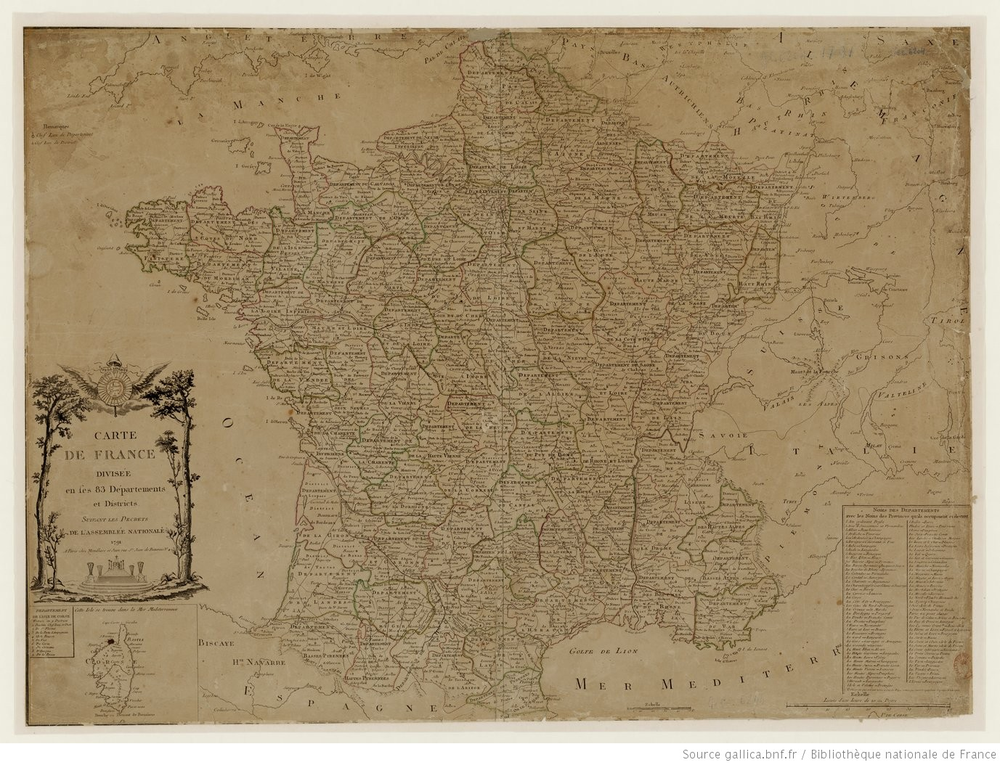
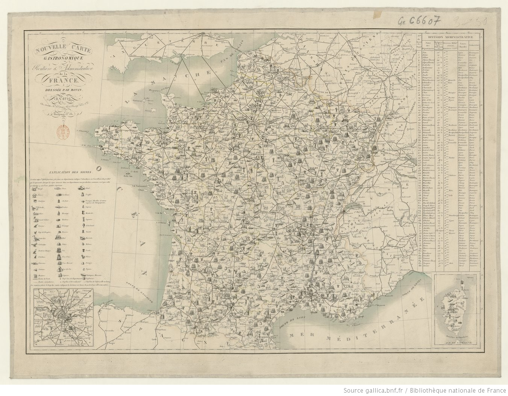
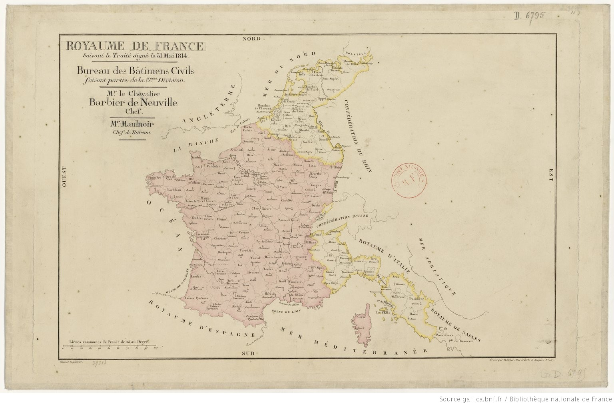
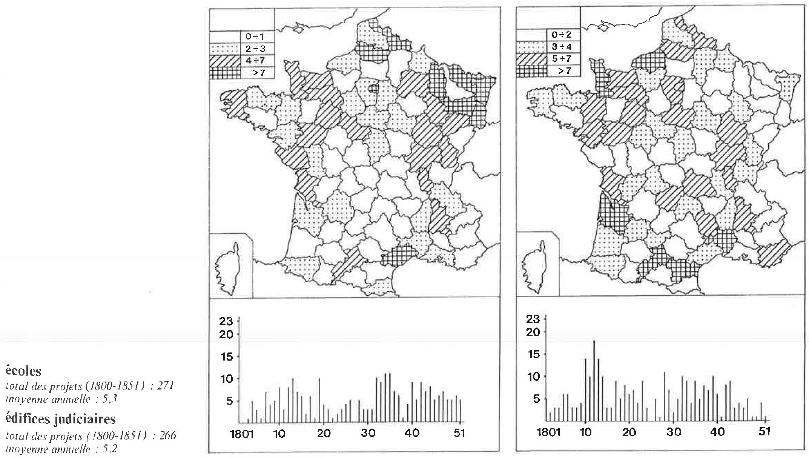
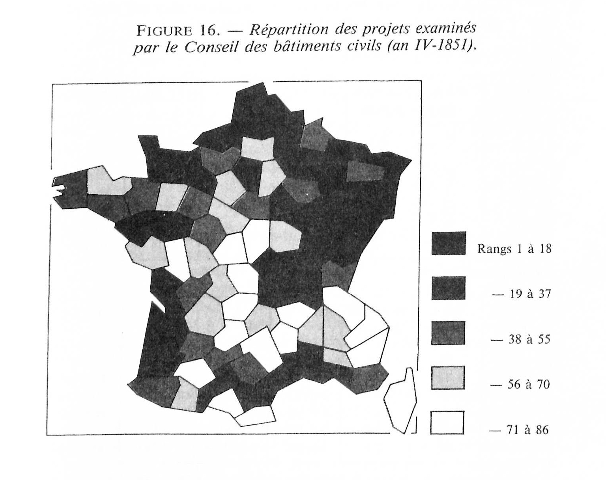

[TOC]

<!-- À déplacer dans la section statique gauche dans le site-->

### Chapitre 1: [Administration et architecture publique en France au XIXe siècle](lenamk.site/memoire/Redaction/Chapitre1#administration-et-architecture-publique-en-france-au-xixe-siècle)

1.1 [L’administration de la France au lendemain de la Révolution](lenamk.site/memoire/Redaction/Chapitre1#ladministration-de-la-france-au-lendemain-de-la-révolution)
	1.1.1 [La division et l’unification du territoire](http://lenamk.site/memoire/Redaction/Chapitre1#la-division-et-lunification-du-territoire) 
	1.1.2 [La centralisation administrative](http://lenamk.site/memoire/Redaction/Chapitre1#la-centralisation-administrative)
	1.1.3 [La rationalisation de l’action publique](http://lenamk.site/memoire/Redaction/Chapitre1#la-rationalisation-de-laction-publique) 
1.2 [Des formes de savoir et de pouvoir à l’œuvre](http://lenamk.site/memoire/Redaction/Chapitre1#des-formes-de-savoir-et-de-pouvoir-à-lœuvre)
    1.2.1 [Miroir du territoire ou de la nation](http://lenamk.site/memoire/Redaction/Chapitre1#miroir-du-territoire-ou-de-la-nation)
    1.2.2 [La statistique](http://lenamk.site/memoire/Redaction/Chapitre1#la-statistique)
    1.2.3 [La pensée cartographique](http://lenamk.site/memoire/Redaction/Chapitre1#la-pensée-cartographique)
1.3 [Le Conseil des bâtiments civils](http://lenamk.site/memoire/Redaction/Chapitre1#le-conseil-des-bâtiments-civils)
	1.3.1 [L’administration de l’architecture publique](http://lenamk.site/memoire/Redaction/Chapitre1#ladministration-de-larchitecture-publique)
	1.3.2 [Archives du projet architectural de la Nation](http://lenamk.site/memoire/Redaction/Chapitre1#archives-du-projet-architectural-de-la-nation)
	1.3.3 [Approches quantitatives, spatiales ou cartographiques](http://lenamk.site/memoire/Redaction/Chapitre1#approches-quantitatives-spatiales-ou-cartographiques)
[Conclusions du chapitre](http://lenamk.site/memoire/Redaction/Chapitre1#conclusions-du-chapitre)
[Notes](http://lenamk.site/memoire/Redaction/Chapitre1#notes)
[Bibliographie du chapitre](http://lenamk.site/memoire/Redaction/Chapitre1#)

<!-- mettre à jour les liens en cas de changement de nom de partie-->

# Administration et architecture publique en France au XIXe siècle

L’architecture publique est une construction de l’État. Il faut donc considérer toute une politique et une structure gouvernementale lorsqu’on veut s’y intéresser. Cela est d’autant plus important qu’au lendemain de la Révolution française, le champ de l’architecture et des arts en général se déplace d’une représentation des privilèges de l’Élite à celle des symboles de l’État. Les changements structurels s’annoncent politiques, économiques, sociaux mais aussi intellectuels et artistiques (Loyer 1999 : <!-- à chercher, dans intro-->). 

Le nouvel État-Nation bâtit également un récit national, un imaginaire collectif qui nourrit un sentiment d’appartenance à la communauté qui compose la nation (Anderson 2006 : 19-21). Il emploie à cet effet des images, telles que son hexagone géographique et le drapeau tricolore *bleu-blanc-rouge* <!--Bleu?-->, des principes, comme la devise « liberté, égalité, fraternité », et une identité linguistique et culturelle, de la langue française à l’hymne national de *La Marseillaise* (Roche-Noel 2019 : 15-16). Il instaure cet imaginaire national à l’échelle du territoire par l’emploi de monuments et de l’architecture publique. 

<!--programmes édilitaires et réforme sociale : Descat- embellissement urbain. Beau + utilité p.2. "Le monument public magnifié par un réseau de rues approprié développe le sens civique et contribue à l’identité culturelle du citadin-citoyen p.4"-->

La production d’image et de récits, comme cette carte de *La France actuelle et ses anciens défenseurs* ([fig.1-1](#fig1-1)), y contribue aussi. Le cadre, composé des portraits de généraux, présente l’histoire d’un pays défendu par de « grands hommes » menés par Napoléon, Empereur des Français. Cette histoire est instituée et immortalisée par les deux monuments, la *Colonne d’Austerlitz* (à gauche) et la *Fontaine de la Victoire* (à droite). Au centre de l’image, une carte de la France, « pays qu’entourent les Pyrénées, les Alpes, le Rhin, l’Océan » (Jules Michelet, *Le Peuple*, 1974 [1846] dans Roche-Noel 2019 : 21<!-- corriger référence-->). Les frontières naturelles formées par les chaînes de montagnes et par le bord de mer sont accentuées pour faire ressortir visuellement le fameux hexagone. Il s’agit d’un exemple précoce de « l’apparition, surtout à la fin du XIXe siècle, de ‘‘cartes historiques’’ destinées à démontrer, dans le nouveau discours cartographique, l’antiquité d’unités territoriales spécifiques et bien délimitées » (Anderson 2006 : 178). Un sentiment national émerge de la correspondance entre la Gaule de César et la France moderne (Roche-Noël 2019 : 23). Ce territoire est ensuite divisé en son maillage unifié et régulier de départements.

Cette carte figure bien les préoccupations de l’État, alliant le pouvoir militaire au contrôle du territoire, le tout incarné par une architecture monumentale qui inscrit ses récits dans l’espace physique. Elle omet également les réalités moins commodes, dont la réalité mouvante du territoire : 

> L’intégration des collectivités d’outre-mer dans la République, dans la France, perturbe[rait] la lecture, transmise par le récit national, de reconstruction ou de reconstitution d’un legs plus ancien. Elle disjoint géographie physique et géographie politique [...] Elle remet en cause l’appréhension d’un territoire qui ne peut plus être abordé ni compris dans la simplicité de sa forme originelle et convoque les mémoires de la colonisation, de l’esclavage, et des luttes pour l’égalité. (Roche-Noel 2019 : 24-25)

**Fig. 1-1** *La France actuelle et ses anciens défenseurs. Carte de France physique et administrative*, 1838, dressée par P. Tardieu. [Gallica](https://gallica.bnf.fr/ark:/12148/btv1b53083503z)

Pour commencer notre étude de l’architecture publique en France au lendemain de la Révolution, nous étudierons tout d’abord le système administratif français qui régit le territoire et l’aménage. L’architecture publique fait partie d’un complexe administratif d’envergure nationale où se mêlent des préoccupations politiques, économiques et sociales. Nous débuterons donc ce travail en cernant le contexte de production de nos archives. Ensuite, il nous semble important de présenter un portrait des modes de pensées de l’époque, dans le rapport au territoire comme dans l’action de l’administration. Parmi les formes de savoir employées par cette administration pour définir et mesurer son action, nous détaillerons en particulier l’emploi de la cartographie et de la statistique. Finalement, nous explorerons la traduction de ces modes de pensées dans le cadre spécifique de l’administration de l’architecture publique, c’est-à-dire au sein du Conseil des bâtiments civils. Nous ferons ensuite l’état des connaissances actuelles sur le Conseil. Cette mise en contexte et la présentation des enjeux qui entourent l’architecture publique nous serviront par la suite de cadre critique pour la construction de notre instrument de recherche. 

## L’administration de la France au lendemain de la Révolution

La Révolution de 1789 concrétise de nombreux changements au sein de la société française. L’abolition des privilèges tout comme de l’esclavage place les citoyens sur un relatif pied d’égalité [^1] . C’est l’émergence de tout un raisonnement rationnel où l’État-nation a pour rôle de fournir des biens et des services pour tous. Nous allons étudier l’institutionnalisation de ce paradigme issu des grandes idées des Lumières. De façon un peu paradoxale, c’est le désir de faire table rase du passé qui permet l’instauration de nombreux changements pensés et tentés au XVIIIème siècle. 

Pour instaurer un nouveau système, l’État a besoin d’une administration. Dans son histoire de l’administration et de la police, Paolo Napoli définit l'administration et fournit ainsi un contexte historique bienvenu étant donné son emploi constant dans la société actuelle. « L’administration incarne le gouvernement. [Elle en constitue] le principe moteur, l’être en action de l’organisation politique. » (Napoli 2003 : ch5, §10) Pour comprendre l’administration de l’architecture, nous commençons donc par étudier l’administration dans son ensemble.

> Le verbe « administrer » apporte quelques éléments plus précis : le contenu d’abord économique sur lequel porte l’action de gouverner, puisqu’on administre les affaires et les biens d’une personne, mais aussi les finances et les revenus de l’État. Ces confrontations permettent d’entrevoir une aire de signification permanente : l’élément comptable est au cœur de l’administration et du fait de gouverner.Ces ambitions gouvernementales ont pour prérequis une organisation spatiale qui les structure et les distribue sur le territoire. (Napoli 2003 : ch5, §11)

Nous étudions donc, dans cette première partie, la division du territoire en département. Nous définissons ensuite le fonctionnement de la nouvelle administration, qui se caractérise par la centralisation du pouvoir et une forte rationalisation de ses décisions. 

### La division et l’unification du territoire 

Avant de poursuivre notre étude de l’administration, nous devons également définir le territoire concerné. Qu’est-ce que la France au lendemain de la Révolution française ? L’État-nation nouvellement formé se transforme tout au long de la période que nous étudions, c’est-à-dire entre 1795 et 1840. Du point de vue politique, les régimes s’enchaînent : première République et la Terreur, premier Empire et les guerres napoléoniennes, Restauration puis Monarchie de juillet. Nous nous arrêtons juste avant la proclamation de la deuxième République. Du point de vue du territoire, les frontières françaises se modifient au fil des conquêtes et défaites avec une extension maximale du territoire français en Italie et aux Pays-Bas sous l’Empire. Le rapport à l’espace, qu’il s’agit de gouverner et d’administrer selon les principes établis par le politique, évolue également. Nous allons commencer par analyser l’impact de la Révolution sur le territoire pour mettre en avant certaines transformations entre l’Ancien Régime et le nouvel État-nation.

La France est régie par une administration de plus en plus centralisée dès 1660. Elle crée ainsi un État fort dont la gestion provinciale est assurée par les intendants (Desrosières 2008 : 2, 28 <!-- page à vérifier --> ). Toutefois, sous l’Ancien Régime, cette administration se heurte à de nombreuses difficultés en raison des nombreuses frontières provinciales et militaires, et de multiples chevauchements de compétences. « [Le] royaume de France était une mosaïque de provinces régies par des lois et des coutumes hétérogènes, notamment sur le plan administratif et fiscal » (Desrosières 1997 : 54).

La *Carte de France divisée en ses XXXI gouvernements militaires et en ses provinces...*  ([fig. 1-2)](#fig1-2), datée de 1754, témoigne de cette complexité. Le grand effort de cartographie accompli par les Cassini permet d’obtenir des représentations géométriques du territoire à l’échelle de la France continentale (Verdier 2001 : 5). L’identification des frontières administratives pose toutefois un autre problème, avec de nombreuses incertitudes concernant les zones limitrophes. Le projet d’une refonte complète de la division du territoire se dessine alors, afin de simplifier et d’asseoir fermement l’administration du territoire. Les transformations de la Révolution vont offrir l’opportunité de réaliser ce projet.

**Fig. 1-2** _Carte de France divisée en ses XXXI gouvernements militaires et en ses provinces, dressée sur les meilleures cartes qui ont parues jusqu’à présent et sur la carte des triangles en XVIII petites feuilles, levée géométriquement par ordre du Roi, et mise au jour par Mr. Cassini de Thury, ... Dédiée et présentée à Mons. le comte de St. Florentin..._ 1754, Roch-Joseph Julien (cartographe), César-François Cassini de Thury (cartographe du modèle), H. Boyet (graveur), [Gallica](https://catalogue.bnf.fr/ark:/12148/cb40653848g)

Dès le 7 septembre 1789, l’Assemblée nationale nomme un comité chargé de la division du territoire en départements. L’objectif est que « la France puisse former un seul tout, soumis uniformément, dans toutes ses parties, à une législation ou une administration commune » (Sieyès cité par Lepetit 1990 : 433). Un premier projet de découpage en 81 carrés uniformes conçu par le géographe Robert de Hesseln est énoncé, mais il doit être adapté aux conditions locales du territoire (Lepetit 1990 : 433). Tout en prenant en compte des frontières naturelles, ce découpage a pour idéal de diviser le territoire en des superficies et des densités urbaines et démographiques équivalentes. « L’égalité géographique est le socle de l’égalité des droits proclamée dans la Déclaration. » (Roche-Noel 2019 : 38)

Si la réalité géographique ne permet pas la concrétisation absolue de cet idéal, le processus de découpage offre une nouvelle prise sur le territoire ([fig. 1-3](#fig1-3)). Il s’agit de remplacer les privilèges de la noblesse par une rationalisation géométrique et démographique. Les départements se veulent égaux, excepté pour la distinction criante du centre administratif, Paris. La logique rationnelle « trouve sa limite et son prolongement dans la place prépondérante de la capitale - département à part sur la carte de Thouret, département à soi seul sur celle de la Constituante. » (Roche-Noel 2019 : 38). Les autres départements sont structurés selon la pyramide administrative à quatre niveaux : département, district, canton et commune (Lepetit 1988 : 114). Chaque échelon de la pyramide est doté d’un point de confluence, dont la centralité est établie dans une logique d’accessibilité. Ce lieu rassemble ainsi les services et les fonctions administratives locales. Cette logique rationnelle et spatiale aura une influence non seulement sur le fonctionnement de l’administration mais également sur la perception du territoire français (Lepetit 1990 : 437).

**Fig. 1-3** *Carte de France divisée en ses 83 Départements et Districts suivant les Décrets de l’Assemblée nationale*, 1791, Anonyme, Paris : Mondhare et Jean, [Gallica](https://gallica.bnf.fr/ark:/12148/btv1b53083405g)

Dans une perspective économique et architecturale, cela se traduit par une lutte pour l’équipement : « on combattait avec la plus grande opiniâtreté pour obtenir un département, un district, un tribunal ; ensuite on négociait, on marchandait un village, on cédait quelque chose pour obtenir à sa ville un établissement. » (Lepetit 1988 : 115). En créant une nouvelle grille territoriale qui uniformise et réglemente les institutions, tant sur leur centralité que sur leur accessibilité, l’État devient un principe organisateur des réseaux urbains et un moteur du développement des villes. « Pour l’opinion éclairée des années 1780, un lien existe entre la puissance urbaine, l’exercice de la fonction administrative et l’organisation du territoire. » (Lepetit 1988 : 201)

Dans la mise en place du système administratif comme dans les actions ministérielles, on observe une réelle volonté de se distinguer de l’Ancien Régime tout en construisant une unité nationale (Chateau-Dutier 2016 : T1, 40). Outre l’exemple de la division en départements, cela concerne l’unification des poids et des mesures via le système métrique, l’uniformisation de la langue française et l’universalisation des droits de l’homme. Dès la première édition du dictionnaire de l’Académie française, la nation est définie comme « tous les habitants d’un mesme Estat, d’un mesme pays, qui vivent sous mesmes loix & usent de mesme langage » (cité dans Roche-Noël 2019 : 90). Ces mesures instituent donc une réalité nationale dans le but « d’assurer la justice des relations entre hommes et garantir la justesse des étalonnages des choses », tout en « donn[ant] une conscience objective à des choses qui, sans [ces codages administratifs et juridiques], ne pourraient pas être comptées » (Desrosières 2008 : T2, 43 <!-- comment citer t2 ou 2008b?-->). 

> La réforme départementale figure parmi les origines d’une perception neuve de l’espace national. Les départements, en offrant leur cadre uniforme et constant pour la collecte de données que la statistique sociale et économique accumule dès la première moitié du XIXe siècle, permettent de penser à la fois l’unité fondamentale de la France et sa diversité. Ils autorisent l’interrogation sur la division rationnelle du territoire (Angeville) c’est-à-dire par la recherche des écarts régionaux qui le structurent (Lepetit 1990 : 442) <!-- XIXe?-->

Les diverses cartes gastronomiques de France mettent de l’avant la diversité régionale tout en figurant clairement une unité nationale. Si celle datée de 1810 ([fig. 1-4](#fig1-4)) exemplifie déjà cette idée, les rapides évolutions dans le médium cartographique facilitent la conception d’une carte thématique, gastronomique, en y ajoutant le réseau routier et les divisions administratives ([fig. 1-5](#fig1-5)) puis le réseau de chemin de fer ([fig. 1-6](#fig1-6)). Ainsi, le territoire est divisé et distinct, tout en demeurant relié, connecté, et faisant partie d’un tout. 

**Fig. 1-4** *Carte gastronomique de la France*, 1810, Anonyme, Weimar : Institut géographique, [Gallica](https://gallica.bnf.fr/ark:/12148/btv1b8440342j)

**Fig. 1-5** *Nouvelle carte gastronomique, routière et administrative de la France*, 1830, Charles Monin, Paris : s.n. [Gallica](https://gallica.bnf.fr/ark:/12148/btv1b53084730z)

​	

**Fig. 1-6** *Carte des Productions Gastronomiques de la France avec ses chemins de fer*, 1852, Lemière, Paris : Lemière (éditeur scientifique). [Gallica](https://gallica.bnf.fr/ark:/12148/btv1b8493163b)

### La centralisation administrative

L’administration nouvelle doit s’établir rapidement et s’assurer de maintenir une unité dans ses actions. Elle justifie les changements qu’elle instaure en laissant entendre qu’il ne s’agit pas de mettre en place un nouveau système, mais simplement d’abolir les privilèges et les différences (Moullier 2004 : 77). Les décisions apparaissent ainsi comme intemporelles et irréfutables sur le plan intellectuel. « On ne peut plus maintenir la séparation qui ralentit l’action au profit de la justice, empêche l’efficacité au profit de la liberté. » (Jacques Ellul 1999, *Histoire des institutions*, Paris : Presses universitaires de France, p. 91. dans Chateau-Dutier 2016 : T1, 42). <!-- corriger référence-->

Au niveau de la répartition des tâches, le Ministère de l’Intérieur a pour rôle particulier de coordonner l’articulation entre l’Assemblée et le pays réel, avec l’assistance de la Police qui, elle, avait pour mandat la sûreté de l’État (Chateau-Dutier 2016 : T1, 63). Il se munissait également d’organismes consultatifs, tel que le Conseil des bâtiments civils, afin « d’acquérir un savoir spécialisé dont [il] était dépourvu » (Château-Dutier 2016 : T1, 197). Avant de passer en revue son fonctionnement, nous allons examiner son organisation spatiale. 

L’unification et la structuration de l’administration est coordonnée avec celle du territoire. « La première exigence nécessitait une surveillance capable de descendre dans les détails de l’action administrative » (Moullier 2004 : 77). On instaure un système administratif centralisé et hiérarchique, qui subsiste encore en partie aujourd’hui. Au sommet de la pyramide, Paris et les Ministères. Ensuite viennent les nouvelles unités géographiques et administratives : les départements et leurs cantons puis les communes. Au chef-lieu du département réside le Préfet, représentant de l’État au niveau local et dans les cantons.

Cette structure pyramidale du pouvoir permet, à terme, d’instaurer une « discipline nationale [et] une administration simple, solide et facile à gouverner » (Guibert 1772 cité dans Foucault 1975 : 171<!--corriger référence-->). L’assise du pouvoir était régulée par une surveillance réciproque entre chacun des échelons (Chateau-Dutier 2016 : 123). Du haut de la pyramide, le pouvoir se propage et descend les échelons administratifs pour avoir un impact sur chaque lopin de terre et chaque individu qui s’y trouve. Avec le télégraphe optique qui étend son réseau dans toute la France, le ministre de l’Intérieur Chaptal annonce à ses préfets : « La chaîne d’exécution descend sans interruption du ministre à l’administration et transmet la loi et les ordres du gouvernement jusqu’aux dernières ramification de l’ordre social — avec la rapidité du fluide électrique » (Chaptal cité dans Teyssot 1978 : 86).

Le processus de centralisation administrative qui se met en place à la première moitié du XIXe siècle s’accompagne d’une rationalisation de l’action ministérielle (Chateau-Dutier 2016 : 40) . En effet, ce schéma ne saurait fonctionner sans une « véritable philosophie de l’action administrative, un appel à chaque employé pour qu’il saisisse ce qu’était l’esprit de l’administration rationnelle d’un grand empire et s’y conforme dans son travail » (Moullier 2004 : 79). Nous allons donc explorer le fondement de cette forme de pensée.

### La rationalisation de l’action publique 

La légitimité du gouvernement napoléonien et des États modernes est fondée sur l’attribut de la rationalisation. Il s’agit d’ « institutionnaliser un système scientifique de gouvernement, basé sur une information uniforme et homogène, et [d’] inaugurer, pratiquement, un mode de communication entre pouvoir central et autorité locale » (Teyssot 1978 : 87). Son application dans l’administration bureaucratique permet de déterminer, selon Weber, la modernité du système bureaucratique. « La rationalisation de l’exercice de la domination se traduit par une impersonnalité croissante. La domination moderne s’exerce par le moyen du droit, c’est-à-dire de règles abstraites qui valent identiquement pour tous. » (Colliot-Thélène 2011 : §9) Le sociologue et historien de la statistique, Alain Desrosières, définit, quant à lui, la rationalité d’une décision comme la « capacité à prendre appui sur des choses dotées de sens stable » (2008 :<!-- lequel-->11). 

Dans les deux cas, l’administration se présente comme une « opération d’objectivation [...] qui remplace des objets et le monde par des référentiels » (Sabatier 2010 : 29). Il devient d’une véritable nécessité pour elle de tout savoir et de tout connaître « d’être constamment et parfaitement informée de tout ce qui se passait dans l’État [...] pour agir à propos » (Woolf dans Perrot et at. 1981 : 85). En ce sens, l’administration va s’organiser dans une tentative de construire un laboratoire central du savoir social afin d’avoir de produire des informations chiffrées sur lesquelles se baser, notamment face aux questions économiques urgentes dues au blocus de 1805 (Desrosières 1997 : 55). Ces référentiels lui permettent d’analyser la situation selon son « devoir de prévoir, nécessité d’évaluer, obligation de la programmation et du contrôle » (Fortier 1978 : 88). 

La première étape consiste à nommer et à décrire des choses, processus que nous allons détailler dans la prochaine partie de ce chapitre, dans le but, dans un second temps, d’agir sur elles (Desrosières 1997 : 56). S’ensuit la documentation, qui a pour rôle de preuve et de justification des actions en même temps. Chaque action est un dossier, soigneusement complété à chaque étape puis archivé en bonne et due forme.Il s’agit de produire des enregistrements uniformes, avec précision et rapidité, pour régulariser les entrées tout en s’assurant de leur bon ordre. « Les documents qui arrivent au Ministère doivent être gérés, comptabilisés et classés afin qu’ils soient faciles à retrouver au besoin. » (Moullier 2004 : 80) L’état administratif est fondé sur un système d’information qui comptabilise ses actions afin d’être capable d’en produire un récapitulatif (Derosières 2008b : <!-- 2008b ? à voir-->110).

> Un tel savoir devenait un instrument de pouvoir, non pas au sens où il aurait conféré une supériorité intellectuelle à l’administrateur, mais parce qu’il renforçait sa position institutionnelle et son contrôle sur les hommes, en lui donnant « les moyens de prouver à chaque agent que rien n’est perdu de ce qu’il fait en bien ou en mal, que son exactitude ou son incurie, que ses soins particuliers dans telle ou telle partie sont appréciés, que rien de la correspondance antérieure n’est perdu, que chaque objet, chaque individu a, si je puis m’exprimer ainsi, ses annales, où tout ce qui le concerne est soigneusement noté. » La surveillance exercée au jour le jour n’était rien sans une mémoire qui permette de la constituer en savoir. (Moullier 2004 : 78)

L’ensemble de ces informations ainsi rassemblées et documentées permet ensuite à produire un savoir. Leur analyse et leur organisation visuelle, comme dans des listes et des tableaux, prolonge encore la volonté de rationaliser les décisions. Par exemple, dans la distribution de direction d’édifices aux architectes, une volonté de rationaliser l’accès mais aussi d’en garantir l’équité inspire le Conseil des bâtiments civils, dès ses premières années d’activité, à « former un tableau sur lequel seront inscrits les noms de ces artistes lequel sera mis sous les yeux du Conseil qui le consultera chaque fois qu’il y aura quelque emploi à donner, afin de désigner pour le remplir, celui qui réunira le plus de titre à cet effet » (A.N., F21* 2470, Registre des Procès-verbaux du Conseil des bâtiments civils, séance du 17 nivôse an IV [6 janvier 1796], n° 33, p. 11 dans Château-Dutier 2016 : T1, 141 <!-- corriger référence-->)

Malgré cette volonté d’organisation intemporelle à la logique transcendante, la réalité de la structuration de l’administration comme celle du territoire est mouvante. Au cours des premières années de son existence, le ministère de l’Intérieur est marqué par une très grande instabilité dans son organisation. Le nombre de divisions et de subdivisions, l’organisation des bureaux et des effectifs administratifs témoignent d’un organigramme fluctuant (Chassagne dans Perrot et al. 1981 : 155-156). Ce sera avec l’Empire que s’installe un pouvoir fort et autoritaire. Celui-ci parvient alors à traduire les projets antérieurs ambitieux en des institutions efficaces comme le code civil, les lycée, l’administration préfectorale, les recensements et le bureau de la statistique. (Desrosières 2008 : 46? <!-- à vérifier-->)

## Des formes de savoir et de pouvoir à l’œuvre

Les exigences vont donc toujours plus loin dans le contrôle et la surveillance, et ce, à chaque échelon de la pyramide administrative. « En voulant tout représenter et tout définir, [cela] alimentait le fantasme d’une administration omnisciente capable de tout voir et de tout contrôler. » (Château-Dutier 2016 : T2, 589) L’époque étudiée commence donc à produire, selon un terme anachronique, des données. Ils créent le bureau de la statistique et les essais ainsi que les expérimentations du siècle précédent mènent à un intérêt grandissant pour la production d’« information » rationnelle, mesurable, et obtenue avec une méthode scientifique, à propos du territoire comme de la population et des richesses. Pour les opérations liées au contrôle, la présence et de l’importance d’un bureau des Cartes et plan est attestée dès la Commission des travaux publics en 1794 (Château-Dutier 2016 : T1, 94). Nousallons donc nous imprégner de ce mode de pensée et étudier son emploi par l’État.

### Miroir du territoire ou de la nation

Pour connaître le territoire gouverné, la stratégie de la République s’inscrit dans la continuité de la tradition médiévale du *miroir du prince*. Il s’agit d’établir un « tableau général et descriptif réservé au Roi », destiné à lui montrer sa puissance, l’effet de sa grandeur et de son royaume ainsi que les limites de son action (Supiot 2015 : 131). Ce tableau descriptif peut comprendre des listes, par exemple, des régions et provinces avec des descriptions qualitatives ou quantitatives des hommes et des richesses qui s’y trouvent. Il peut également prendre la forme d’une description littéraire ou d’une carte. La notion de miroir sous-entend que la représentation, qu’il s’agisse d’un texte, d’un tableau ou d’une carte, serait un reflet de la réalité. Cette métaphore suppose transparence et vérité des faits représentés. Pour pouvoir en faire une lecture critique, il est bon de se rappeler que « la production d’une matrice cognitive est un processus politique : on peut même définir la politique comme le lieu d’interprétation de la réalité sociale. » (Moullier 2004 : 22)

Pour l’administration monarchique, la connaissance du territoire passe par la fragmentation des listes et de l’énumération (Lepetit 1990 : 440). Issues de progrès « technologiques », de nouvelles méthodes de représentation du territoire viennent ajouter des facettes à ce miroir. La cartographie et la statistique se développent considérablement entre le XVIIIe et le XIXe siècle. Employées comme sciences de l’État, elles s’octroient une autorité, celle de l'État, et une légitimité, du fait de son caractère scientifique. Si les moyens techniques employés sont validés socialement pour leur fiabilité, il ne faudrait cependant pas les confondre avec la réalité. La confiance acquise en ces moyens de production d’information « suppose transparence et évidence, [mais en] supprime et oublie le travail de construction » ( Desrosières 2008b : `104?` <!-- à vérifier -->). 

Le terme « réalisme photographique » est souvent employé pour parler tant de ces techniques de représentation de la nation. Pourtant, la photographie elle aussi déforme la réalité, à commencer par le passage d’une réalité tridimensionnelle à une image bidimensionnelle. Tous ces instruments de vision donnent le « pouvoir de voir sans être vu » (Haraway 1998 : 581). La cartographie et la statistique représentent le monde tout en excluant celui·elle qui les regardent. L’abstraction ou l’objectivation opérée (Sabatier 2010 : 29) place l’observateur (ou l’administration) au-dessus du monde et obtient ainsi une perspective « divine » ou du moins souveraine. 

Selon la perception traditionnelle de la cartographie, le rôle de la carte consiste à créer une représentation précise ou du moins objective de la réalité. Elle reflète précisément (*miror accurately*) des facettes d’une réalité qui serait « simple, connaissable et qui peut être exprimée comme un système de faits »  (Harley 1989b : 82). De la même manière, la statistique comme le miroir objectif de la nation (Desrosières 2008 : 48). Toutefois, elle constitue un « outil essentiel de rationalisation de la conduite des affaires humaines [qui prétend] substitue[r] la raison de la mesure et du calcul à l’arbitraire des passions et au jeu des rapports de force » (Desrosières 2008b : 24?<!-- à vérifier -->). 

Un double mouvement de réduction caractérise la démarche du statisticien comme celle du savant ou du cartographe. La première étape est le passage du territoire au laboratoire, réduction de la réalité à une entité mesurable et qui se résume à sa documentation par le chercheur. La seconde étape concerne le mouvement inverse : le retour du laboratoire vers la société est une généralisation tout aussi réductrice. 

> Il faut réduire la complexité du monde, pour en isoler certains aspects, en les standardisant, en les rendant comparables, et en les transportant dans un lieu organisé spécialement pour traiter des faits ainsi découpés et agrégés, et en déduire des assertions plus générales que les observations particulières initiales. (Desrosières 1997 : 54)

Le géographe J.B. Harley propose une approche critique afin de déconstruire l’illusion de l’objectivité cartographique. Le processus de déconstruction permet d’interroger les intentions dissimulées de la cartographie, de révéler de nouvelles approches de la carte et de retracer les mécanismes sociaux liés à sa production (Harley 1989). Nous employons cette idée de déconstruction des instruments de savoir dans ce mémoire, en commençant par analyser en détail le fonctionnement et le rôle de la statistique puis de la cartographie au début du XIXème siècle.

### La statistique

> La statistique est un langage nouveau contribuant à unifier l’État et à en transformer le rôle.(Desrosières 2008 : 306)

La statistique apparaît comme outil administratif dès le XVIIIe. À cette époque, on peut la définir comme un ensemble de connaissances particulières, quantifiées et périodiques, destinées aux administrateurs (Desrosières 2008 : 28?<!-- à vérifier -->). Il s’agit généralement d’un outil employé en pratique, dans un temps immédiat, dans le cadre d’enquêtes spécialisées et quantitatives, à des fins fiscales par exemple. La statistique était ancrée dans une description locale d’un territoire divers et hétérogène (Desrosières 1997 : 53).

Après la période révolutionnaire, la statistique bascule progressivement vers son sens moderne, c’est-à-dire un système de description quantitatif. Entre 1789 et 1815 se forment les outillages politiques, cognitifs et administratifs nécessaires à l’émergence d’une statistique d’État (Desrosières 1997 : 57). D’une part, la division du territoire et la construction d’équivalences préparent le terrain et les mesures. D’autre part, les pratiques statistiques, initiées au siècle précédent, se réalisent de façon plus complète grâce à une administration centralisée et rigoureusement structurée à tous les échelons (Desrosières 1997 : 57). 

La statistique prétend ainsi représenter la nation de façon « objective ». Un État qui se veut républicain et égalitaire a besoin de connaître la nation afin de l’administrer. Il choisit ainsi de créer des sources d’information rationnelles, mesurables, et obtenues de façon rigoureuse et scientifique (Desrosières 2008 : 28). La statistique s’érige comme la progressive construction d’une « information », issue du territoire mais de plus en plus détachée de lui. Déterritorialisée, concentrée dans des lieux et des langages spécialisés, elle en devient autonome et comparable aux laboratoires des sciences de la nature (Desrosières 1997 : 53).

> Les statistiques, telles que nous les pratiquons actuellement, sont dans la très grande majorité des cas, des statistiques établies administrativement, comptabilité régulièrement tenue, selon des règles connues. Elles sont nées, se sont développées, se sont perfectionnées autant par des nécessités administratives que par certaines exigences scientifiques (Gille 1980 : Introduction, §7)

Dès 1795 s’amorce la création d’un bureau de renseignements, première forme d’un service de la statistique (Gille 1980 : Ch2, §29). François de Neufchâteau, ministre de l’Intérieur de 1797 à 1799 « attachait une grande importance aux renseignements statistiques et que l’on sentait le besoin, après les troubles révolutionnaires, de faire le point de la situation générale du pays » (Gille 1980 : Ch2, §30). La date exacte de la création du Bureau de statistique n’est pas connue. Dans son ouvrage, *Les Sources statistiques de l’histoire de France*, Bertrand Gille enquête au sujet de son apparition dans les circulaires ministérielles datée de l’an IX (1801). On assiste ainsi à la naissance d’un bureau de statistique officielle dont émerge une activité de production administrative du savoir statistique. 

Combinant les univers et les normes de la sciences avec celles de l’État moderne et rationnel, la statistique a pour finalité le service efficace de l’intérêt général et efficacité (Derosières 2008 : 16). « Il s’agit moins de parvenir à une description globale du territoire, que de disposer d’un outil fiable pour évaluer l’action de l’État. » (Moullier 2004 : 36) Cette science est donc directement associée à la construction de l’État, qui a « grand besoin en permanence de compter et de chiffrer pour délimiter les nouvelles frontières administratives ou pour organiser les élections » (Woolf dans Perrot et Al. 1981 : 58). De plus, elle est employée pour justifier la Révolution par la démonstration et la quantification de progrès acquis depuis la fin de l’Ancien régime. (Woolf dans Perrot et at. 1981 : 8). 

Le premier exemple à cet effet concerne l’enquête des préfets de 1800. Il s’agit d’une enquête statistique monumentale qui, dans une situation de crise extrême tant économique, politique que militaire, utilise de nombreux projets de recensements et d’enquêtes approfondies pour refonder la société sur des bases nouvelles (Desrosières 2008 : 45). Les préfets sont chargés d’explorer et de documenter leur département puis d’en transmettre un compte-rendu à l’autorité centrale afin de l’éclairer. S’ensuit, entre 1801 et 1805, le projet de « compiler et [de] publier une énorme topographie descriptive de la France [qui] mit la statistique au rang des premières affaires de l’État » (Woolf dans Perrot et al. 1981 : 71). Durant la dernière période de l’Empire, dès 1810-1811, l’emploi de la statistique est plus pragmatique et restreint. De conception utilitaire, elle est un « instrument au service de la formulation d’une politique économique » (Woolf dans Perrot et at. 1981 : 8). 

La procédure de comptage est l’acte central dans les statistiques. L’acte d’addition, qui permet la fusion dans un tout, implique la disparition de la singularité de l’individu. Le graphique permet de rapprocher et de mettre en relation, sous le regard, des grandeurs séparées tant par les conditions et les lieux de leurs enregistrements que par leur nature (Desrosières 2008b : 124-125<!-- à corriger-->). L’utilisation d’un support matériel comme le papier pour le traitement de l’information offre la possibilité de déployer des capacités logiques et cognitives. L’organisation de l’information prend alors de l’importance. Une liste par exemple, aligne des personnes ou des choses et permet de traiter chaque item sur le même plan. Elle présente déjà une vue d’ailleurs et de nulle part, une position d’extériorité similaire au tableau, au graphique ou à la carte. (Desrosières 2008 : ~110<!-- vérifier-->). 

L’administration centrale emploie des tableaux statistiques, structurés par rubriques, qui ont pour objectif de mesurer l’efficacité de l’action des autorités départementales (Moullier 2004 : 36). « Il s’agissait d’être capable de descendre dans les détails, en même temps de pouvoir classer méthodiquement toutes les affaires, et de produire des analyses. Le savoir devenait l’instrument du pouvoir » (Chateau-Dutier 2016 : 215).

**Fig. 1-7** *Tableau général de la France embrassant les parties physique, statistique...*, 1838, Chandelet. [Gallica](https://gallica.bnf.fr/ark:/12148/btv1b53083011k.r=btv1b53083011k?rk=21459;2)

Ces tableaux, diffusés sous la formes de périodiques, d’atlas statistiques ou encore comme l’exemple de ce *Tableau général de la France* daté de 1838 ([fig. 1-7](#fig1-7)), ne sont pas uniquement destinés à l’État. L’idéal d’instruction publique de la République en fait l’affaire de tous et les destine à l’usage de la nation. La statistique prétend représenter la société entière, devenant ainsi le miroir de la nation et non plus celui du prince (Desrosières 2008 : 48<!-- vérifier-->). « Au lieu de servir le dirigisme, la statistique dûment diffusée par l’État lui-même, favoriserait au contraire un fonctionnement plus libre et plus harmonieux de la société civile » (Bourguet dans Perrot et al. 1981 : 134) Il s’agit de nourrir l’idéal d’une société plus égale et d’un État au service de ses citoyens.

Coquebert, professeur de statistique à l’école des Mines, propose de transformer le bureau de la statistique en une mémoire collective pour tous les autres bureaux [...] s’il réussit à créer une collecte centrale des données, ce fut précisément l’échec de ses méthodes de traitement qui amena à la suppression du bureau » (Perrot dans Perrot et al. 1981 : 10). L’engouement pour la statistique et son utilité potentielle pour l’administration est toutefois limitée par le succès relatif, voir l’échec selon certains, de la discipline. En effet, à cause d’un manque d’effectifs, de complétion ou de cohérence des statistiques fournies par les préfets, l’information nécessaire n’atteint pas toujours l’administration centrale à temps ou les formulaires ne sont pas dûment complétée. Parfois, au contraire, des préfets minutieux envoient de longs rapports peu pratiques pour la production de statistiques. Face aux doutes quant à l’emploi de l’information fournie, comme l’impact du recensement sur le statut des villes et villages par exemple, on constate la présence de « choix stratégiques » dans les chiffres transmis dans les statistiques. Finalement, dans le cas de l’enquête Champagny effectuée par Serge Chassagne, il ne peut s’empêcher de qualifier le projet de « plaisanterie, puisqu’on lance une enquête et que l’on prend une décision avant les résultats... » (Chassagne dans Perrot et al. 1981 : 142)

Cette nouvelle science a néanmoins une nature tout aussi prescriptive que descriptive (Desrosières 2010 : 13-17). Cela devient évident lorsqu’on examine plus attentivement le processus de quantification, de *mesure*, effectuée par les ingénieurs d’État. Ils suivent avec assiduité les critères de mesure émis par l’administration. Ces mesures, pourtant centrales à la production de statistiques, ne sont donc pas si objectives. Puis, ces informations, « révélées » ou « représentées » par la statistique justifient et appuient les décisions, les *mesures* administratives mises en place par la suite (Desrosières 2008b : 84<!-- vérifier-->). Ainsi, les deux utilisations du terme « mesure » permettent de rendre compte de la relation quelque peu incestueuse qui existe entre les statistiques et les décisions de l’État. Les objets mesurés ne sont pas uniquement des reflets de la réalité, mais aussi agents de transformation de celle-ci (Desrosières 2008b : 15<!-- vérifier-->)

> Structurant le territoire de façon pyramidale, de la commune à la capitale, cette administration fournit une statistique à son image. Elle décrit sa propre activité, plutôt que la société : la délinquance punie par la justice, la pauvreté secourue, plutôt qu’une délinquance ou une pauvreté réelles, qui seraient antérieures à ces procédures et que nul ne connaît. (Desrosières 1997 : 57)

C’est aussi pour nourrir un désir de contrôle que l’administration veut employer les statistiques. Il s’agit de rassembler des informations sur chaque ville et d’en connaître la situation budgétaire par exemple. C’est le cas, par exemple, du « tableau général de la comptabilité des grandes villes de l’Empire [que le ministre de l’Intérieur] présenta en 1813 ainsi qu’un résumé du budget de toutes les communes » (Chateau-Dutier 2016 : 215). La statistique se trouve ainsi à l’interface entre le savoir et le pouvoir, les descriptions et les décisions, le « il y a » et le « il faut » (Desrosières 2008 : 11<!-- vérifier-->).

### La pensée cartographique

> Par sa fonction d’interface entre le sujet et l’objet, la carte apparaît [...] comme l’un des dispositifs fondateurs de la pensée occidentale (Jacob 1992 : 52)

La fin du XVIIIème et le début du XIXème sont également marqués par l’émergence d’une pensée cartographique (Lepetit 1988 : 122). La carte permet une représentation du territoire national mais elle occupe également une fonction cognitive, au niveau d’actes administratifs par exemple. « Médiation visible et matérialisée générant une image mentale, la carte met peut-être en évidence une constante de notre organisation cognitive, du moins dans notre tradition culturelle : l’image inscrite et visible a plus d’impact que le discours qui la décrirait. » (Jacob 1992 : 51) Nous avons déjà relevé son rôle décisif dans la détermination des limites départementales. La matérialisation qu’offre la cartographie permit d’appuyer des plaidoyers effectués auprès du Comité de division afin d’orienter leur décision dans le découpage du territoire (Lepetit 1990 : 435). 

Le changement de régime politique influe également sur la place de la cartographie. Son usage se diversifie, quitte l’espace confidentiel des stratégies militaires pour se diffuser plus largement auprès de la population et devenir un savoir public (Pelletier 1996 : 8). Comme la carte produit une description plus ou moins standardisée du territoire, elle devient, comme la statistique, un outil de prédiction pour l’administration. Le maillage départemental, cohérent et stable après 1840, est systématiquement utilisé pour faire apparaître les régularité de l’organisation spatiale des diverses parties de la France. Tout au long du XIXe siècle, des cartes thématiques, dressées à partir des statistiques du territoire, servent de support à des rapprochements, à des mises en corrélation entre les phénomènes les plus variés (Desrosières 1997 : 57). 

> Le découpage standardisée du territoire selon les départements, parcourus par leurs préfets, ne suffit pas, à lui seul, à la production d’une information totalisable pour la France entière. Il doit être inscrit dans une réseau administratif et matériel plus vaste, permettant de relier, de proche en proche, d’une part, l’individu, la famille, la ferme, l’atelier ou la boutique, et, d’autre part, le Bureau central responsable de la totalisation nationale (Desrosières 1997 : 54?<!--à vérifier-->)

**Fig. 1-8** *Carte figurative de l’instruction populaire de la France*, 1826, Charles Dupin, J. Collon dessinateur. [Gallica](https://gallica.bnf.fr/ark:/12148/btv1b530830640)

L’unification politique et administrative du territoire (1790) ouvre aussi la voie à un mouvement de cartographie statistique, qui s’amorce dès 1830 (Palsky 1996). L’invention de la lithographie contribue à ce déliement des utilisations et on assiste à un véritable bourgeonnement d’usages de la cartographie, pour témoigner ou argumenter autour de sujets aussi divers que l’état de l’instruction ou la criminalité. Le Baron Pierre Charles Dupin, véritable pionnier dans la représentation cartographique, crée en 1826 la première carte faisant état d’une distribution, celle du degré d’instruction de la population ([fig. 1-8](#fig1-8)). S’ensuit rapidement l’idée d’une *Statistique comparée de l’état de l’instruction et du nombre de crimes* (Adriano Balbi et André Michel Guerry, 1829. [fig. 1-9](#1-9)) ou de la distribution de la population (Frère Armand Joseph de Montizon, 1830, [fig. 1-10](#fig1-10))[^2]. La cartographie dépasse la représentation topographique pour devenir thématique et s’allie aux premières études statistiques (Palsky 1996 :13). Son usage est primé pour sa capacité à exprimer des informations quantitatives et sa qualité d’immédiateté visuelle. 

**Fig. 1-9** *Statistique comparée de l’état de l’instruction et du nombre des crimes dans les divers Arrondissements des Académies et des Cours Royales de France*, 1827, A. Balbi et A.-M. Guerry. [Gallica](https://gallica.bnf.fr/ark:/12148/btv1b53093802z)

**Fig. 1-10** *Carte Philosophique figurant la Population de la France*, 1830, Armand-Joseph Frère de Montizon. [Gallica](https://gallica.bnf.fr/ark:/12148/btv1b8492261j)

La corrélation entre cartographie et statistique n’est pas ancrée dans le temps présent. Au contraire, il s’agit d’utiliser des mesures qui ont été prises dans le passé dans le but de planifier, et en quelque sorte prévoir, le futur (Chapel 2010 : 21). La carte statistique contient une foule de projections et de conceptions théoriques considérée comme vraies afin de réunir les « condition[s] de possibilité d’un projet sur l’espace qui se veut à la fois objectif et prédictif » (Chapel, 2010 : 13). Ces outils de mesure, ces instruments de savoir, permettent la naissance de l’urbanisme. L’abstraction présentée par la carte et la statistique permet de saisir et comprendre la ville, puis de projeter de le contrôler. Ces données chiffrées, tout d’abord recueillies et spatialisées, puis juxtaposées et comparées, révèlent des constantes et donc des principes pouvant ramener l’apparent désordre urbain à une raison supérieure et globalisante (Chapel 2010 : 21)

> Toutes ces visualisations thématiques entraînent une véritable dissection de l’image de la ville, qui permet de saisir et de débattre des questions d’hygiène, de circulation et d’aménagement au moment où l’espace urbain est de plus en plus pensé en termes d’équipements et de réseaux (Picon, Robert, 1999 dans Chapel 2010 : 20)

Cette cartographie reste cependant, tout comme la statistique, au service de ses commanditaires. Pelletier, citant Palsky, insiste bien que « les premières cartes thématiques du XIXème siècle sont ainsi ‘‘moins spectacles ou inventaires que moyens de persuasion’’ » (Pelletier 1996 : 7). Il s’agit de présenter une vision du monde à partir de laquelle prendre des décisions (Besse 2006 : 5). On peut ainsi comprendre l’engouement pour l’usage de la carte par les administrations (Verdier 2005 : 2). Son emploi régulier à des fins précises mène à la « mise en place d’une _nouvelle grammaire figurative du territoire_ » (Verdier 2015 : 13). La première moitié du XIXème siècle est donc pleinement investie d’une pensée cartographique dont les formes et les usages connaissent une expansion sans précédents. Comme le résume bien Pelletier, « en France, cartographie et pouvoir ont longtemps été indissociables » (Pelletier 1996 : 8).

Ainsi se révèle la « carte comme objet de savoir-pouvoir » (Besse 2006 : 5). La présence ainsi que l’utilisation gouvernementale de la cartographie et de la statistique à l’époque est indubitable. En classant et en analysant ces informations, il s’agissait de produire un savoir sur le territoire, employé ensuite comme instrument de pouvoir dans l’affirmation d’un État-nation (Château-Dutier 2016 : T1, 215). 

## Le Conseil des bâtiments civils

Produit de l’administration centrale, l’architecture publique emploie les instruments de l’État tels que la cartographie et la statistique. Parmi les nombreuses interactions entre l’administration, le territoire et l’architecture, cette dernière a une place particulière. Elle héberge l’action de l’administration dans ses édifices et incarne le pouvoir dans l’espace physique du territoire. Elle est distribuée sur le territoire mais agit sur lui également en le modelant progressivement à son image. Nous allons donc plonger dans l’historiographie du Conseil des bâtiments civil, présenter le fonctionnement de cette administration et élucider les logiques du projet architectural qu’elle a instaurées. Il s’agit également de souligner la dimension politique de l’architecture publique et d’identifier les moyens utilisés jusqu’à présent pour l’étudier.

### L’administration de l’architecture publique

Issu de la centralisation administrative imposée par le Gouvernement révolutionnaire, le Conseil des bâtiments civils est un organe consultatif établi auprès du ministre de l’Intérieur. Formé en 1795, il est à l’origine d’une politique d’équipement, qui permit à la France révolutionnaire de se doter des édifices institutionnels nécessaires au nouveau Régime. 

> La rationalisation de la politique architecturale opérée au moyen d’une centralisation des affaires s’appuyant sur un découpage administratif très hiérarchique allait permettre, en moins d’un demi-siècle, de fournir aux nouvelles institutions françaises les édifices nécessaires à leur exercice et d’inscrire leur existence symbolique dans le bâti (Château-Dutier 2016 : T1, 27)

Les membres du Conseil des bâtiments civils sont des architectes renommés, généralement prix de Rome, « dépositaires d’un savoir technique spécifique, qui faisait très largement encore défaut à l’administration » (Chateau-Dutier 2016 : 198). Leur tâche consiste à veiller sur la production architecturale de l’État, garant de l’utilité, de la nécessité et de la qualité des ouvrages afin d’assurer leur légitimité. Ces actions engendrent progressivement la codification d’une typologie définissant l’apparence, la situation et la structure des édifices publics. Ce fonctionnement marque un « vrai bouleversement dans l’organisation de la commande d’architecture publique » (Chateau-Dutier 2016 : 112). 

> Étudier l’administration de l’architecture publique au XIXe siècle c’était d’abord s’intéresser à la politique architecturale de l’État. La création d’une administration des Bâtiments civils fut le premier moyen pour celui-ci de mettre en œuvre une telle politique. Au sortir de la Révolution la nouvelle République, puis les différents régimes politiques qui se succédèrent cherchèrent à se doter d’une politique d’architecture publique dont le service des Bâtiments civils et son Conseil furent les principaux instruments. (Château-Dutier 2016 : T2, 680)

Ces architectes-fonctionnaires ont pour tâche d’assister le ministre de l’Intérieur dans la prise de décision sur des projets d’architecture publique projetés dans toute la France. En effet, la centralisation administrative de l’époque requiert, pour tout projet d’architecture publique dépassant une somme relativement modique [^4]<!--2000f? à retrouver--> , d’obtenir l’accord du ministère de l’Intérieur avant de le réaliser. L’administration des bâtiments civils procède ainsi à « l’examen des projets et des budgets de tous les édifices projetés sur les fonds du gouvernement à Paris et en province" (Chateau-Dutier 2016 : T1, 49). Elle recevait les dossiers soumis par les localités, puis les membres du conseil se les répartissaient. Ils rédigeaient ensuite un rapport parfois accompagné d’une recommandation pour chaque affaire soumise à leur examen ([fig. 1-11](#fig1-11)). Au cours des séances du Conseil, après avoir entendu le rapporteur, l’assemblée délibérait et produisait un avis en fonction de l’adéquation des projets aux besoins et au budget de l’État (Château-Dutier, 2016 : T1, 27). Cet avis était ensuite transmis au Ministre, puis redescendait les échelons administratifs jusqu’à la localité en question.

<!-- récupérer fig 139 p79 dans annexes thèse-->

**Fig. 1-11** Alexandre-Jean-Baptiste-Guy de Gisors (1762-1835). *Détails faits par le sousigné qui sont en calque à son rapport concernant un projet d’établissement thermal au Mont Dore* (Puy-de-Dôme), séance du 18 avril 1814. Dessin sur calque à l’encre noire et rouge, lavis gris et rose. Paris, Bibliothèque de l’Institut, Ms. 1044.

Grâce à cette connaissance et à cette surveillance, les architectes du Conseil et le Ministère de l’Intérieur purent établir une politique d’équipement guidant l’aménagement des édifices institutionnels nécessaires à l’assise du pouvoir sur le territoire. L’architecture publique atteignit ainsi un « niveau de contrôle jamais envisagé, ou même rêvé jusque-là, par les institutions » (Chateau-Dutier 2016 : T1, 48). La collaboration entre les autorités locales et le pouvoir centrale permit la dénonciation des entrepreneurs négligeant comme la valorisation de ceux dont le travail était loué (Chateau-Dutier 2016 : T1, 50). Les exigences du Conseil des bâtiments civils, notamment la production de plans d’alignements, et les détails requis dans les plans architecturaux qui leurs étaient envoyé, documentent bien leur désir de contrôle et de surveillance (Château-Dutier 2016 : T2, 589).

Au conseil et à l’administration des bâtiments civils était associé un bureau des cartes et plans (Chateau-Dutier 2016 : T1, 94). On y classait et conservait notamment les plans d’alignements et les autres plans associés à des interventions urbanistiques, les cartes qui situaient les bâtiments dans la ville et les plans d’architecture. Il y avait également un service de « levées et formation des cartes » (Chateau-Dutier 2016 : T1, 96). S’il s’agit là de cartes à l’échelle locale, nous émettons l’hypothèse que le bureau des Bâtiments Civils recevait également des cartes à l’échelle nationale, puisque nous en avons trouvé un exemplaire de 1814 qui leur est directement adressé ([Fig. 1-12](#fig1-12)). Ces cartes offrent un regard d’ensemble sur le territoire et tracent les limites administratives lors des évolutions du territoire, comme pour celle suivant le traité du 31 mai 1814. 

**Fig 1-12**. *Royaume de France, suivant le traité signé le 31 mai 1814*, 1814, (Signé : Chemot, ingénieur). [Gallica](https://gallica.bnf.fr/ark:/12148/btv1b8445701j)

En raison de leur profession d’architecte, les membres du Conseil des bâtiments civils privilégient probablement une pensée visuelle et l’organisation spatiale. Ils emploient des indicateurs graphiques de façon complémentaire à leur argumentaire. « En rédigeant une esquisse le rapporteur s’exprimait dans le langage figuré des architectes en évitant des discours compliqués pour exprimer ses corrections. Certains rapports font donc explicitement référence à des alternatives dessinées comme complément du commentaire architectural. » (Château-Dutier 2016 : T2, 607). Le bureau des cartes et des plans, au même titre que les archives documentaires, assure la disponibilité des pièces nécessaires à leur travail quotidien (Château-Dutier 2016 : T2, 641). Le Conseil favoriser également la prise de décisions rationnelles dans la distribution des biens et des services, comme le montre l’exemple suivant. Le ministre avait exprimé la volonté d’employer un un maximum d’artistes et de rationaliser les choix dans les nominations, tant au niveau économique que pour la distribution des mandats. 

> Afin de garantir l’équité dans l’accès aux places, le Conseil des bâtiments civils à la séance du 17 nivôse an IV (6 janvier 1796) décidait de « de former un tableau sur lequel seront inscrits les noms de ces artistes lequel sera mis sous les yeux du Conseil qui le consultera chaque fois qu’il y aura quelque emploi à donner, afin de désigner pour le remplir, celui qui réunira le plus de titre à cet effet » (A.N., F21* 2470, Registre des Procès-verbaux du Conseil des bâtiments civils, séance du 17 nivôse an IV [6 janvier 1796], n° 33, p. 11. Les articles F13 331 et 332 sont probablement le résultat de ce travail... dans Chateau-Dutier 2016 : T1, 141)

Si l’administration des bâtiments civils ne pratiquait pas une statistique officielle, son fonctionnement « comptable » a été documenté à travers son fonctionnement bureaucratique et la tenue de procès-verbaux quasi-systématique. On peut également imaginer qu’ils disposaient d’un savoir spatial, lié à leur expérience, qui leur permettrait de mettre en lien les projets et leur distribution sur le territoire. Il peuvent ainsi penser le projet architectural de la nation comme un méta-édifice, sans que cela se traduise concrètement en des tableaux statistiques ou des cartographies thématiques, des techniques encore trop expérimentales et très coûteuses en temps à l’époque. 

« La politique architecturale se définissait alors comme une action centralisée et unificatrice qui se traduisait par une spatialisation du territoire à travers la production d’un maillage d’équipements. » (Chateau-Dutier 2016 : 263) Les équipements monumentaux transforment la ville car ils sont l’inscription des pouvoirs dans l’espace (Teyssot 1978 : 94). Pouvoir et territoire s’articulent donc par la pensée cartographique pour mettre en place des stratégies à l’échelle des villes et de la nation

### Archives du projet architectural de la Nation

Les dossiers du Conseils des bâtiments civils sont conservés aux Archives Nationales puisqu’il sont issus de l’administration des bâtiments publics du Ministère de l’Intérieur ([fig. 1-13](#fig1-13) et fig. [1-14](#fig1-14)). Parmi les documents produits par le Conseil des bâtiments civils se trouvent les dossiers soumis par les localités et évalués par un rapporteur, progressivement enrichis par les commentaires, avis et notes laissées par les administrations par lesquelles ils sont passés. 

<!-- images?-->

<!-- Fig. 119 thèse annexes-->

**Fig. 1-13** Cartons de la sous-série, F21. Paris, Archives Nationales de France 

<!-- Fig. 120 thèse annexes-->

**Fig. 1-14** Registres des procès-verbaux du Conseil des bâtiments civils. Paris, Archives nationales de France 

Il existe également une version de ces documents qui est, de surcroît, spécifique aux avis du Conseils. Il s’agit des procès-verbaux des séances du Conseil des bâtiments civils, lors desquelles le secrétaire prenait des notes méticuleuses des discussions émises aux sujets des différents dossiers traités. Ces procès-verbaux sont donc des archives particulièrement précieuses pour étudier la production des Bâtiments civils dans son ensemble et pour l’envisager « comme le résultat d’une politique concertée de l’équipement conduite de manière centralisée pendant plus d’un demi-siècle » (Château-Dutier 2016 : T2, 680). En étudiant l’ensemble de l’activité du Conseil, il nous semble possible de déterminer les priorités qui ont orienté ses décisions. 

Le Conseil des bâtiments civils a souvent été dépeint par les historien·ne·s comme une « institution guidée dans l’application rigoureuse d’un dogme néoclassique » (Château-Dutier, 2016 : T2, 679). François Loyer, dans son important ouvrage sur l’architecture française, va même jusqu’à décrire le Conseil comme l’initiateur d’une « véritable dictature architecturale de la capitale sur le reste du pays » (Loyer, 1999 : 34). Cependant, l’examen approfondi de son activité, mené par Emmanuel Château-Dutier dans sa thèse, conduit à nuancer ces critiques et révèle des « avis mesurés et surtout relativement ouverts à l’innovation architecturale et technique » (2016 : T2, 679). Ses préoccupations sont plutôt d’ordre économiques, relative à l’utilité, la solidité ou l’urgence du travail (Château-Dutier 2016 : T1, 128). 

> Dans l’examen des projets d’édifices, ses avis se caractérisent par un réel libéralisme. Chargé d’une mission de contrôle de la qualité architecturale, le Conseil des bâtiments civils s’aventura en réalité rarement sur la question du style. En conformité avec les missions qui lui étaient assignées, le contrôle exercé sur les projets se révèle plus technique qu’esthétique. (Château-Dutier 2016 : T2, 680)

Ce contrôle technique effectué par le Conseil des bâtiments civils est centré sur « les équipements monumentaux, transparents, lisibles dans leur apparence d’objets ‘‘réguliers’’, [qui] transforment la ville en ville-programme, en ville-équipement » (Teyssot 1978 : 94). Aux yeux du gouvernement, la ville se mue un système de services, où l’architecture se charge également de l’inscription des pouvoirs dans l’espace. Il est notamment question de mettre en place de mesures d’hygiène, notamment en lien avec la présence, la circulation et l’abattage animal, d’élargir les rues pour faciliter la circulation, de mieux contrôler et surveiller les marchandises comme les hommes (Fortier 1978 : 84). Il faut donc produire l’équipement collectif et urbain, à l’aide d’une bureaucratisation de l’architecture et d’une typologie de plus en plus définie des bâtiments, pour répondre aux politiques de rationalisation et de réorganisation économique mise en place par le ministère de l’Intérieur. C’est la mise en place d’un « système scientifique de gouvernement, basé sur une information uniforme et homogène, et [d’] un mode de communication entre pouvoir central et autorité locale qui sera un des moteurs de la Rationalisation. » (Teyssot 1978 : 87)

Bruno Fortier lie cette logique de l’équipement à une quantification du projet architectural. Les décisions d’architecture sont soumises à une économie du projet, tant sur les coûts que dans la gestion, pour maximiser l’efficacité des équipements (1978 : 85). Il s’agit de penser les bâtiments pour répondre à des besoins de l’administration et de la population. « L’équipement se définit donc comme un outil dans une politique urbaine dont la population est à la fois un préalable (Qu’il faut protéger et connaître) et une cible (dont on doit encadrer la vie) » (Fortier 1978 : 83) Les bâtiments sont pensés et évalué selon leur rendement ou leur efficacité, tant du point de vue économique que fonctionnel. L’administration se charge de prévoir, évaluer, programmer et contrôler l’architecture, ce qui mène à la « définition d’une politique de l’aménagement des villes qui s’est inscrite dans la réalité du territoire » (Lepetit 1988 : 257). L’architecture est l’objet d’une politique ainsi que vecteur du pouvoir dans l’espace.

### Approches quantitatives, spatiales ou cartographiques

Les rapports entre territoire et pouvoir peuvent être analysés de différentes façons. Nous pouvons reprendre l’exemple du « maillage départemental [qui] assure, avec l’uniformisation du territoire, son unification politique » (Lepetit 1990 : 435). Teyssot qualifie cette division du territoire comme un « traduction spatiale, à l’échelle territoriale, d’un pouvoir […] au niveau économique, avant de s’imposer également comme pouvoir politique et administratif » (Teyssot 1978 : 86). On observe également que la formation de cet État-nation passe par des stratégies territoriales architecturales. Analysées par Fortier dans la distribution des équipements de certains projets du Conseil des bâtiments, ce dernier dénonce un « régime constamment politique dans lequel s’est trouvé l’équipement à partir du XIXe siècle » (1978 : 85). Les actions du Conseil des bâtiments sont issues d’une logique d’ensemble et ne doit pas être analysée à l’échelle individuelle. 

> La production des Bâtiments civils, qui peut parfois être jugée ennuyeuse ou répétitive prise isolément, doit plutôt être envisagée de manière globale comme le résultat d’une politique concertée de l’équipement conduite de manière centralisée pendant plus d’un demi-siècle. (Château-Dutier 2016 : T2, 680) 

La documentation systématique présente dans les archives et les procès-verbaux du Conseil sont des données quantifiables. « L’objet statistique est d’autant plus facile à saisir qu’il est déjà comptabilisé » (Gille 1980 : introduction, §31). Ces documents peuvent donc servir de source statistique et l’action du conseil des bâtiments civils devient, en ce sens, mesurable. Nous pouvons donc envisager d’étudier les « données », d’en produire une forme de statistique et de les cartographier pour en explorer les dimensions spatiale. 

Une telle entreprise analytique a déjà été tentée, il y a plus de trente ans et à deux reprises, par Georges Teyssot et par Bernard Lepetit. Le premier s’est penché, en collaboration avec le géographe Gilbert Érouard, sur les index des affaires traitées par le Conseil des bâtiments civils entre 1801 et 1851 (Teyssot, 1978). Teyssot et Érouard ont ainsi produit des graphiques qui situent ces affaires dans l’espace et dans le temps en les classant suivant leurs destinations (édifices culturels, prisons ou écoles, par exemple). Bernard Lepetit s’est quant à lui intéressé aux projets soumis au Conseil des bâtiments civils portant sur le développement des villes et sur leurs politiques d’aménagement (1988). Dans ces deux cas, les recherches ont engendré des évaluations quantitatives et la production de cartes thématiques à partir de la consultation des archives, ces deux pratiques ayant pour but d’approfondir les connaissances sur le travail du Conseil et son impact sur le territoire.

**Fig. 1-15** *Tableaux de distribution des projets par département de 1800 à 1851*, 1978, Gilbert Érouard, « Écoles et édifices judiciaire », analyse quantitative de Georges Teyssot et Gilbert Érouart, dans Georges Teyssot, « La Ville-équipement, la production architecturale des bâtiments civils 1795-1848 », *Architecture, Mouvement, Continuité*, no 45, 1978, p. 89 

Malgré tout l’intérêt de la collaboration interdisciplinaire entre Georges Teyssot et Gilbert Érouard, leurs cartes s’avèrent peu informatives en raison du choix de ces auteurs d’étudier la distribution des projets sur le territoire selon leurs types architecturaux et à une échelle départementale ([fig. 1-15](#fig1-15)). La faiblesse de ces cartes s’explique par le contexte historique : penser l’architecture publique sous l’angle de l’équipement amenait le Conseil des bâtiments civil à la concevoir comme un système de services à répartir équitablement sur le territoire (Fortier, 1978 : 82). La République avait en effet eu pour but de créer une unité fondamentale en privilégiant l’égalité entre les régions à travers la création de départements (Lepetit, 1990 : 442). Il y avait donc peu de chance que l’un d’entre eux, nouvellement équipé d’une maison centrale de détention ou d’un lycée, par exemple, ait rapidement besoin de construire un autre établissement de ce genre. La comparaison entre les départements ne présente ainsi que peu de variantes, lesquelles s’expliquent sans doute mieux par les différences démographiques existant entre les régions ou par la chronologie des investissements que par une quelconque influence des actes du Conseil des bâtiments civils. Toutefois, même si l’on peut regretter qu’ils ne procèdent pas de manière plus détaillée à l’étude des résultats quantitatifs qu’ils ont obtenus ou à l’analyse des cartes et graphiques qu’ils proposent, Teyssot et Érouard n’en restent pas moins pionniers dans l’étude rapprochée et continue des archives du Conseil des bâtiments civils.

**Fig.1-16** *Répartition des projets examinés par le Conseil des bâtiments civils (an IV – 1851)*, 1988, Bernard Lepetit, dans Bernard Lepetit, *Les villes dans la France moderne : 1740-1840*, Paris, Albin Michel, 1988, p. 259 

Bernard Lepetit, quant à lui, compare la distribution des équipements publics et le niveau de développement des départements et des communes entre 1795 et 1851 (Fig. 12). À travers une analyse statistique détaillée, ce chercheur est notamment parvenu à démontrer que « généralement, les équipements publics neufs ou reconstruits sont, dans la première moitié du XIXe siècle, plus nombreux dans les départements les plus riches et les plus peuplés » (Lepetit, 1988 : 258). Il observe cependant que les communes rurales sont plus susceptibles de s’équiper si l’exploitation des propriétés collectives telles que les bois et les forêts leur en fournit les moyens financiers (259). En dépit de ces premiers résultats prometteurs, le décès prématuré de l’historien est venu mettre un terme à ses recherches, lesquelles n’ont, encore à ce jour, pas été approfondies.

L’observation des écueils des travaux de ces auteurs suffit pour mettre en évidence le potentiel d’une analyse quantitative et spatiale des archives du Conseil des bâtiments civils. Or, il est désormais possible de poursuivre le travail amorcé grâce au traitement systématique des archives, réalisé entre 1988 et 2009 par une équipe du Centre André-Chastel[^3] dirigée par Françoise Boudon et Werner Szambien (2009b). 

## Conclusions du chapitre

=> Contexte qui situe les mentalités et priorités à la première moitié du XIXe : les choses "en marche" et celles qui sont en train d’émerger pour devenir les visualisations et cartographies thématiques et autres modes de pensées qui nous sont familiers

Conscientisé·e·s au fonctionnement de ce raisonnement quantitatif au sein du gouvernement et de son administration, nous pourrons plonger dans l’œuvre du Conseil des bâtiments civils avec une perspective, certes contemporaine, mais de nature similaire puisque cartographique et quantitative. Ainsi, nous nous attendons à révéler certaines politiques d’équipements qu’il a instaurées et dont on ne saurait comprendre le sens sans s’imprégner de cette pensée quantitative et cartographique.

> mais, s’il réussit à créer une collecte centrale des données, ce fut précisément l’échec de ses méthodes de traitement qui amena à la suppression du bureau" (Perrot et Al. 1981 : 10)

ce qui n’était pas possible à l’époque, ce qu’on peut réaliser aujourd’hui

==> État de la question et contexte historique XIXe informent la création de l’instrument de recherche. Poursuivre des recherches prometteuses qui peuvent être renouvelée grâce à l’apport de nouvelles technologies.

Ce premier chapitre, ancré dans le XIXe siècle, a pour but d’assurer l’intégrité du dispositif numérique que nous avons conçu. La nouvelle interface pour CONBAVIL a été imaginée en considérant ces connaissances historiques, dans l’optique d’éviter des anachronismes que les technologies du XXIe siècle peuvent imposer à l’Histoire. 

___

## Notes

[^1]: Cela reste relatif, notamment dû à l’exclusion encore quasi-complète des femmes de la société civile.
[^2]: Exemples identifiés à l’aide de la chronologie numérique *Milestones in the History of Thematic Cartography, Statistical Graphics, and Data Viszalization*, une chronologie illustrée des innovations de Friendly et Denis (Friendly et Denis 2001)
[^3]: Le [Centre André-Chastel](http://www.centrechastel.paris-sorbonne.fr/) est un centre de recherche en histoire de l’art (Unité Mixte de  Recherche 8150) sous la tutelle du Centre National de Recherche  Scientifique, de Sorbonne Université et du ministère de la Culture
[^4]: 

<!-- manque palier somme pour évaluation des projets-->

## Bibliographie du chapitre

(à venir)