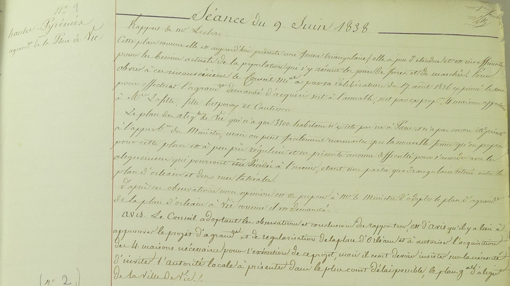
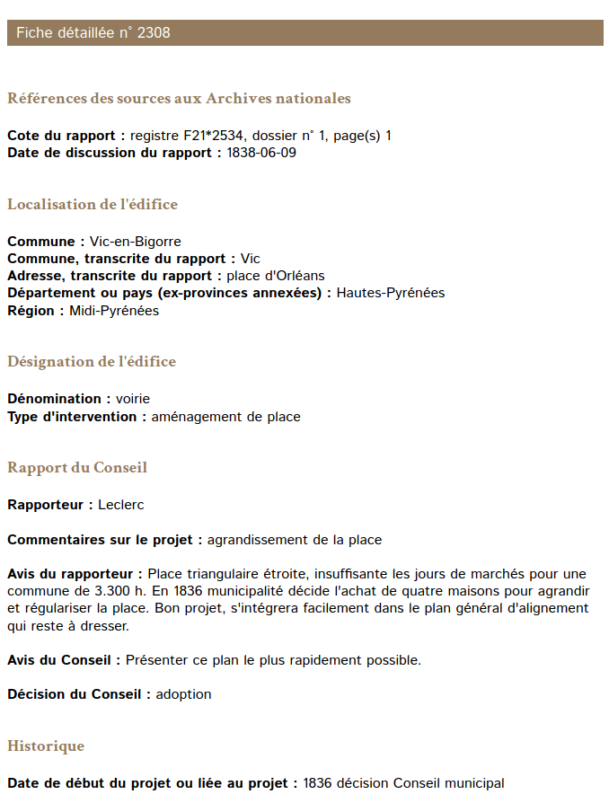
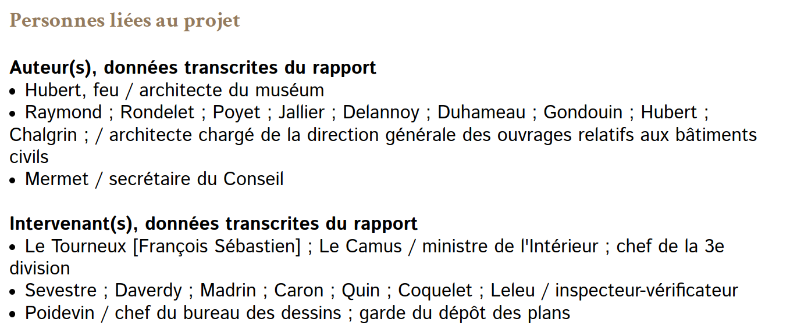
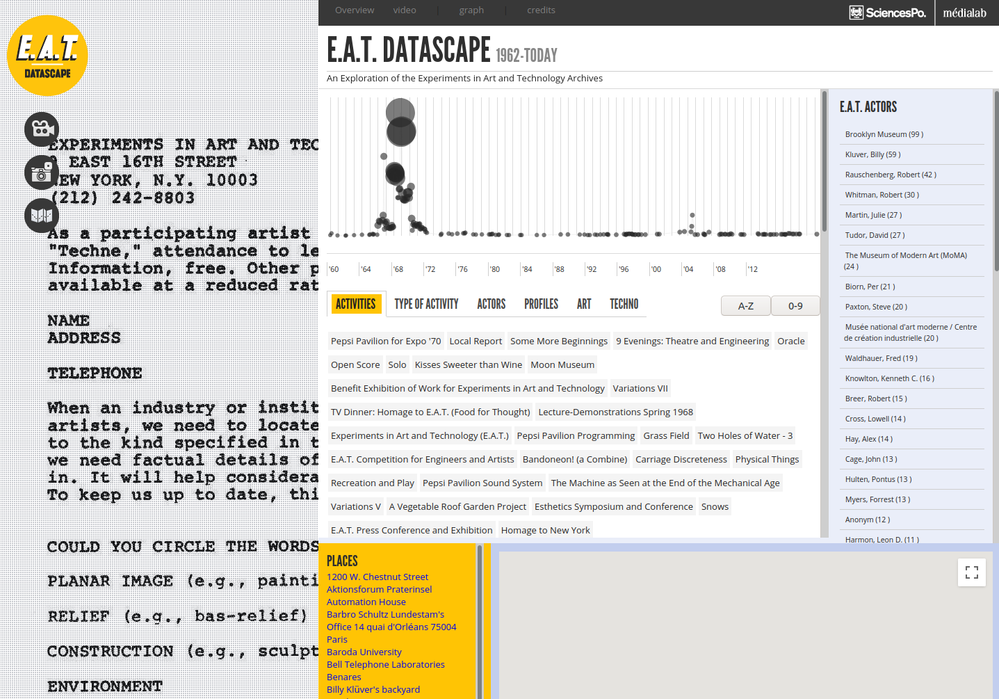
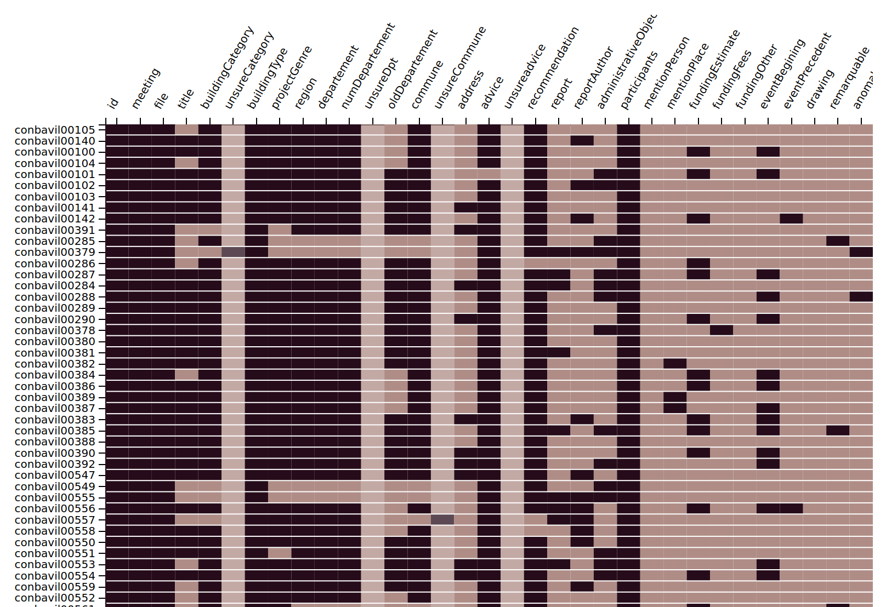

# Chapitre 2 : les données CONBAVIL

Dans le chapitre précédent, nous avons établi le potentiel et la pertinence d’une approche quantitative et spatiale des archives du Conseil des bâtiments civils. Le traitement systématique des procès-verbaux du Conseil des bâtiments civils, réalisé entre 1988 et 2009 par une équipe du Centre André-Chastel[^1] dirigée par Françoise Boudon et Werner Szambien (2009b) permet désormais d’aborder d’une manière renouvelée l’approche quantitative de son activité. Les chercheur·se·s procèdent au dépouillement analytique est effectué sur les 26’900 rapports consignés dans les 66 premiers registres des procès-verbaux (1795 à 1840) des séances du CONseil des BAtiments ciVILs, d’où son nom « CONBAVIL ». Ce projet pionnier produit l'une des premières bases de données en histoire de l’art. Il est donc d'autant plus intéressant d'étudier sa mise en place et son déroulement. 

Ce chapitre est conçu comme une étude critique de la forme et du contenu des données de CONBAVIL. Nous allons tout d’abord présenter le contexte de mise en place du projet de base de données dans années 80s, puis nous passerons ensuite au peigne fin la transformation des archives en données afin d’arriver à une compréhension approfondie de notre matériel de recherche. Ensuite, nous poursuivrons avec la question de l’emploi des bases de données en histoire. Nous étudierons les modes d’accès à une base de données et l’interface actuelle pour l’interrogation de CONBAVIL. Cela nous aidera notamment à identifier les apports (ou *affordances*) mais aussi les limites de l’interface de recherche présentement disponible. Cette analyse servira également à nourrir la réflexion et à identifier les besoins quant à la conception d’une nouvelle interface pour CONBAVIL. Finalement, nous passerons en revue une série d’enjeux théoriques et pratiques qui supporterons nos expérimentations à venir avec les données. 

En amont des particularités de notre base de données, nous revenons sur le terme « données », qui sonne intrinsèquement comme un fait, quelque chose qui « est donné ». Pour contrer cet effet, la chercheuse et *digital humanist* Johanna Drucker martèle « *all data is capta* » (Drucker 2013 : 129). Par ce changement de terminologie, elle souhaite souligner le cadre interprétatif sous-jacent à la captation des données. Dans ce mémoire, nous nous attellerons à déconstruire la « rationalité scientifique » associée aux données. La lecture rapprochée du contenu de CONBAVIL et des moyens pour y accéder sera effectuée par la pratique. Nous employons, tout au long de ce chapitre, des exemples issus de la base de données pour présenter son contenu ainsi que sa forme. 

## 2.1 Créer une base de données 

### 2.1.1 La naissance d’un projet

#### Documenter des archives

Le fort intérêt que présente le fonds d’archives du Conseil des bâtiments civils a justifié une initiative de mise au point de leur utilisation par des chercheur·se·s du Centre André-Chastel. L’objectif est de faciliter l’accès au contenu de ces archives, particulièrement en l’absence d’un répertoire détaillé, tout en les préservant de l’usure causée par leur consultation régulière (Boudon Szambien 1990 : 2). Les chercheur·se·s doivent commencer par choisir un procédé adapté à leurs besoins. À la fin des années 1980, un solution populaire pour lutter contre l’usure des documents est de se tourner vers la reproduction mécanique comme des microfilms afin de préserver les originaux[^2]. Pour ce qui est de faciliter l’accès à leur contenu, la pratique courante consiste à produire un répertoire numérique détaillé ─ le terme « numérique » est employé au sens de « numéroté ». Cet instrument de recherche archivistique permet aux chercheur·se·s de facilement identifier les cotes des documents à consulter. Il contient des descriptions formelles des documents qui composent le fond d’archives[^3]. Il ne présente toutefois que des indications limitées sur le contenu des archives. La vocation de cet instrument est descriptive, il s’agit de faciliter la découvrabilité des fonds et ainsi la recherche.

Une option pour approfondir l’accès au contenu consiste à l’indexer en produisant un dépouillement signalétique des archives. Cela signifie parcourir l’ensemble des documents pour produire un index des lieux, des types architecturaux ou des personnes mentionnées par exemple. Les chercheur·se·s peuvent ainsi cibler les documents dont le contenu semble pertinent pour la consultation. Il est possible de produire certaines analyses ou d’élaborer des hypothèses à partir d’un index[^4]. En revanche, il·elle·s doivent tout de même accéder aux archives pour approfondir le sujet car l’index ne présente pas d’information détaillée ou contextuelle sur le contenu. L'indexation étant très chronophage, ce n’est que rarement l’approche adoptée par les archivistes.

Les chercheur·se·s du Centre André-Chastel ont cependant choisit une approche encore plus poussée en procédant à un dépouillement analytique. Ici, il s’agit d’extraire méthodiquement des caractéristiques de chaque entrée dans les registres. Guidé par des questions de recherches, ce processus présente une véritable valeur scientifique (Szambien et Boudon 1990 : 3). Le contenu produit est beaucoup plus riche que l’index ou le répertoire détaillé car il documente les caractéristiques avec une plus grande variété et plus en détail. Cette forme de dépouillement réduit ainsi les besoins de consultation des archives. Il s’agit également d’une approche plus analytique qu’une retranscription complète des documents, car la normalisation des contenus ─ des types architecturaux ou des décisions du conseil par exemple ─ les rend comparables malgré les différences de formulation. L’option d’un dépouillement analytique apparaît donc comme un « investissement plus coûteux en temps, en argent, mais infiniment plus stimulant pour l’esprit » (Szambien et Boudon 1990 : 3). Ce type de dépouillement fonctionne également comme une sorte de mémoire externe aux documents. En effet, un·e chercheur·se retire des connaissances à une échelle individuelle lors de sa consultation des archives. Le fait de procéder à un dépouillement analytique enregistre formellement un certain nombre de ces informations et les rends accessibles à toutes les personnes ayant accès à ce dépouillement. 

#### Une approche quantitative et informatique

Le choix d’un dépouillement analytique reflète également un intérêt des chercheur·se·s du Centre André-Chastel pour une approche quantitative. En effet, si l’histoire de l’art quantitative est encore un champ sous-exploré (Joyeux-Prunel 2008), l’avènement de l’histoire quantitative et de l’école des Annales ont inspirés des recherches dont l’approche vise à être moins événementielle et d’avantage sociale ou économique. Cette orientation s’est accompagnée d’un nouvel emploi de sources telles que les archives départementales pour favoriser une représentation de l’ensemble du tissu social. Par exemple, la *Rencontre des historiens du Limousin* s’attelle, par le dépouillement de tables de l’état civil de chaque commune, à l’étude des prénoms dans le département sur plus d’un millénaire (Pérouas et al. 1984 : 4). 

Les premiers dépouillements des registres du Conseil des bâtiments civils, effectués par les historiens Bernard Lepetit et Georges Teyssot durant les années 70 et 80, attestent de l’intérêt d’une approche quantitative à partir de ce fonds d’archives. Toutefois, l’utilisation d’outils informatiques pour travailler avec un fonds d’archives reste singulière au milieu des années 80 en histoire de l’art. Malgré une utilisation de plus en plus quotidienne, la micro-informatique n’a pas encore été mise au service de la discipline. Hormis les travaux pionniers engagés par Jacques Thuillier au Collège de France, depuis 1978, peu de projets numériques ont été engagés en histoire de l’art en dépit de son potentiel pour « modifier l’échelle des recherches, et du même coup leur nature » (Thuillier 1992 : 5). C’est un appel d’offre du ministère de l’Équipement qui stimule l’intérêt des chercheur·se·s en histoire de l’art pour la production d’une base de données. 

Au moment où le projet est conçu, il était alors devenu évident que l’intérêt d’un dépouillement analytique serait décuplé par l’informatique. « Un dépouillement informatisé permet non seulement d’enregistrer mais surtout de traiter la masse énorme d’informations contenues dans ces rapports et de diffuser les résultats obtenus » (Szambien et Boudon 1990 : 3). Cette transformation des archives en une base de données permet également de les appréhender comme un tout. Plutôt que de consulter les archives une page après l’autre, on présent qu’il est possible de se doter d’une vue « distante » : les documents peuvent être « étudiés dans leur ensemble[. Ils] offrent une vision continue, dans l’espace et dans le temps, et détaillée de l’activité architecturale » (Szambien et Boudon 1990 : 10). La structuration du contenu le rend comparable, ce qui permet ensuite son analyse en tant que phénomène dont les dynamiques (ou tendances) ─ spatio-temporelles ou typologiques ─ pourront être révélées. « En traitant tous les rapports selon une analyse informatisée, on les a rendus, en bloc, supérieurs à ce qu’ils sont chacun dans leur individualité, c’est-à-dire comparables » (Boudon 2009 : 13). Ces nouveaux moyens techniques impliquent cependant un véritable renouvellement des méthodes de production de connaissances. 

### 2.1.2 La conception de CONBAVIL

En premier lieu, il fallut décider quel outils et moyens techniques seraient employés pour effectuer le dépouillement analytique des procès-verbaux du Conseil des bâtiments civils, notamment le choix d’un format de données et d’un logiciel adapté. S’ensuivit la création de la grille d’analyse pour modéliser le contenu des archives dans un système de gestion de base de donnée (SGBD). Il s’agit de la construction d’un modèle abstrait dont le système d’équivalence (normes et structure) rend les éléments individuels comparables. Finalement, une fois ce modèle définit, advient l’entrée des données dans le système. Nous analysons ici ces trois étapes qui ont déterminé les bases du projet. 

#### Le choix du logiciel 

À l’aube du processus de création d’une base de données, il faut commencer par étudier le choix de moyens techniques et de logiciels disponibles afin de sélectionner le plus approprié. Les logiciels disposent tous d’avantages et d’inconvénients, dans la forme du contenu tout comme dans leur utilisation. Pour CONBAVIL, les critères de sélection identifiés par les chercheurs du Centre André Chastel sont les suivants : Le logiciel doit être « facile à manier et assez puissant pour engranger une masse de données distribuées en un grand nombre de champs indexés ou rédigé et permettre des questionnements croisés » (Boudon 2009 : 8). Parmi les qualités recherchées, on identifie d’une part la simplicité d’utilisation, puisqu’elle sera manipulée par des historien·ne·s dont la formation en informatique sera nécessairement être limitée. D’autre part, la puissance technique séduit, face à la quantité de données à enregistrer — on pouvait probablement estimer qu’il y aurait plusieurs milliers d’entrées — tout comme pour la consultation des informations ainsi recueillies. 

La décision des chercheur·se·s s’arrête sur le choix du logiciel documentaire TEXTO, employé à l’époque pour la gestion de la plupart des bases de données de l’INRA (Vouteau 2005 : 18) et divers autres projets documentaires dans l’enseignement supérieur en France. TEXTO est une base de données dite « à plat », contrairement aux bases de données employées aujourd’hui qui sont de type relationnelles. Cela signifie qu’il est limité à la gestion d’une entité principale, ici le procès-verbal qui va recevoir des descriptions avec des propriétés. Le choix des propriétés est ainsi crucial car celles-ci doivent contenir la totalité des éléments issus du dépouillement que l’on souhaite enregistrer dans la base de données. TEXTO ne contient ainsi qu’une seule table, dont chaque ligne représente une entrée dans un procès-verbal et les colonnes les propriétés le décrivant. 

Si ce système semble s’apparenter à l’utilisation d’un tableur Excel, il s’en distingue nettement dans son fonctionnement. D’une part, les données sont structurées et normées par le modèle abstrait. D’autre part, c’est la puissance et l’efficacité pour effectuer des recherches dans un très grand nombre de données qui caractérise les bases de données. Le modèle abstrait, employé avec un langage de requête structuré (*structured query language*), permet de définir avec précision les valeurs des propriétés qui nous intéressent dans la base de données. Par exemple, pour trouver toutes les prisons dans CONBAVIL, on peut sélectionner toutes les entrées dont la propriété « typeArchitectural » a pour valeur « prison ». Il faut donc garder à l’esprit que les propriétés servent à retrouver des entrées dans la base de données une fois celle-ci complétée.

#### Création de la grille de dépouillement

Le principe des logiciels de base de données se distingue par une dissociation entre le modèle abstrait et l’implémentation technique, c’est-à-dire l’entrée physique des données. La première étape détermine l’ensemble du projet : la modélisation. Il s’agit de concevoir un schéma qui définit les entités représentées dans le modèle, leurs propriétés ainsi que les liens entre entités. Pour nos procès-verbaux, l’entité choisie est le procès verbal. Les propriétés sont des éléments qui seront extrait lors du dépouillement analytique, tels que le lieu ou la toponymie du projet architectural en question. 

Il faut également penser ces critères de description à partir des archives à dépouiller. Ce sont des textes manuscrits, plus précisément une série de procès-verbaux structurés par séance et délibérations (composées d’un rapport et d’un avis), avec quelques annotations en marge ([fig. 2-1](#fig2-1)) Ces procès-verbaux sont produits dès la création du Conseil en 1795 et le modèle de base de données doit pouvoir prendre en compte leur évolution à travers le temps, jusqu’en 1840 [^5]. Pour ce faire, l’équipe a d’abord procédé par carottage pour obtenir un échantillon des procès-verbaux à différentes époques. L’étude rapprochée de cet échantillon a permis de prendre en compte les changements éventuellement intervenus dans la source ou le processus administratif au cours du temps. 

**Fig 2-1** Registre des procès-verbaux du Conseil des bâtiments civil, Séance du 9 juin 1989, dossier n°1, p. 1.
Paris, Archives Nationales de France, F21 2534.

À partir de cet échantillon, les chercheur·se·s ont identifié des critères pertinents pour le dépouillement. Ces critères deviendront les propriétés (ou champs) de la base de données. Le défi est de créer « une grille d’item, assez large pour englober tous les cas traités par le Conseil, assez restreinte pour ne pas rendre l’entreprise démesurée » (Szambien et Boudon 1990 : 3). Dans le modèle mis en place en 1989 puis ajusté aux débuts de l’entreprise ([fig. 2-2](#fig2-2)) chaque entrée est décrite selon des champs qui renseignent tour à tour les documents physiques (la côte d’archive, le registre concerné et la page), la séance (sa date), et l’identification de l’affaire examinée. Celle-ci est constituée d’un rapport (dont le rapporteur est identifié), d’un avis émis par le Conseil, des informations géographiques et typologiques, de détails financiers, des mentions de noms de personnes ou de lieu (similaires à une indexation), l’identification des personnes intervenants dans l’affaire comme participants ou comme architectes et, finalement, d’éventuels liens vers d’autres rapports ou affaires. En sus, la base de données se décrit elle-même, c’est-à-dire qu’elle contient des champs consacré à documenter la saisie et la modification des données (qui, quand, ...). 

**Fig 2-2** Lena Krause, *Transcription des champs de la base de données CONBAVIL dans Texto*, 2020, à partir de Szambien et Boudon, *Les rapports présentés au Conseil des Bâtiments Civils, 1795-1840. Constitution d’une base de données*. [Rapport de recherche] 676/90, Ministère de l’équipement, du logement, des transports et de la mer / Bureau de la recherche architecturale (BRA); Université de Paris IV / Centre de recherche sur l’histoire de l’architecture moderne, 1990, p.26.
En ligne https://hal.archives-ouvertes.fr/hal-01909887

Pour transposer cette grille dans un modèle de base de donnée, il faut aussi définir le type de réponse attendu pour chaque propriété. On distingue, dans CONBAVIL, des champs à compléter avec des mots clés (il peut y en avoir plusieurs, séparés par des « ; ») et ceux dont la rédaction se fait en texte libre. Les champs en textes libres sont « proches » du documents. Ils ne sont toutefois pas des transcriptions, mais plutôt des résumés ou des analyses sommaires du contenu des archives. Cela s’explique notamment par la limitation de la longueur des entrées à 4 000 signes dans TEXTO. Ces champs peuvent contenir des incertitudes en raison de difficultés relatives à la lisibilité du manuscrit par exemple.

Les champs qui contiennent des mots-clés sont ce qu’on appelle « normalisés ». Ils sont le produit d’une catégorisation par les chercheur·se·s qui requiert un certain degré d’interprétation du contenu des archives. Nous pensons notamment à la catégorisation des édifices, basée sur le vocabulaire du *Thésaurus de la désignation des œuvres architecturales et des espaces aménagés* (Vergain 2015). L’emploi de vocabulaires normés comme celui-ci permet d’envisager une comptabilité avec d’autres bases de données qui l’emploient également. Ce choix s’explique notamment par l’aide technique apportée par des documentalistes du service de l’Inventaire des richesses de la France dans la réalisation du projet. Pour les champs actualisés par les chercheur·se·s, comme pour les dates du calendrier révolutionnaire ou la toponymie, les deux versions du nom de la commune ou du département sont renseignées. Les chercheur·se·s ont parfois signalé leur incertitude quant à la catégorisation en ayant recours à des moyens typographiques tels que des points d’interrogation, l’emploi de parenthèses ou de crochets. Un tel travail requiert un degré de spécialisation ainsi que de nombreuses recherches, mais il augmente exponentiellement l’efficacité de la base de données car il permet d’effectuer des comparaisons ou des regroupement en dépit des variations des formulations dans la source originale.

La charge de travail qui incombe aux chercheur·se·s pour effectuer un tel dépouillement et d’opérer cette normalisation se justifie par l’objectif de produire une « analyse [...] de qualité [pour] obtenir une rédaction synthétique et logique des bordereaux informatisés » (Boudon Szambien 1990 : 4). ll demeure cependant essentiel de ne pas abuser de l’indexation, ce qui augmenterait exponentiellement le travail nécessaire à la complétion du projet. Ce danger est relevé par Jacques Thuiller dans son article de la *Revue de l’art* en 1992 où il dresse l’état de la situation entre l’informatique et l’histoire de l’art en 1992. « Dans la plupart des cas, un index très court suffit à une interrogation fine, et de surcroît aboutit à des données plus adéquates et plus complètes. Or ce qui est en jeu, c’est une lourdeur d’indexation qui coûte beaucoup de temps, d’argent et d’efforts, et qui a suffit à étouffer dès le départ les meilleurs projets. » (Thuillier 1992 : 8) Pour les bases de données d’objets ou d’inventaire, Thullier recommande, à juste titre, de faire évoluer le projet par étapes afin de concrétiser son aboutissement, puis d’éventuelles mises à jour contenu des enrichissements. Surtout, l’auteur fustige les projets documentaires produits par les institutions culturelles sans répondre à des questions de recherche. La base CONBAVIL s’en distingue car elle est une base de données de recherche : l’indexation a un impact majeur sur son potentiel épistémologique. L’effort d’indexation et de normalisation a tout de même dû être limité, par exemple dans les informations financières liées aux projet, afin de contenir l’ampleur du travail de saisie des données.

#### L’entrée des données

Une fois la grille définie, il faut la compléter pour chaque délibération. C’est le début du long processus d’entrée des données. Le travail des chercheur·se·s consiste donc à lire (déchiffrer) le texte manuscrit, puis à identifier les éléments requis pour compléter la grille d’analyse. Cet exercice de lecture analytique permet d’isoler des détails pertinents dans les champs indexés tout en résumant le contexte dans les champs plein texte (Boudon 2009 : 14). Prenons pour exemple la première délibération de la séance du 9 juin 1838 ([fig. 2-1](#fig2-1)) [^6], qui provient du registre F21*2534 (COF21), dossier n1 (DOS), page 1 (PAG). On identifie en marge le département et l’objet de l’affaire. La date de la séance est en titre, et le nom du rapporteur se trouve en dessous. S’ensuit le rapport dont on peut extraire l’historique (Conseil municipal : délibération du 14 août 1836 approuvé), qu’il s’agit d’un aménagement de place (nature du projet), à la place d’Orléans (rue) à Vic (ville - ancienne graphie). L’avis du rapporteur et celui du Conseil ont été résumés.

L’entrée des données se faisait en deux temps. D’abord la lecture et la complétion de la grille sur papier, puis la transcription dans le logiciel TEXTO, installé sur un bull micral 65 ([fig. 2-3](#2-3)). Cette double saisie consistait en une mesure de sécurité (Boudon Szambien 1990 : 6). Elle semble également nécessaire par le fait que TEXTO est un logiciel monoposte, c’est-à-dire qu’on ne peut le manipuler que depuis un seul ordinateur (Vouteau 2005:18). De plus, il faut également considérer le confort des chercheur·se·s, car les ordinateurs portables restaient rares et coûteux, et n’étaient pas toujours dotés d’interfaces conviviales ainsi qu’en témoigne la désignation des champs à compléter ([fig. 2-2](#fig2-2)). 

**Fig. 2-3** Bull Micral 60 (released in February 1986)
http://jean.thiery.pagesperso-orange.fr/en/2010/collect/BM-60.html, [© 2010 ModLibre.info](http://www.modlibre.info/) [(cc-by-sa license)](http://creativecommons.org/licenses/by-sa/3.0/)

Nous ne pouvons pas montrer le résultat dans TEXTO, sur un Bull Micral 60, cependant, nous présentons ici la même fiche, dans nos données en format JSON ([fig. 2-4](#fig2-4)) et sur la version de la base de données accessible en ligne aujourd’hui ([fig. 2-5](#fig2-5))

**Fig. 2-4** Lena Krause, *Fiche CONBAVIL02308 - format JSON*, capture d’écran, 2020

**Fig. 2-5** Lena Krause, *Fiche CONBAVIL02308 - interface INHA*, capture d’écran de la délibération sur le site de l’INHA, 2020
https://www.inha.fr/conbavil/notice.php?pv=02308

### 2.1.3 Contraintes conceptuelles et logicielles

#### Interprétation : des archives aux données

L’approche systématique requise par les bases de données impose une rigueur dans l’interprétation des archives. Si une fiche ne correspond pas au modèle choisi, il faut parfois forcer, comme pour « faire entrer le carré dans le triangle » et le résultat peut être moins pertinent. D’une structure inadaptée dans un cas précis aux difficultés d’attribution d’une typologie ou d’un toponyme en passant par la question de la lisibilité du texte manuscrit, il existe une marge de manœuvre pour laquelle il serait nécessaire de pouvoir signaler ou exprimer le doute quand il advient. Cela a parfois été fait dans la base, par l’utilisation de parenthèses, de crochets et de points d’interrogation, par exemple. Cependant, l’utilisation de ces marqueurs d’incertitude n’est ni normalisée, ni spécifique. 

Face à la complexité des graphies des noms de personnes, le choix a été fait de les relever telles quelles (Boudon Szambien 1990 : 8). Couplé avec de possibles erreurs de lecture ou de saisie, cela implique de considérer toutes les graphies possible lors d’une recherche. Par exemple, le nom de l’architecte Boissonnade est parfois entré comme « Boissonade ». La haute complexité des champs financiers, notamment renseignés avec de multiples devises, n’a pas pu être normalisée. C’est un travail qu’il restera à faire. Au fur et à mesure des lectures de dépouillements, il a également été convenu de l’ajout du champ « éléments remarquables » pour signaler des spécificités qui n’apparaîtraient pas dans la grille d’analyse prédéfinie. Il reste à trouver comment les employer et les valoriser car nous n’avons pas d’information quant à une éventuelle normalisation de ces éléments remarquables.

#### La « reconstitution conceptuelle » 

Une limite importante de la base de données concerne l’absence de regroupement des délibérations par affaires. En effet, le conseil pouvait délibérer à plusieurs reprises concernant la même affaire. Refus, ajournement (pour obtenir d’avantage de documents par exemple) ou adoption avec réserve, ajustement et plus encore, une affaire importante peut passer un très grand nombre fois au Conseil. 

Les entrées dans CONBAVIL sont, quant à elles, le produit d’une lecture linéaire des documents. Les instances ne sont pas regroupées conceptuellement, ce qui change complètement le sens du « nombre d’entrées qui correspondent à votre recherche ». Nous faisons face à un problème conceptuel et méthodologique de « peut-on et si oui comment regrouper par affaire de façon systématique ? ». Il existe des champs dédiés pour signaler affaires précédentes ou le début de l’affaire, mais leur utilisation est irrégulière et relativement imprécise. 

Il ne nous semble pas réaliste d’effectuer une reprise de données via l’utilisation d’un algorithme qui identifierait des affaires « similaires ». Cela pourrait cependant servir de point de départ, tout comme les mentions relatives aux autres affaires, pour que des chercheur·se·s identifient et confirment (lorsque possible) ces regroupement de délibérations en affaires. De façon similaire, le contenu de CONBAVIL peut être étudié du point de vue des édifices. En effet, un bâtiment peut être envisagé pour l’installation de divers établissements au cours du temps. Cela concrétiserait les nombreuses réaffectations et les réemplois des édifices. Dans les deux cas, il s’agit d’un travail de fond dont le potentiel serait décuplé par la mise en commun de ces efforts individuels. Il sera question des moyens de contribution au contenu dans la section sur l’éditorialisation (Chapitre 3).

#### Les limites du logiciel

Même s’il a été choisi pour sa « très grande souplesse » (Boudon Szambien 1990), nous avons identifié plusieurs contraintes liées au fonctionnement « à plat » du logiciel TEXTO [^7]. Tout d’abord, la structure prédéfinie devient extrêmement contraignante, car la totalité de l’information doit être contenue dans le monolithe de l’entité « délibération ». Cet inconvénient était en partie compensé par les riches fonctionnalités d’indexation offertes par le logiciel. Toutefois, dans une base de données relationnelles, on aurait pu traiter d’avantage d’entités, comme pour les personnes par exemple. On peut alors employer l’identifiant à chaque mention, ce qui permet d’éviter la redondance[^8] et les erreurs ortho-typographiques. Pour chaque « personne », on pourrait spécifier qu’il existe d’autres orthographes. De plus, si d’avantage de recherches sont effectuées — par exemple les dates de naissance et de décès, le lieu de travail, ou encore des références bibliographiques concernant l’architecte — l’information pouvait être centralisée pour être proposée lors de la consultation de n’importe quelle fiche.

Dans TEXTO, on doit entrer les informations sur les personnes pour chaque fiche. Si, dans l’idéal, chaque propriété « personne » décrit un individu, il faut savoir que le nombre d’architectes ou d’intervenants dans les délibérations varie. Les chercheur·se·s ne pouvaient qu’estimer le nombre « raisonnable » à prendre en compte. Il·elle·s ont ainsi décidé de créer trois champs : AUT, AUT1 et AUT2. Il arrive, cependant, qu’il y ait un plus grand nombre de personnes concernées. C’est le cas, par exemple, pour une délibération au sujet du muséum d’histoire naturel, tenue lors de la première séance de l’assemblée centrale des architectes et qui réunit, de ce fait, un très grand nombre d’auteurs et d’intervants ([fig. 2-6](fig#2-6)). Dans les cas où le nombre dépasse, le contenu a été condensé dans AUT2, en séparant les noms par des points virgule. Cette solution est un bricolage qui fonctionne, mais qu’il faut également prendre en compte en sus des variations dans la graphie des noms quand on cherche un architecte dans la base (nous reprenons en détail cet exemple dans la partie suivante). 

**Fig. 2-6** Lena Krause, *Extrait de la fiche 00232*, Capture d’écran, 2021
https://www.inha.fr/conbavil/notice.php?pv=02232

### Les premiers résultats

L’ampleur du travail abatu par le centre André Chastel avec CONBAVIL a été extraordinaire : les 66 premiers registres des procès-verbaux des séances du Conseil des bâtiments civils, soit les années 1795 à 1840, contenant 300 à 500 affaires par volume, allant jusqu’à « 1 100 dans les moments de frénésie constructive des années 1812 ou 1820 » (Boudon 2009 : 9), ont été dépouillés et donnent un total de 26 900 rapports. « Il ne s’agit de rien de moins que [d’]une des premières bases de données d’histoire de l’architecture française » (Szambien et Boudon, 1990 : 3). Un projet si titanesque que malgré l’entrain soulevé et la détermination de l’équipe, les délais furent excessivement supérieurs à ceux énoncés lors du rapport rédigé en 1990. La saisie informatique a débuté en mars 1989 et, en octobre 1990, 15 000 affaires sont déjà analysées, dont 5 500 « saisies en machine »[^9] . L’achèvement du dépouillement des années 1795 à 1840 était prévu pour fin 1991. En réalité, le travail s’est prolongé jusqu’en 1998, où les deux-tiers des rapports (~18 000) sont lus, analysés, saisis et corrigés. Après une interruption du travail entre 1998 et 2005, l’Institut national d’histoire de l’art (INHA) soutient le projet afin qu’il puisse être achevé et mis en ligne. D’après l’institut, le projet CONBAVIL s’accorde avec sa vocation de « favoriser la réalisation de projets d’intérêt collectif dont la qualité et l’ampleur enrichissent le regard et les perspectives de chacun[·e] » (Garric [préface] dans Boudon 2009 : 5). 

Lorsque le projet reprend après une suspension de huit ans, il devient nécessaire de faire des ajustements matériels, car l’informatique personnelle a beaucoup évolué au cours de ce laps de temps. Le premier logiciel documentaire utilisé, Texto avait une mémoire limitée (pas plus de 4 000 signes par fiche) qui obligeait à adopter un style télégraphique, voire à réduire le texte avec la simple mention « [détail] » (Boudon 2009 : 26). Surtout il était depuis longtemps devenu obsolète face aux bases de données relationnelles. Le choix pour le nouveau logiciel s’est porté sur FileMaker Pro. Il s’agit d’une base de données relationnelles propriétaire qui n’impose pas de limite dans le nombre de signes. La rédaction des fiches en devient plus naturelle et lisible, sans les « abréviations qui gênent la lecture » (Boudon 2009 : 26). Cela a également permis de renommer les champs, ce qui a augmenté la lisibilité et le confort pour l’entrée des données ([fig. 2-7](#fig2-7)). L’ajout d’une entité personne a également été effectué, toutefois, son emploi n’est pas systématique.<!-- @ec ici dire quelques mots sur la grande faveur du logiciel parmi les historiens, qui s’explique notamment par des interfaces graphiques qui permettent de facilement créer et personnaliser des rapports ou modifier la structure de la base. -->

**Fig 2-7** Emmanuel Château-Dutier, *Tables et relations CONBAVIL dans la base Filemaker*, Capture d’écran, 2020

Au cours de la même période, d’autres projets de numérisations ont aussi été réalisés, dont la série iconographique F21 1875-1908 aux archives nationales. Ce fonds d’archives contient les images numérisées des calques des projets acceptés, généralement datés du jour d’adoption du projet et parfois assortis de légendes. Ces dessins sont donc un complément d’un grand intérêt pour CONBAVIL. Leur numérisation et leur mise en ligne sur Archim (http://www2.culture.gouv.fr/documentation/archim/Batim.html), désormais classés topographiquement et majoritairement datés et identifiés, a permis un travail systématique de mise en relation entre le fond iconographique et les rapports dans CONBAVIL. Les cotes des dessins ont donc été ajoutées à la base lors de cette seconde étape dans sa création (Boudon 2009 : 10-11).

Finalement, une fois les 26 900 rapports analysés, entrés dans la base et mis en relations avec les 3 700 dessins, il il a été convenu de fournir un outil d’interrogation en ligne. Dès la création de la base, l’enjeu de la rendre accessible aux chercheur·se·s externes au centre André-Chastel était considéré. Au temps et au travail nécessaire pour créer une base de données, ce n’est pas l’idée d’une utilisation non pas individuelle ni locale mais bien celle d’un avancement collectif et une multitude de perspectives de recherche qui étaient visés par ce travail de longue haleine. « Les auteurs de la base ne pourront exploiter que quelques aspects du travail, qui sera par conséquent mis à la disposition des chercheurs et des institutions selon les modalités qui s’imposeront. » (Szambien et Boudon, 1990 : 23). De plus, la collaboration avec les chercheur·se·s-utilisateur·rice·s de la base s’impose pour corriger les erreurs et coquilles, ainsi que pour enrichir la base davantage de leur expérience d’utilisation de la base (Boudon 2009 : 16). 

Ce contenu initial a effectivement évolué depuis la présentation détaillée publiée en 2009, les changements ne sont toutefois pas aussi clairement documentés. Un accès à la base à travers un outil d’interrogation en ligne est disponible depuis 2009 sur le site internet de l’INHA et il a été mis à jour en 2015 lors de la refonte du site web de l’institution[^10].

## 2.2 L’accès aux données 

#### Comment interroge-t-on une base de données ?

Lorsqu’une base de données a été complétée, on peut commencer à l’interroger. Les chercheur·se·s ont bel et bien créé la base de données avec des idées de ce qu’ils aimeraient en retirer une fois l’entrée des données terminées. Nous avons retrouvé certaines de ces idées dans le rapport rédigé par Françoise Boudon et Werner Szambien en 1990. Les chercheur·se·s y mentionnent un certain nombre de requêtes qu’ils souhaitaient effectuer. Pourtant encore aux prémisses de la création de la base de données, l’engouement pour le potentiel d’utilisation de la base de données se fait déjà sentir. Il·elle·s listent une série de question auxquel il sera possible de répondre grâce à CONBAVIL, lorsque la base sera complète.

> On pourra établir à volonté en quelques minutes la liste des dépôts de mendicité créés par Napoléon [q1], des églises transformées en école dans le département de la Nièvre entre 1802 et 1810 [q2], des rapports confiés à Chalgrin dès son retour « au pouvoir » sous le Directoire [q3], le nombre et la nature des chantiers dirigés par l’architecte Boissonnade en Aveyron dans les années 1830 [q4], le pourcentage des dossiers de construction et de réparation présentés au conseil pendant dix ans [q5], le pourcentage de ceux qu’il rejette et ceux qu’il adopte [q6], l’activité de Rondelet comme auteur de projets et comme rapporteur de dossiers [q7], etc... (Szambien et Boudon, 1990 : 10)

Nous avons voulu faire l’exercice de répondre à ces questions, c'est pourquoi nous les avons numérotées « de q1 » à « q7 ». Nous avons documenté nos idées de réponses [en ligne](https://public.archi/atlas-2021/viz/BoudonSzambien/index.html). Dans cette partie, nous allons reprendre quelques unes de ces questions pour démontrer, par l’exemple, les moyens d’accéder aux données dans CONBAVIL. Nous identifions ainsi les moyens actuels d’utilisation de la base de données.

### 2.2.1 Les formes d’accès au contenu d’une base de données

#### Les requêtes 

La première et la plus « basique » manière d’utiliser une base de données consiste à l’interroger via un langage structuré. Les langages varient selon le SGBD employé. Pour une base de données relationnelle, on emploie souvent le langage SQL (Structured Query Language) alors qu’une base de données XML requiert l’utilisation de XQuery par exemple. Ce type de langage est très puissant et permet d’effectuer des recherches complexes avec rapidité. Il faut cependant non seulement connaître le langage de requêtes mais également être familier·ère avec le modèle abstrait et le contenu de la base de données pour former des requêtes complètes. Il s’agit là d’un niveau de littératie numérique peu commun parmi la majorité des chercheur·se·s qui étudient l’architecture publique en France durant la première moitié du XIXe siècle. Nous souhaitons toutefois en promouvoir la compréhension et familiariser nos lecteur·rice·s aux principes sous-jacents. Comme le langage SQL est très communément utilisé, nous l'avons sélectionné pour notre démonstration d'un langage structuré. Nous répondrons donc à deux des questions de recherches susmentionnées avec des exemples de requêtes SQL.

#### Vues

Afin de faciliter l’utilisation de bases de données, l’informatique prévoit des interfaces, ou des vues, qui permettent à des utilisateurs qui ne connaissent pas le langage SQL ou même les détails de la base de données de s’en servir malgré tout. Ces interfaces sont plus visuelles que textuelles : au lieu d’écrire une requête, on est dans un environnement « boîte à clics » où l’on sélectionne, dans des listes déroulantes par exemple, des critères pour filtrer la base de données. C’est un dispositif où l’on peut visualiser sa requête via les champs du formulaire. Il est interactif dans le sens où l’utilisateur peut agir via la sélection d’un élément dans une liste déroulante, le choix de cases à cocher ou en entrant des chaînes de caractères (du texte). L’interface sert d’intermédiaire, elle est programmée pour transformer l’équivalent d’un formulaire en une requête SQL. 

Cette interface peut être conçue au sein du logiciel de base de données, ce qui signifie qu’elle s’utilise localement, sur l’ordinateur où la base de données est installée. Cela signifie que qu’un·e chercheur·se ne peut y avoir accès que s’il·elle se rend au Centre André-Chastel afin d’utiliser les machines équipées à cet effet, après avoir obtenu les autorisations nécessaires[^11]. 

#### Web

Avec l’avènement du web, il a été question de rendre les bases de données accessibles en ligne. Cela signifie que la base de données se trouve sur un serveur connecté à internet. L’interface est un site web qui communique avec le serveur pour envoyer des requêtes et recevoir des résultats. Le langage utilisé change, mais le principe d’interface qui permet de créer des requête structurée et l’affichage des résultats reste identique. Un tel outil d’interrogation en ligne est disponible depuis 2009 sur le site internet de l’INHA. Dans un second temps, nous ferons une analyse de l’accès web à la base de données CONBAVIL, en répondant à d’autres questions de recherches posées en 1990 par Françoise Boudon et Werner Szambien.

Il faut toutefois prendre note que la base de données « en ligne » est un export de la base de données « locale » qui se trouve au centre André-Chastel. Lorsque les chercheur·se·s apportent des changements à la base de données locale, ces modifications ne s’appliquent pas à la base en ligne si celle-ci n’est pas connectée dynamiquement. C’est donc un système de versions qu’il faut prendre en compte. Cela signifie que, par exemple, qu’après une étape de recherche qui enrichit le contenu de CONBAVIL, on effectue une mise à jour de la base de données en ligne pour l’aligner avec le contenu[^12]. Ce faisant, il faut notamment tenir compte du fait que le contenu de la base peut changer. La version de la base de données que nous avons employée pour la rédaction de ce mémoire n’est donc pas tout à fait identique ni à celle en ligne, ni à celle « maîtresse »[^13] au centre André-Chastel.

### 2.2.2 Requêtes SQL

Du point de vue informatique, l’interrogation d’une base de données se fait donc par l’intermédiaire de requêtes exprimées dans un langage structuré. Lorsqu’on apprend à créer une base de données, on apprend donc également comment faire une requête d’interrogation SQL. On effectue ces requêtes sur l’ordinateur qui contient la base de données, soit dans le terminal, soit dans l’interface du SGBD utilisé. Dans le cas de TEXTO, il existait un langage et des fonctionnalités propres à ce SGBD. Cependant, le remplacement de TEXTO par un logiciel plus performant lors du rachat de l’entreprise le développant en 1997 fait qu’il n’est plus compatibilite qu’avec le système d’exploitation Windows 98 ou des systèmes antérieurs (Vouteau 2005 : 18). Malgré le grand nombre d’utilisateur·rice·s de ce logiciel en France durant les années 80 et 90, peu de personnes en connaissent le fonctionnement aujourd’hui. 

L’accès à un tel système et l’apprentissage de TEXTO dépassant le cadre choisi pour ce mémoire, nous avons choisi d’illustrer son fonctionnement théorique avec des exemples en SQL. Une requête SQL est une instruction informatique textuelle dont les trois instructions débutent par des mots-clefs et se terminent par un retour à la ligne[^14]. La première, « SELECT », concerne l’information à afficher comme résultat de la requête. L’élément complet se désigne par l’astérisque, sinon il faut lister les propriétés que l’on veut afficher. La deuxième, « FROM », sélectionne la table. dans la base de données, dans laquelle est stockée l’information. Puisque CONBAVIL est une base de données dite « à plat » et non pas relationnelle, elle ne contient qu’une seule table. Nous allons donc toujours chercher l’information dans la table « conbavil » avec l’instruction « FROM conbavil ». La dernière instruction, « WHERE », contient les conditions pour retourner un élément dans le résultat. On choisit donc des valeurs souhaitées pour certains champs dans la base de données. Nous avons sélectionné deux questions qui correspondent à des requêtes types comme exemples[^15].

#### Les églises transformées en école dans le département de la Nièvre entre 1802 et 1810 (q2)

Pour connaître le nombre d’églises transformées en école dans le département de la Nièvre entre 1802 et 1810 (question 2), ou pour effectuer toute requête, il faut commencer par identifier les éléments dans la question qui correspondent à des champs de la base de données. Dans cette requête, on identifie « église » et « école », qui sont des types d’édifices. « Nouvelle affectation » correspond à un type d’intervention. Puis on a un département, la Nièvre, ainsi qu’une fourchette de dates « entre 1802 et 1810 ».

Nous voulons donc interroger la base de données pour savoir s’il existe des fiches qui correspondent aux critères suivants : la date (DAR) de la fiche doit être comprise entre 1802 et 1810 ─ '1802-01-01' et '1810-12-31' . Le département doit correspondre à la Nièvre; on peut l’écrire en toutes lettres 'AL = "Nièvre" ' mais si l’on veut éviter des problèmes d’orthographe et d’accents, on peut également utiliser le numéro de département (L), « 59 ». Le type d’intervention(PJT) doit être une nouvelle affectation et le type d’édifice (DES) soit une église, soit une école, ou les deux. Dans les cas de nouvelles affectations, les chercheur·se·s ont tenté de documenter les deux fonctions de l’édifice, c’est-à-dire le type d’édifice avant (église) et après (école) le changement. Cependant, ce n’était pas toujours possible. Dans ces situations, il est recommandé de « viser large » au début ─ le type d’édifice est soit une église, soit une école ─ puis de choisir une façon de trier les résultats s’il y en a trop.

>`SELECT *`
>
>`FROM conbavil`
>
>`WHERE (DAR BETWEEN '1802-01-01' AND '1810-12-31') AND L='58' AND (DES='église'|'école') AND PJT='nouvelle affectation'`

Lorsqu’on effectue une telle requête, on a en tête une hypothèse concernant le nombre de résultats. Dans ce cas-ci, on commence avec les 27 000 fiches contenues dans CONBAVIL. Par un simple calcul de probabilité (qui ne prend pas en compte les spécificités de la base), on peut estimer que la fourchette de date en élimine environs les 4/5èmes (8 ans sur 45). Dans le cas d’une répartition égale à travers le temps, il nous en reste un cinquième, donc environ 5 000 fiches. Le choix du département de la Nièvre exclut tous les autres (plus d’une centaine, surtout avec les régions annexées à l’époque). À nouveau, même en faisant l’hypothèse d’une répartition égale des fiches entre les départements (on sait que n’est pas le cas, mais nous visons large), il resterait un centième donc 50 fiches. De plus, en ne considérant que les nouvelles affectations, on élimine toutes les nouvelles constructions ainsi que les réparations. on peut ainsi se douter qu’on aura peu de résultats pour cette requête. Finalement, si l’on spécifie les deux types d’édifices, église et école, en restera-t-il ? 

Ces hypothèses issues des probabilités peuvent être enrichies par des connaissances historiques et la familiarité avec les données. Travailler ses hypothèses n’est toutefois pas forcément nécessaire car c’est très rapide de lancer une requête, le résultat est quasi-immédiat. On peut simplement fonctionner par essais-erreurs et ajuster le tir au fur et à mesure de la lecture des résultats obtenus. On peut même aller contre l’instinct, faire une recherche « même si on y croit pas trop » ; la facilité et la rapidité d’obtention des résultats invite même à élargir ses questionnements.

#### Le nombre et la nature des chantiers dirigés par l’architecte Boissonnade en Aveyron dans les années 1830 (q4)

Le second exemple que nous avons choisi porte sur le nombre et la nature des chantiers dirigés par l’architecte Boissonnade en Aveyron dans les années 1830 (q4). On cherche des fiches dont l’auteur est un architecte (PAUT = "architecte") et dont le nom est « Boissonnade », au cours des années 1830 (DAR BETWEEN '1830-01-01' AND '1839-12-31')[^16]. Il faudra ensuite les regrouper par type d’intervention et compter les occurrences pour chaque type. Initialement, identifier les délibérations en Aveyron dont Boissonnade est l’architecte semble plutôt évident : AUT="Boissonnade". Il faut toutefois prendre en compte les problèmes d’orthographe, car les noms de personnes ont été mentionnées et orthographiées tels que les chercheur·se·s ont pu les lire (Boudon 2009 : 20). En parcourant les données, nous avons remarqué qu’il y a (au moins) deux orthographes employées : « Boissonnade » et « Boissonade ». De plus, nous avons soulevé dans la partie 2.1 le problème de TEXTO, dont le fonctionnement à plat requiert d’entrer les cas avec de multiples auteurs dans les champs AUT, AUT1, AUT2, puis d’inclure une série de nom séparés par des virgules dans AUT2 s’il y en a encore plus, et il reste à savoir si les professions (PAUT2) sont renseignées de la même façon.

> `SELECT PJT, Count(*)`
>
> `FROM conbavil`
>
> `WHERE Depart='12 AND (DAR BETWEEN '1830-01-01' AND '1839-12-31')(((AUT='Boissonnade' OR AUT='Boissonade) AND PAUT='architecte') OR ((AUT1='Boissonnade' OR AUT1='Boissonade) AND PAUT1='architecte') OR (Contains(AUT2, 'Boissonnade') OR Contains(AUT2, 'Boissonade')) AND Contains(PAUT2,'architecte'))`
>
> `GROUP BY PJT`

Afin d’identifier la nature et le nombre des projets, nous regroupons (Group by) par nature du projet (PJT) et sélectionnons le résultat en affichant chaque groupe et son nombre d’occurrences (Count). L’absence de normalisation dans les noms, en sus du problème des multiples champs auteurs, rend la requête complexe et touffue. Si on ne connaît pas les spécificités de la base, il y a un gros risque de ne pas penser à ces détails et d’ainsi passer à côté de plusieurs résultats. L’incertitude syntaxique, le choix des champs et les renseignements multiples peuvent causer des résultats que l’on peut qualifier de « bruit » - pour ceux qui ne devraient pas être là s’il n’y avait pas ces inconvénients et ce degré de complexité — ou de « silence » pour les résultats qui absents pour les mêmes raisons. Lors du travail avec des requêtes et des données, prendre conscience des possibles bruits et silences est une étape essentielle pour pouvoir examiner de manière critique les résultats obtenus.

### 2.2.3 Interface de l’INHA

#### Présentation du formulaire

À l’occasion de la complétion de la base de données en 2009, un outil d’interrogation en ligne a été créé pour faciliter son utilisation et augmenter son accessibilité. Il s’agit d’un formulaire disponible sur le site internet de l’INHA[^17]. L’interface de consultation de la base de données détermine ses utilisations possibles. Nous allons donc effectuer une analyse de cette interface afin d’identifier les moyens actuellement disponibles pour se servir de CONBAVIL, particulièrement dans le cadre de recherches académiques. 

Le formulaire se divise en trois sections. Tout d’abord, la section « Interrogation sur le projet » contient les informations relatives à l’architecture : fonction et emplacement de l’édifice, type d’intervention, intervenant et coût. La deuxième section, « Interrogation sur le rapport issu de l’examen du projet » se réfère au fonctionnement du Conseil : date de la séance du conseil, rapporteur et contenu du rapport, décision, cote dans les archives et présence de dessins. Finalement, la dernière section est un choix de procédures administratives. Le formulaire contient des champs « plein texte », où l’utilisateur·rice peut écrire en toutes lettres ce qu’il·elle recherche, et des listes déroulantes, où il faut choisir un critère dans les options dans la liste. Les cases à cocher sont des critères booléen (oui/non), ce qui signifie que le critère concerné agit comme un filtre s’il est coché. 

Le résultat d’une recherche via le formulaire apparaît sous la forme d’une liste de fiches qui correspondent aux critères sélectionnés. Pour consulter les détails, le chercheur doit parcourir la liste de façon linéaire. Chaque fiche présente le contenu d’une entrée dans la base de données. Nous avons testé cet outil d’interrogation en ligne, toujours avec la liste de questions qui nous servent de cas d’utilisation.

#### Les dépôts de mendicité créés par Napoléon (q1)

Pour trouver les dépôts de mendicité créés par Napoléon, nous devons identifier la dénomination de façon hiérarchique. La liste déroulante suggère d’abord les catégories, nous sélectionnons « architecture hospitalière, d’assistance ou de protection sociale » ([fig. 2-8](#fig2-8)). Apparaissent alors les types d’édifices qui appartiennent à cette catégorie. Cela sous-entend que l’utilisateur doit être capable d’identifier la catégorie d’un type d’édifice ou y aller par « essai/erreur » puisque les types se mettent à jour en fonction de la sélection de la catégorie.

**Fig 2-8** Lena Krause, *Interrogation CONBAVIL - dénomination*, Capture d’écran sur l’interface d’interrogation en ligne de CONBAVIL, 2020
https://www.inha.fr/fr/ressources/outils-documentaires/conseil-des-batiments-civils-conbavil/interroger-conbavil.html

Nous avons ensuite sélectionné « Napoléon » dans le contenu du rapport ([fig. 2-9](#fig2-9)) car on peut exclure qu’il ait eu le rôle d’architecte ou d’intervenant spécialisé dans le projet. Puisque cocher « élément remarquable » pourrait éliminer les options plein texte, mais que si Napoléon est un élément remarquable, son nom est probablement contenu dans le rapport, nous n’avons pas coché cette option. On a également préféré inscrire Napoléon sans préciser « I » ou « Ier » dans le but d’inclure le plus de résultats possible. On ne peut malheureusement pas exclure la possibilité que d’autres graphies aient été employées.

**Fig 2-9** Lena Krause, *Interrogation CONBAVIL - Contenu du rapport*, Capture d’écran sur l’interface d’interrogation en ligne de CONBAVIL, 2020
https://www.inha.fr/fr/ressources/outils-documentaires/conseil-des-batiments-civils-conbavil/interroger-conbavil.html

**Fig 2-10** Lena Krause, *Interrogation CONBAVIL - 3 enregistrements correspondants à la recherche*, Capture d’écran sur l’interface d’interrogation en ligne de CONBAVIL, 2020
https://www.inha.fr/fr/ressources/outils-documentaires/conseil-des-batiments-civils-conbavil/interroger-conbavil.html

Dans les trois résultats qui correspondent notre recherche ([fig. 2-10](#fig2-10)), nous constatons que le nom de Napoléon est mentionné en référence à des articles du « code Napoléon », c’est-à-dire au code civil. En fait, en prenant du recul par rapport au formulaire pour se concentrer sur le contexte historique, on comprend que la question fait plutôt référence au décret impérial du 5 juillet 1808, où Napoléon prescrit la création de dépôts de mendicité dans chaque département (Peny 2011 : § 1-2). S’il en existait déjà certains avant, ce sont donc ceux créés après 1808 qui répondent à cette question.

En revenant au formulaire, on constate toutefois qu’on ne peut pas choisir un intervalle de dates, mais seulement sélectionner une date avec un degré de précision qui va de l’année, au mois puis au jour. Lorsqu’on lance la requête pour tous les dépôts de mendicité, on obtient un total de 930 enregistrements répartis sur 47 pages. La dernière entrée de la première page de résultats est datée de mars 1808, mais nous ne parvenons pas à afficher la page suivante[^18]. Outre ce problème, nous devrions ensuite compter les entrées manuellement, sachant que les délibérations peuvent concerner la même affaire. Pour exclure ce problème, il faudrait toutes les consulter et tenter d’établir lesquelles sont liées. En conclusion, malgré l’indexation des dépôts de mendicité dans la base de données, l’interface n’assiste pas encore suffisamment les chercheur·se·s pour répondre à une telle question « en quelques clics ». 

#### Les rapports confiés à Chalgrin dès son retour au pouvoir sous le Directoire (q3)

Pour identifier les rapports confiés à Chalgrin dès son retour « au pouvoir » sous le Directoire, il suffit de sélectionner « Chalgrin » comme rapporteur ([fig. 2-11](#fig2-11)) et l’on obtient effectivement 102 résultats en quelques clics ([fig. 2-12](#fig2-12)). La date de son retour « au pouvoir » sous le Directoire est à déterminer pour le spécialiste qui se pose cette question. Il en est de même pour les résultats obtenus

**Fig 2-11** Lena Krause, *Interrogation CONBAVIL - Rapporteur*, Capture d’écran sur l’interface d’interrogation en ligne de CONBAVIL, 2020
https://www.inha.fr/fr/ressources/outils-documentaires/conseil-des-batiments-civils-conbavil/interroger-conbavil.html

**Fig 2-12** Lena Krause, *Interrogation CONBAVIL - 102 enregistrements correspondants à la recherche*, Capture d’écran sur l’interface d’interrogation en ligne de CONBAVIL, 2020
https://www.inha.fr/fr/ressources/outils-documentaires/conseil-des-batiments-civils-conbavil/interroger-conbavil.html

#### Le nombre et la nature des chantiers dirigés par l’architecte Boissonnade en Aveyron dans les années 1830 (q4)

Revenir à la question 4 (le nombre et la nature des chantiers dirigés par l’architecte Boissonnade en Aveyron dans les années 1830) nous permet d’identifier une série de limitations dans l’interface. Nous retrouvons la possibilité de sélectionner l’Aveyron mais pas l’intervalle de temps des années 1830. Ensuite, en ce qui concerne l’architecte, nous pouvons utiliser la troncature du nom, « Boisson*  » pour inclure les deux graphies (Boissonnade et Boissonade)[^19]. 

**Fig 2-13** Lena Krause, *Interrogation CONBAVIL - 29 enregistrements correspondants à la recherche*, Capture d’écran sur l’interface d’interrogation en ligne de CONBAVIL, 2020
https://www.inha.fr/fr/ressources/outils-documentaires/conseil-des-batiments-civils-conbavil/interroger-conbavil.html

Il y a du bruit des résultats ([fig. 2-13](#fig2-13)), comme dans la troisième notice, où nous ne trouvons pas de mention de Boissonnade ni d’autre termes qui commenceraient par ces lettres. Nous ne savons pas pourquoi cette notice apparaît, mais cela signale un problème de transparence, car l’interface n’explicite pas les résultats pour l’utilisateur·rice.

#### Observations critiques sur l’outil 

Le formulaire présente un avancement important dans le cycle de vie de la base de donnée. Il offre un accès à CONBAVIL depuis n’importe quel ordinateur personnel connecté à internet. L’interface assiste la recherche au sein de ces archives et permet d’en consulter le contenu. Il en devient presque inimaginable de comparer l’interrogation de la base de données à un déplacement aux archives pour parcourir la dizaine de registres qui concernent la période à la recherche des délibérations qui concernent le travail de l’architecte Boissonnade en Aveyron (cf. q4). Cela signifie notamment des chercheur·se·s qui n’avaient pas prévu ou ne pouvaient pas consulter les archives y ont désormais accès. Accessible en ligne, l’interface permet à un plus grand nombre de se pencher sur le contenu des archives du Conseil des bâtiments civils et facilite les recherches dans CONBAVIL. De plus, la localisation des documents est facilitée pour ceux·elle·s qui se rendent aux Archives nationales.

Nous avons cependant constaté que l’interface présentait plusieurs inconvénients pour la recherche. En sus des contraintes sur l’interrogation du contenu que nous avons révélées dans les cas d’utilisations, certains éléments de l’expérience utilisateur (UX) complexifient la recherche. 

Tout d’abord, on ne peut pas consulter la base sans sélectionner un critère de recherche. Lorsqu’on la découvre et qu’on ne connaît pas nécessairement sa structure et son contenu, c’est impossible de l’explorer sans tout de suite devoir sélectionner des critères. Quand on lance une recherche, on ne voit plus les critères sélectionnés, mais seulement la liste de résultats. On ne peut donc pas vérifier les critères et repérer une possible erreur. Dans le cas où on revient en arrière, il faut faire retour avec la fonction précédent du navigateur, il n’y a pas de boutons qui permette de retourner à la requête pour la modifier par exemple. En pesant retour, les critères précédents sont souvent encore présents mais ça ne se remarque pas facilement[^20]. On ne peut pas non plus enregistrer ou partager une recherche, ni les résultats, ce qui est problématique pour publier des résultats. 

Ensuite apparaît un problème classique en informatique : la confrontation entre la facilité et la flexibilité du logiciel employé. On peut « tout » faire avec des requêtes SQL, mais il faut savoir écrire ses requêtes. Il n’y a qu’à cliquer et à sélectionner des critères de recherche dans une interface comme le formulaire de l’INHA. Toutefois,ce type de « solution clef en main » est très restrictive. Il y a des requêtes qu’on pourrait faire très facilement et qui n’y sont pas prévues. On ne peut pas dévier des options prédéfinies. Tout type d’utilisation qui n’est pas prévu par les concepteur·rice·s de l’interface est donc impossible. Quels que soit la qualité de l’interface et les améliorations que l’on peut y apporter, les moyens d’interrogation sont fini (*finite*).

Nous avons également manqué de retours (*feedback* visuel) entre la recherche effectuée et les données. Cela a créé un doute constant : est-ce bien ça que je cherchais, est-ce que ce résultat correspond à ma recherche ? On ne peut pas critiquer le résultat obtenu car les critères de sélection ne sont pas mis de l’avant lors de la consultation des fiches. L’interface étant composée de deux vues principales distinctes — le formulaire de recherche et la liste de résultats —, cela crée un effet « boîte noire » quant au processus d’interrogation de la base de données. On ne peut pas voir ses critères de recherche et les résultats obtenus en même temps. Lorsqu’il s’agit d’un critère « évident », comme un numéro de département ou la date d’un rapport, cela n’est pas forcément nécessaire. Toutefois, lorsqu’on effectue une recherche plein texte comme dans l’exemple précédent (q4), plus de transparence et de clarté parmi résultats obtenus seraient les bienvenus. 

Un manque important de l’interface nous apparaît dans l’absence d’une dimension quantitative, quand on souhaite avoir des résultats quantifiés tels que des nombres ou des pourcentages. Excepté pour le « nombre d’enregistrements qui correspondent à la recherche » dont nous avons démontré la validité relative, il n’y a pas moyen d’envisager une approche quantifiée dans l’interface.

Au niveau de la consultation des fiches, leur format statique les limites à des « présentoirs ». Le confort d’utilisation de cette mise en page est tout à fait supérieur à un résultat en « texte pur » affiché dans un terminal. Cependant, nous avons ressenti un limitation à ne pas pouvoir sélectionner un contenu pour naviguer dans la base, contrairement au principe web avec ses liens hypertextes auquel nous sommes habitués lors de la consultation de Wikipédia par exemple. Cela est dû à la différence fondamentale entre une base de données et des données « hyper »-liées, dans le sens de reliées par des hyperliens[^21]. 

Par principe, une base de données est une boîte noire : une fois entrées, les données ne peuvent être ressorties de la base de données qu’avec une requête SQL. Il y a donc l’interface en surface, et les données sont stockées en profondeur. Au contraire, une page web est un contenu linéaire et « à plat ». Tout est là, mais cela signifie que tout doit être déjà en place : un hyperlien n’existe que s’il a été entré dans la page et ne fonctionne que si la page reliée existe également. Il existe des solutions pour transposer le contenu d’une base de données en un système d’encyclopédie exploratoire où l’on navigue à travers le contenu via une série d’hyperliens. La décision de créer un formulaire nous semble due à la priorité d’outiller les chercheur·se·s pour qu’il·elle·s puissent interroger de la base de données.

Ainsi, pour se focaliser sur un contenu spécifique dans l’interface de l’INHA, il faut retenir le critère en question, revenir en arrière jusqu’au formulaire ou ouvrir un nouvel onglet pour effectuer sa recherche. Nous avons cependant régulièrement ouvert un très grand nombre d’onglets pour éviter de perdre les résultats d’une recherche. Cela a pour effet de créer une avalanche d’onglets ouverts, généralement difficiles à naviguer. Il s’agit là d’un environnement contraignant pour effectuer toute forme de comparaison. 

L’ensemble de ces éléments posent des défis majeurs pour faire de la recherche avec l’interface en ligne, surtout si l’on souhaite effectuer des comparaisons ou développer des approches statistiques. Pourtant, ce sont les qualités quantitatives de la base qui intéressent les chercheur·se·s. Les questions émises par Françoise Boudon et Werner Szambien en 1990 s’expriment en nombres et en pourcentages. « En traitant tous les rapports selon une analyse informatisée, on les a rendus, en bloc, supérieurs à ce qu’ils sont chacun dans leur individualité, c’est-à-dire comparables » (Boudon 2009 : 13). L’intérêt de la base de données se situe donc au-delà de l’accès à la fiche individuelle.

## 2.3 Nouvelle interface, nouvelles approches

Dans l’objectif de mettre en valeur cette base de données, en même temps que pour ouvrir des horizons jusqu’ici non-exploités dans la recherche sur les actions du Conseil des bâtiments civils et donc sur l’histoire de l’architecture publique en France, nous nous sommes proposé de réfléchir à la conception d’une nouvelle interface utilisateur pour la base CONBAVIL. Nous allons tout d’abord passer en revue les enjeux épistémologiques intrinsèques à la création d’une nouvelle interface de recherche (pour une base de données en histoire de l’art). Nous établissons ensuite la direction que nous souhaitons prendre dans la création de cette interface, avec la restructuration et l’enrichissement des données nécessaires. Finalement, nous prendrons du recul pour observer nos données depuis une « vue distante »[^22]. Ce changement de perspective nous permet de percevoir l’ensemble des données comme un matériau avec des spécificités et des caractéristiques que nous allons travailler, manipuler, dans le chapitre suivant. 

### 2.3.1 Enjeux épistémologiques 

Un des enjeux que nous souhaitons aborder avec la création d’une nouvelle interface de recherche pour CONBAVIL est le suivant : comment ne pas faire *une* recherche mais *de la* recherche avec une base de données? Ce que nous souhaitons distinguer entre ces deux formulations concerne le type d'interrogation qu'on effectue et les connaissances que la réponse peut nous apporter. Dans le premier cas, il s'agit de poser une question précise à la base de données. La réponse continent une information. Si cette information peut être utile, elle ne suffit pas, en elle-même, pour produire un savoir. Dans le second cas, il s'agirait d'une question de recherche probablement plus complexe, dont la réponse contiendrait une forme de connaissance. Faire *une* recherche dans CONBAVIL revient à obtenir en retour des données, présentées à l'écran comme une fiche ou une liste de fiches. Faire *de la* recherche avec CONBAVIL serait utiliser les données pour étudier un phénomène tel que l’évolution des dynamiques d’équipement instaurées par le Conseil des bâtiments civils. Comment pouvons-nous créer une telle interface?

#### Des données aux humanités numériques

Il ne suffit pas d’avoir affaire à des données en sciences humaines pour se situer dans le champs des humanités numériques. Alexandre Gefen suggère plutôt de concevoir les humanités numériques comme 

> l’apparition d’un paradigme méthodologique et épistémologique qu’il importe de saisir dans toute sa puissante heuristique, sans se laisser entraîner par l’idée naïve d’une production transparente de savoirs par moissonnage du big data des corpus, masses de données qui restent des artefacts muets en l’absence d’une herméneutique spécifique (Gefen 2015 : 62). 

Dans le cas de grands volumes de données, il devient nécessaire de créer de nouveaux moyens pour les étudier et traiter l’information (Gefen 2015 : 61). En fait, même dans le cas de « petites » quantités de données, on peut distinguer les approches « numérisées » de celles « numériques » (Drucker 2013) . Dans le premier cas, la numérisation change le médium sans pour autant affecter la méthode. Les chercheur·se·s effectuent sur l’ordinateur un travail qui serait équivalent aux méthodes analogues. On pourrait parler d’une approche numérisée lorsque l’on « feuillette » des archives numérisées, sans autres données ou informations que l’ordre des pages. Pour explorer des méthodes numériques, le changement de médium des archives (qui, dans ce cas, ne sont pas nativement numériques) s’accompagne d'une forme d’extraction de leur contenu, métamorphosant ainsi les moyens disponibles pour les étudier.

#### Nature des données CONBAVIL

CONBAVIL ne peut pas être véritablement considérée comme relevant du *big data*, c’est-à-dire une « masse de données hétérogènes ». Il s'agit plutôt d'une forme d’archives numériques où le dépouillement analytique, effectué manuellement par des chercheur·se·s, détient un riche potentiel épistémologique. Le processus employé dépasse le champs d’une « simple » numérisation, qui équivaudrait à une reproduction numérique des documents d’archive (de leur image)[^23]. Le dépouillement analytique est un contenu interprété sous une forme nativement numérique. Certaines données sont des transcriptions ou des résumés du contenu des archives, d’autres sont le produit d’une interprétation et d’une catégorisation du contenu[^24]. Nous relevons toutefois la possibilité d’ajouter la reproduction numérique (scan) des documents[^25]. Ce complément donnerait la possibilité de lire les documents originaux tout en bénéficiant des avantages du dépouillement numérique. Il·elle·s pourront également poser un regard critique sur l’indexation et les champs qui sont le produit d’une interprétation. On atteindrait ainsi un certain idéal d’accès et de transparence dans le procédé.

De part la forme choisie pour ces données et leur quantité, dès le départ, il a été nécessaire d’avoir un outil qui permette leur consultation et leur manipulation. Cet outil a pour but de répondre aux questions de recherche évoquées par les chercheur·se·s (2.2) mais aussi à celles actuelles dans la discipline (chapitre 1). Dans le contexte de création d’une nouvelle interface CONBAVIL, nous pensons toutefois qu’il est possible d’explorer et de prendre avantage d’un plus grand nombre d’opportunités offertes par le champs des humanités numériques. 

#### Utilisation de sources numériques en histoire de l’art

Un cas actuel et exemplaire de création et d’utilisation de données est issue des archives d’une organisation, *Experiments in Arts and Technology* (E.A.T), fondée en 1966 par les artistes Robert Rauschenberg et Robert Whitman et les ingénieurs Billy Klüver et Fred Waldhauer (Leclercq 2016 : 46). Une équipe interdisciplinaire, au croisement de l’histoire de l’art sociale, du design et des humanités numériques, s’est penchée sur les archives E.A.T.. Les chercheurs du médialab ont commencé par identifier et interpréter des informations contenues dans les archives pour former un ensemble de données structurées. Après ce processus d’extraction [manuelle et humaine] des données, l’objectif a été de d’équiper les historien·ne·s d’un instrument de recherche pour les explorer (Leclerq et Girard 2013 : 6). 

**Fig. 2-14** Lena Krause, *Interface E.A.T Datascape*, capture d’écran de Christophe Leclerq, Paul Girard, Patrick Browne et Daniele Guido, *EAT Datascape*, MédiaLab SciencesPo, Paris, 2013
http://eat_datascape.medialab.sciences-po.fr/

Le résultat obtenu prend la forme d’un *datascape*, conçu « à la fois outil et méthode d’analyse, de visualisation et d’exploration d’archives » (Leclercq 2016 : 45). L’interface interactive ([fig. 2-14](#fig2-14)), offre la possibilité d’explorer les données sous plusieurs perspectives[^26]. Elle permet de « visualiser et [de] penser ensemble, et non comme séparés, processus et résultat, pour rendre compte de la complexité d’une réalisation à la vie particulièrement longue » (Leclercq 2016 : 50). Le *datascape* du projet E.A.T., tout comme celui produit pour étudier *Les transformations de l’économie française par le prisme du commerce international, 1716-1821* (TOFLIT18) (Loïc Charles, Guillaume Daudin, Guillaume Plique et Paul Girard, site web TOFLIT18. Consulté le 14 janvier 2021 http://toflit18.medialab.sciences-po.fr), démontrent avec aisance l’apport d’un tel instrument à la production de connaissance.

### 2.3.2 Travail des données

> How can our new abilities to store vast amounts of data, to automatically classify, index, link, search and instantly retrieve it lead to new kinds of narratives? (Manovich 1999 : s.p.)

Quels moyens existe-t-il employer pour bâtir un récit (*narrative*) avec les données? Face à ce nouvel enjeu, il est nécessaire d’innover dans nos façon de penser et de produire des connaissances. Un défi particulier se situe dans l’interdisciplinarité de cette question. Si l’épistémologie appartient aux chercheur·se·s, les outils informatiques reviennent souvent à des « ingénieurs ». Cette division des rôles et des tâches freine voire empêche l’innovation. Johanna Drucker argumente que « le design d’outil numériques pour la recherche est une responsabilité intellectuelle et non une tâche technique » (Drucker 2009 : B6). Cela requiert soit une proche collaboration, soit une double formation, afin de saisir les enjeux de recherche tout en choisissant et en adaptant les technologies appropriées pour y répondre. En les considérant « dans toute leur épaisseur symbolique, psychologique et méthodologique » (Caviglia 2014 *Design and the digital humanities @Séminaire « les fabriques cartographiques contemporaires »*), on peut alors parvenir à produire de nouveaux outils et de nouvelles connaissances. 

La création d’interface et l’interactivité transforme des données numériques en une « matière digitale » que les chercheur·se·s peuvent manipuler (Caviglia 2014). En fait, lors du travail avec une base de données, une première étape importante est de se familiariser avec le contenu. 

>  Being able to download this dataset influenced my perception of a digital collection. Even though I had access to exact copies of archival databases, they still made it difcult to consider a dataset as a single entity, as a whole. **In a database, information is scattered across a number of tables and in order to retrieve it, one has to formulate a precise query** [even when it isn’t, it doesn’t afford visualisation of the whole]. [...] 
>
>  In principle, one could create a single file export from any database, but this is not something the database paradigm afords – in the Gibsonian (1977) sense. **Databases aford partial access, while downloading a file entails that all data is contained within that file**. A study conducted by Harper et al. (2013) highlights how users see files as something they can own and manipulate, giving them a sense of control and completeness – both qualities that are useful also for analysing data. (Kraütli 2016 : 145)

Il faut aussi penser aux formats et à leur impact sur l’utilisation des données. Nous avons déjà analysé un format de base de données dit à plat, TEXTO, et effectué quelques comparaisons avec les possibilités offertes par une base de données relationnelle. Dans l’ensemble, l’avantage des bases de données est qu’elles permettent d’enregistrer et de faire des requêtes sur un grand nombre de données. Toutefois, TEXTO n’existe plus et Filemaker étant un logiciel propriétaire, il faut payer pour avoir le logiciel qui fonctionne sur un ordinateur. Si l’histoire se répétait et que la compagnie faisait faillite ou la solution était abandonnée, l’absence de mises à jour pour les nouveaux ordinateurs compliquerait une fois de plus l’accès et la maintenance de la base de données. Si le choix d’un format d’utilisation de CONBAVIL à l’interne est une décision qui revient à ses détenteurs, le Centre André-Chastel, nous nous intéressons à l’accès pour les autres chercheur·se·s. Pour éviter les contraintes d’accès et d’interopérabilité, ainsi que pour manipuler l’ensemble du contenu de la base de données, nous donc avons commencé par exporter les données.

#### Exportation et transformation de CONBAVIL

Pour des questions de conservation et de pérennité, nous avons tout d’abord choisi d’exporter les données dans le format XML (eXtensible Markup Language). Étant un simple fichier texte, ce format présente l’avantage d’être lisible sur tous les ordinateurs sans prérequis logiciel. Cela le rend plus résilient face aux évolutions des technologies. Il peut aussi être structuré lorsqu’on l’utilise avec un schéma, un ensemble de règles concernant le document. Pour « trouver » des données dans ce grand fichier linéaire, on utilise le langage XPath qui trace un chemin vers les éléments qui correspondent à la requête. Il existe également le système de transformation de ces données, nommé XSLT (eXtensible Stylesheet Language Transformation), qui prend les informations et les retranscrit selon le format et la structure désirée. L’interrogation est effectuée avec XQuery. Finalement, c’est un langage qui est lisible par les machines comme par les humains. L’export des données Filemaker en un fichier XML avec un schéma correspondant a été effectué par Emmanuel Château-Dutier dans le cadre de ses recherches sur le Conseil des bâtiments civils et les données CONBAVIL. Nous avons ainsi obtenu un premier accès aux données. 

Un second élément important l’accès à la nouvelle interface. Tout comme l’outil d’interrogation, nous pensons que pour rendre cette base de données accessible, elle doit être consultable sur le web. En ce qui concerne le web, il est plus commode d’employer le format JSON (JavaScript Object Notation). C’est un format de données qui est pris en charge nativement dans les standards du web : le trio HTML, CSS et JavaScript. Dans ce trio, HTML contient le contenu textuel, CSS sert à la mise en page et Javascript à la gestion des interactions telles que des mouvements de souris et des clics. 

S’il existe de très nombreuses options de format pour créer une interface de consultation des données CONBAVIL, nous avons choisi d’utiliser uniquement le trio standard du web pour plusieurs raisons. Tout d’abord, nous voulons limiter les dépendances à des logiciels ou à des outils de programmation afin d’assurer un maximum d’autonomie au projet. Cela permet aussi de maximiser le temps disponible pour travailler sur les visualisations de données. Comme il s’agit d’une expérimentation dans le cadre d’un mémoire de maîtrise et que l’apprentissage de nouvelles méthodes en programmation est chronophage, nous avons choisi de limiter la complexité des outils employés. Malgré beaucoup d’hésitation et de conseils divers, React.js, une librairie de code qui assiste la création d’interfaces utilisateur·rice·s, n’a donc pas été utilisée. Au vu de ces décisions, la chaîne de production se présente comme suit : travail à l’interne sur la base de données Filemaker, exportation vers XML pour la conservation des données, puis transformation en JSON pour leur utilisation web. Les scripts qui permettent de passer d’un format à l’autre sont faits pour être réutilisés et adaptés en cas de mise à jour dans les données. 

Nous avons donc écrit un script en Javascript avec l’aide précieuse de Prof. Stéfan Sinclair pour transformer le fichier XML en JSON. Les propriétés sont structurées différemment et certains noms ont été changés car ce travail a été effectué avec l’appui de collaborateurs et à un stade nous n’étions pas très familiers avec les données. Le choix des noms de propriété est un peu aléatoire, mais ils peuvent facilement être changés dans le script si désiré. Ensuite, il a fallut régulariser plusieurs éléments de la base de données, c’est qu’on appelle le nettoyage des données. Il a notamment été nécessaire de séparer les marqueurs d’incertitude du contenu concerné. À l’écrit, on a tendance à mettre les choses entre parenthèses ou crochet, ou encore à ajouter un point d’interrogation. Cependant, pour les machines, il vaut mieux les indiquer de la même façon, et de préférence distinguer cette information du contenu textuel. Nous avons donc retiré tous ces marqueurs pour les remplacer par une propriété supplémentaire : « unsure » dont la valeur est vraie quand le texte comportait une indication d’incertitude. Cela permet d’uniformiser les données sans pour autant perdre cette information importante. Nous avons aussi mis à jour les références vers le Thésaurus de la désignation des œuvres architecturales, car il été modifié et ne correspondait plus tout à fait aux entrées dans CONBAVIL. 

#### Enrichir les données par la géolocalisation

L’aspect spatial important dans CONBAVIL nous a aussi tout de suite inspiré une approche cartographique. C’est pourquoi il fallait compléter les noms de communes, dûment ajustés aux divisions de la France actuelle par les chercheur·se·s du CAC, par leur géolocalisation. Pour ce faire, nous avons tout d’abord établi une liste de toutes les communes mentionnées dans CONBAVIL. Nous avons ensuite cherché un fichier de données ouvertes qui contient la géolocalisation de toutes les communes françaises. Il a ainsi été possible de trouver de compléter la liste des communes de leur géolocalisation. Il reste certains problèmes d’encodage (la façon dont on écrit les accents) qui causent parfois des erreurs dans l’alignement des données. Pour ce qui est des emplacements qui ne font pas partie de la France actuelle, les données comportaient le nom et le pays actuel. Nous avons utilisé un service de géolocalisation d’Open Street Map intitulé « Nominatim » pour obtenir les géolocalisations de ces lieux[^28].

Une fois cette liste des communes enrichie des géolocalisations, nous avons ajouté les géolocalisations de ces communes pour l’ensemble des mentions de communes de CONBAVIL. Nous avons cependant fait face à des difficultés majeures, puisque de nombreuses délibérations ne concernent pas un seul emplacement, mais plusieurs. Pour documenter cela, les chercheur·se·s ont étés contraint·e·s, par le logiciel TEXTO, d'entrer les noms des communes dans le même champs, en les séparant généralement par des points virgules. Cependant, comme la propriété commune est un champ distinct de celle « département » et « numéro de département », il·elle·s ont également dû entrer ces informations dans les champs respectifs, à nouveau séparés par des points virgules lorsqu’il y en avait plusieurs. Le problème auquel nous avons fait face concerne la relative fréquence des homonymies entre les communes de départements distincts. Il s’est avéré, à de multiples reprises, qu’il n’était pas possible de déduire informatiquement quelle commune correspondait à quel département puisque nous ne sommes pas parvenues à trouver un ordre logique entre les champs et leurs entrées respectives (quelle commune correspond à quel département et numéro de département). Malgré ces difficultés, nous avons réussi à compléter la géolocalisation de 22 000 délibérations. Il nous semble possible de compléter celles manquantes, toutefois, en raison de contraintes temporelles, cela n’a pas été fait pour le moment.

### 2.3.3 Vues distantes du contenu

Qu’est-ce que le contenu de la base de données CONBAVIL? Comment comprendre une base de données dans son ensemble? Avec l’exportation des données à laquelle nous avons procédé, il devient possible de s’outiller pour produire des vues sur l’ensemble de la base de données. Nous reprenons le concept de *datascape* ou « paysage de données », qui est « à la fois outil et méthode d’analyse, de visualisation et d’exploration d’archives » (Leclerc et Girard, 2017 : 45). L’idée est de produire une sorte de topographie des données de CONBAVIL. Cependant, en lieu des latitudes, longitudes, altitudes et autres éléments figurés se trouvent les données et leur propriétés. Nous avons produit deux paysages de données pour expérimenter avec le concept ainsi que pour découvrir le contenu général de CONBAVIL. 

#### Datascape 1 : occurrences et valeurs distinctes de chaque propriété 

Le premier est un simple histogramme, ou *bar chart* ([fig. 2-15](#fig2-15)). Chaque barre figure une propriété et sa hauteur est calculée selon sa récurrence dans la base de données. Le système bicolore permet de distinguer les occurrences uniques (en rose) de celles multiples. L’interactivité du graphique permet d’explorer le contenu de chaque barre en cliquant dessus. Cela affiche en dessous le nombre d’occurrences total, ainsi que les valeurs distinctes, puis une liste de ces dernières. 

 <iframe src="https://public.archi/atlas-2021/viz/datascape/index.html" title="Lena Krause, Datascape#1, recherche associée à l’*Atlas numérique de l’architecture publique en France (1795-1840)*, iframe, 2020" alt="Fig. 2-15 : https://public.archi/atlas-2021/viz/datascape/index.html" width="100%" height="600" frameborder="0" style="display:block; margin : 0 auto;" id="fig2-15">&nbsp;</iframe>

**Fig. 2-15** Lena Krause, *[Datascape #1](https://public.archi/atlas-2021/viz/datascape/index.html)*, recherche associée à l’*Atlas numérique de l’architecture publique en France (1795-1840)*, iframe, 2020

Logiquement, les champs normalisés sont majoritairement en bleu tandis que les champs plein texte sont en rose. Dû aux grandes disparités entre les valeurs, on ne peut pas voir la partie rose, c’est-à-dire les occurrences distinctes, de certaines propriétés comme les registres (valeur : 66) ou les catégories architecturales (16). Il faut noter que le champ « id » est nécessairement rose puisque ce sont les identifiants uniques. Puisqu’il s’agit d’un moyen figurer la base de données, nous n’avons pas retiré ce champs même s’il est moins pertinent, car c’est plus un exercice de figuration (brute ou directe) que d’expression analytique.

Lorsque la propriété contient 1 élément pour chaque fiche, le résultat est de 26954. C’est le cas pour la date de réunion. Il y a exactement une date par fiche, donc 26954 valeurs pour le champs date. Les valeurs distinctes nous informent que la base de données contient 4199 dates différentes. C’est une façon d’inférer que, sauf erreur[^ 29], ce sont près de 4200 séances du conseil dont les procès-verbaux ont été numérisés.

Le type de bâtiment est un exemple d’une propriété est renseignée plusieurs fois par fiche. Le nombre d’occurrence monte à 43555, ce qui donne une moyenne de 1.5. Statistiquement parlant, on pourrait penser que la moitié des fiches comportent 1 type d’édifice, et l’autre moitié 2. Cependant, nous savons que plusieurs fiches ne comportent pas de type de bâtiment car il s’agit d’affaires administratives. Nous relevons donc ici l’utilité relative de ces chiffres. L’objectif est de donner une idée, mais à eux seuls, ces chiffres ne permettent pas de tirer des conclusions. Pour arriver à une évaluation statistique plus probante, il faudrait par exemple calculer la moyenne et les écarts-types. 

S’il était évident avant de produire ce graphique que la base de données contenait les 66 premiers registres des procès-verbaux, il n’y a pas eu, à notre connaissance, d’étude « distante » du contenu de CONBAVIL. Ce type de graphique donne un contexte aux informations contenues dans la base de données. Il s’agit d’un outil utile pour situer des résultats (fiche classique, fiche hors normes etc.) dans l’ensemble des données.

#### Datascape 2 : approche sensible de près d’un million d’affirmations

Le second datascape est un graphique complexe et long, plutôt conceptuel ou poétique ([fig. 2-17](#fig2-17)). Il s’agit d’une trame composée des propriétés (colonnes) dont chaque ligne est une fiche. Ce système binaire, qui signale si la propriété est renseignée (sombre) ou non (clair), est inspiré par les matrices de l’éminent cartographe et sémiologue français, Jaques Bertin[^30]. Le principe des matrices de Bertin est un système visuel de classification, la diagonalisation, qui permet d’identifier des similarités entre des entités. Il s’agit d’employer capacité instictive d’interprétation visuelle pour ranger et classifier dl’information.

**Fig. 2-16** Lena Krause, *[Datascape #2](https://public.archi/atlas-2021/viz/datascape/index.html)*, recherche associée à l’*Atlas numérique de l’architecture publique en France (1795-1840)*, capture d’écran, 2020

Les propriétés sont regroupées thématiquement (toponymie, rapports et avis, détails). Nous avons augmenté la transparence des champs que nous avons créés lors du nettoyage des données car ces champs n’existent pas en tant que tel dans la base[^] 2.3.2). L’effet recherché est de facilité une exploration sensorielle des données. La structure évoque la texture de la dentelle ou les partitions à trous d’une boîte à musique, des matières que nous pouvons manipuler et parmi lesquelles nous pouvoir ressentir avec aisance la présence de motifs. Pour ce faire, nous pensons qu’il faudrait littéralement imprimer, perler, tricoter ou effectuer en légo ce graphique. Ce retour à une matérialité permettrait un renouveau dans notre perspective et dans notre sensibilité face aux données présentées. 

Les paysages de données que nous avons créés sont pensés comme une étape de travail « préliminaire ». Ils ne figurent pas le contenu en soit de CONBAVIL, mais plutôt des métadonnées. La différence entre données et métadonnées est une question de contexte. Dans ce cas, les données sont le contenu de chaque fiche, comme la date, l’avis, les topographie et typologie renseignées. Les métadonnées décrivent le contenu de la base de données, mais ne le contiennent pas. Par exemple, dans notre réinterprétation des matrices de Bertin, nous avons créé une métadonnées qui indiquent si « oui » ou « non » les propriétés, telle que la date, l’avis etc., sont renseignées dans la base de données. 

## Conclusion chapitre

Ce chapitre nous a ainsi été immergé·e·s dans cette initiative pionnière en histoire de l'art numérique, la base de données CONBAVIL. Nous avons exploré les moyens d’en développer une compréhension critique malgré son contenu vertigineux, avec près de 26'900 entrées dans la base de données. Du document d’archive aux multiples formats de données, nous avons parcouru les transformations successives de l’information contenue dans CONBAVIL. En étudiant les formes d’accès à la base de données par le biais de questions de recherche posées par Françoise Boudon et Werner Szambien, nous avons révélé les détails de son contenu ainsi que les modes d’interrogation de la base actuellement disponibles. Cette analyse démontre l'impact du format et de l'accès des données sur la production de connaissance. Ces constats ont donc informés nos choix et notre préparation pour la création de nouvelles formes d'accès à CONBAVIL que nous proposons dans le chapitre suivant.

[^1]: Le [Centre André-Chastel](http://www.centrechastel.paris-sorbonne.fr/) est un centre de recherche en histoire de l’art (Unité Mixte de  Recherche 8150) sous la tutelle du Centre National de Recherche  Scientifique, de Sorbonne Université et du ministère de la Culture
[^2]: Cela a été effectué, probablement au cours des années 1990, mais nous n’avons pas trouvé la date exacte.
[^3]: Dans le cas des archives du Conseil des bâtiments civils, conservées aux archives nationales de France, nous avons par exemple le répertoire des côtes F/21/2470-F/21/2588. Ce dernier continent la description formelle des documents : pour chaque registre sont indiqués l’intervalle de dates des séances concernées, le nombre d’affaires administratives contenues, et l’éventuelle présence d’une table des matières. Ce répertoire a été mis à jour par Brigitte Labat-Poussin et Werner Szambien à l’occasion du dépouillement dont il est question dans ce chapitre.
[^4]: on peut comparer cela à l’index d’un livre : en faisant confiance à la qualité de l’index, on pourrait en tirer certaines conclusions. Par exemple, l’auteur fait 23 fois références à ce lieu, c’est un lieu important dans l’ouvrage. Toutefois, la validité et la pertinence de cette méthode d’analyse doit être défendue afin d’éviter les évidences et les conclusions précoces. (Moretti 2008, Rockwell et Sinclair 2016); 
[^5]: La série de procès-verbaux se poursuit, mais 1840 a été choisie comme date butoir car la qualité des procès-verbaux diminue à ce moment, notamment dû à la réduction du format des volumes ainsi qu’à la piètre qualité de l’écriture (Boudon 2009 : 9)
[^6]: Car nous avons la reproduction numérisée de cette entrée.
[^7]: Parce que c’était plus simple d’utilisation et plus commun (?) à l’époque
[^8]: La redondance est un terme utilisé dans le langage des bases de données pour parler des répétitions, lorsque l’information est enregistrée en double ou plus. C’est un principe d’éviter les redondances pour faciliter la gestion des données.
[^9]: Les affaires étaient d’abord analysées à l’aide d’un document manuscrit, qui était ensuite saisi dans la machine. Ce système de double-vérification devait également rendre la saisie plus confortable, les ordinateurs et leurs interfaces étant moins confortables et familiers à l’époque
[^10]: La base de données passées sous FileMaker lors de la reprise du projet a été convertie vers MySQL par les soins de la cellule d’ingénierie documentaire de l’INHA. L’interface publique est un formulaire PHP MySQL assez classique. Il n’a pas alors été possible de verser Conbavil dans la base collective de l’INHA Agorah en raison du caractère spécifique de son modèle de données ce qui explique cette situation atypique dans le conetxte de l’établissement.
[^11]: À moins d’avoir un ordinateur personnel équipé du logiciel et d’une copie autorisée de la base.
[^12]: L’alignement, en informatique, signifie une comparaison de deux versions d’un contenu. L’un est considéré « plus avancé » que l’autre, et l’alignement permet d’identifier les différences ainsi que la mise à jour du contenu neuf ou modifié.
[^13]: Traduction libre du terme anglais couramment utilisé en informatique « master ».
[^14]: Le retour à la ligne est une recommandation mais il n’est pas obligatoire.
[^15]: Avertissement : n’ayant pas accès à la base de données dans son format original, les proposition suivantes sont des exemples basés sur la [documentation](http://127.0.0.1:8080/viz/Structure/index.html) que nous avons réunie et inspirés par la requête à effectuer.
[^16]: Pour écrire une requête, on prend souvent la question à reculons car la façon dont on tend à les formuler en français continent souvent les informations détaillées à la fin. On commence donc avec l’intervalle de temps et le département, puis on s’attaque aux questions de l’auteur, pour finalement décrire la forme sous laquelle on veut obtenir le résultat.
[^17]: https://www.inha.fr/fr/ressources/outils-documentaires/conseil-des-batiments-civils-conbavil/interroger-conbavil.html
[^18]: Le problème semble être causé par le trop grand nombre de pages, car, pour une recherche qui comporte par exemple six pages de résultats, le bas de la page énumère les pages de résultats, cliquables pour leur consultation.
[^19]: Il y a également un « Boisson-Quincy » dans la base, mais sa seule mention est dans les Yvelines (conbavil26321), ça ne fausse pas cette requête. Toutefois, pour savoir cela, nous avons fait recherche plein texte dans le fichier de données. C’est difficile à vérifier pour un·e utilisateur·rice qui n’a que l’interface

[^20]: C’était relativement inconsistant lors de nos essais. 
[^21]: À ne pas confondre avec des données liées, une technologie beaucoup plus récente.

[^22]: Nous faisons ici référence à la notion *distant reading,* Franco Moretti (2008)
[^23]: Nous avons mis « simple » entre guillemets car si le fond reste quasi-identique via reproduction photographie haute résolution, la forme matérielle change. Cela implique la question de la classification, comment stocker et référencer ces archives numérisées.
[^24]: C.f. la création de la grille et l’entrée des données, la partie 2.1.1 de ce mémoire
[^25]: Projet prévu par Emmanuel Château-Dutier et les Archives Nationales de France.
[^26]: http://eat_datascape.medialab.sciences-po.fr/
[^27]: À contrario, parmi les institutions culturelle, les bibliothèques ont été très rapides pour envisager l’apport conséquent que l’informatique pouvait apporter à leur domaine
[^28]: https://nominatim.openstreetmap.org/ui/search.html
[^ 29]: Au-delà des potentielles erreurs de transcription, il pourrait y avoir des irrégularités dans la conversion du calendrier républicain par exemple.

[^30]: Le fonctionnement des matrices ainsi que les version informatisées qui ont été créées depuis sont notamment présentées dans l’article de Perin et al. (2018)