# Chapitre 3: Création d'un atlas numérique

Les connaissances que nous avons acquises sur le Conseil des bâtiments civils et sur la base de données CONBAVIL nous permettent désormais de concevoir une nouvelle interface pour ces données. 


Il s'agit de concevoir un dispositif exploratoire qui s’inspire des questions de recherche évoquées par les chercheur·se·s impliqué·e·s dans la création de la base, l'historiographie des recherches sur le sujet et le contexte historique, c'est-à-dire la statistique, la cartographie thématique et la rationalisation administrative. 


instrument de recherche

revenir au dispositif? 

L'accès au contenu que nous souhaitons


Identifier l'impact de l'interface sur l'accès au contenu nous a également orienté vers les directions à prendre pour la nouvelle interface.

Nous souhaitons désormais aborder la création d’un espace de travail pour l'interprétation et l'expérimentation avec les données de CONBAVIL. 


Nous cherchons, dans un premier temps, des concordances entre ces questions et les moyens méthodologiques et technologiques à notre disposition. Nous expérimentons ensuite avec leur mise en pratique de façon isolée, avant de les rassembler dans un espace éditorial commun : l'atlas numérique de l'architecture publique en France (1795 - 1840). Cet atlas est à la fois conçu comme un outil de réflexion théorique autour des enjeux d'éditorialisation et de conception d'interfaces de recherche, et un micro-prototype issu de l'application pratique de ces opérateurs théoriques. 

<!-- @ec il faut revoir l’introduction -->

## 3.1 Espaces et interprétation des données 

Une interface est l'espace numérique qui donne un forme aux données. Elle définit les vues sur les données ainsi que les interactions possibles. Comme nous l'avons constaté lors de l'analyse du formulaire de l'INHA, la présence ou l'absence d'un bouton ou d'un critère d'interrogation a de fortes répercussions sur les recherches que nous effectuons avec. L'interface dicte ainsi nos façons de réfléchir et les questions qu'on se pose lorsqu'on veut consulter la base de donnée. Cela signifie également qu'une interface produit des affordances épistémologiques. Parce qu'elle définit le cadre au sein duquel nous pensons, elle peut tout autant inspirer nos questions, nos observations, nos hypothèses et nos déductions à propos de la base de données. 

Puisqu'il existe déjà un outil d'interrogation de la base de données CONBAVIL, nous voulons créer, comme complément, un instrument de recherche. Le premier permet de chercher un contenu spécifique via l'outil d'interrogation. Grâce à ce point de départ, nous pouvons temporairement mettre de côté les contraintes et le pragmatisme dans l'accès aux données pour expérimenter avec le potentiel de différentes formes d'interfaces. Nous pouvons ainsi spéculer autour de la création d'un instrument de recherche et dispositif critique qui serait à l'origine de questionnements et d'une herméneutique des données. Ces spéculations mènent, d'une part, à la création de notre atlas numérique. D'autre part, les connaissance et l'expérience produites à l'issue de ce travail pourront servir à penser une éventuelle de refonte de la base.

### 3.1.1 Quantitatif, statistique et cartographique

#### Approches quantitatives et statistiques

Notre instrument de recherche a pour objectif de poursuivre et étendre les recherches quantitatives ou statistique, ainsi que la dimension spatialisée des travaux de Georges Teyssot et Bernard Lepetit ([ch1.3.3](http://lenamk.site/memoire/Redaction/Chapitre1#approches-quantitatives-spatiales-ou-cartographiques)). Une telle entreprise est désormais non seulement rendue possible mais aussi facilitée par CONBAVIL puisque les données sont indexées géographiquement et par types architecturaux. Nous puisons également dans le contexte de création de la base de données pour les méthodes de recherches encore inexploitées. Dans l’introduction du livret qui accompagne la mise en ligne de CONBAVIL en 2009, l'historien de l'architecture Jean-Phlippe Garric détaille l'énorme potentiel de cette base de données pour la recherche. 

> Cette base de données [...] nous conduit à imaginer des enquêtes et des travaux jadis presque impossibles, ouvrant des perspectives inédites sur des analyses quantitatives, économiques ou typologiques, sur des comparaisons entre régions ou sur les rapports Paris-Province, sur le mouvement de codification des règlements et des marchés de travaux, sur les combats de l’art et de la nécessité, du local et du national. (Garric dans Boudon 2009: 5)

C’est cette réflexion quantitative que nous souhaitons poursuivre tout en nous inspirant du contexte de production des archives. Comme nous l'avons vu dans le premier chapitre de ce mémoire, une véritable volonté de créer et d'utiliser des données émerge à l'époque de la création du Conseil des bâtiments civils. Si les moyens n'étaient pas encore disponibles, ni en statistique, ni en cartographie, nous avons aujourd'hui une variété d'outils à disposition pour en faire l'exercice. Nous envisageons donc la production de cartes thématiques ou d'autres façons pertinentes de visualiser nos données pour en révéler le raisonnement sous-jacent: des dynamiques bâtisseuses, des priorités régionales ou des tendances en matière d'équipement.

Pour ce faire, il faut trouver un moyen d'articuler les propriétés contenues dans les données. Les mentions de personnes et les informations financières n'étant pas suffisamment structurées, nous avons choisi de nous concentrer sur les propriétés spatiales, chronologiques et typologiques. Nous employons également des outils statistiques pour comptabiliser les actions du Conseil des bâtiment civil, à commencer par le simple acte d'addition selon un critère, puis une distribution en pourcentages. Bien d'autres méthodes quantitatives et statistiques sont à la disposition de l'historien·ne pour l’analyse (Lemercier et Zalc 2008). Nous avons toutefois choisi, dans le cadre de ce mémoire, de nous arrêter à ces méthodes de base car elles nous paraissent plus proches du mode de pensée de l'époque et nous procurent déjà une mine de nouvelles informations sur le sujet. 

#### Formes de pensée cartographique 

Les approches quantitatives se combinent aisément à une approche géographique inspirée par la géographie de l'art (Kaufmann 2004). 

> En 1987, Dario Gamboni regrettait, dans sa Géographie artistique de la Suisse, le caractère exceptionnel de l’usage de la carte en histoire de l’art, d’une part faute de "données systématiques et quantifiables comme celles que travaillent à recueillir ethnologues, dialectologues, économistes ou sociologues " (Gamboni, 1987, p. 2), et d’autre part en raison d’une conception de la culture "qui voit dans l’œuvre d’art le produit d’une activité échappant par essence aux déterminations historiques, telles qu’elles se matérialisent notamment dans l’espace " (id.) (Besse 2010: 214)

CONBAVIL nous fournit des "données systématiques et quantifiables". Nous pouvons donc envisager de contribuer à une géographie artistique afin d'ouvrir "de nouveaux programmes de recherche propres à l'histoire de l'art, apparus dans le prolongement de cet intérêt pour les problématiques spatiales" (Besse 2010: 215). 

En entreprenant les recherches théoriques et pratiques nécessaires pour cartographier les données de CONBAVIL, nous avons pris appui sur les réflexions du philosophe et historien Jean-Marc Besse qui propose une conception pragmatique de la carte et, par extension, de l’acte cartographique :

> 1. Toute carte est en même temps une interprétation et un projet vis-à-vis du territoire auquel elle réfère, autrement dit toute carte se présente comme une version possible du territoire. 
> 2. Toute carte est la traduction et la condition d’un pouvoir qui cherche à s’exercer socialement et culturellement, et qui s’appuie sur la carte pour s’assurer une forme d’autorité. 
> 3. Toute carte développe sa stratégie par l’intermédiaire de la mise en œuvre d’un univers graphique au sein duquel elle construit son discours, un espace graphique qui n’est rien d’autre que la mise en forme d’un territoire de référence au sujet duquel le discours est construit. (Besse 2006: 8)

Relevons ici l'importance de rendre visibles les dimensions interprétatives et graphiques de la carte, précepte qui ressort également dans les principes de la cartographie critique. Dans son article "*Deconstructing the Map*" (Harley 1989), le spécialiste de la cartographie historique Brian Harley met tout d’abord le système de la cartographie en relation avec celui du discours selon Foucault, c’est-à-dire un système de possibilités qui produit de la connaissance. L'auteur identifie deux ensembles de règles qui sous-tendent et dominent l’histoire de la cartographie occidentale depuis le XVIIème siècle. La première concerne la production technique des cartes et les règles scientifiques de la production de connaissances. La seconde contextualise la production cartographique dans sa dimension culturelle, les cartes respectant les codes de la société qu’elles représentent tout en les renforçant. Sous le masque de la neutralité scientifique se révèle une image construite non seulement à partir de mesures d’un monde phénoménologique mais également à partir de l’ordre social qui régit ce monde (Harley 1989: 3-7).

Dans la deuxième partie de l'article, Harley emploie la déconstruction selon Derrida pour analyser en détail le texte cartographique. Dans les marges et les écarts du modèle normatif, Brian Harley identifie la dimension symbolique du fait cartographique. La cartographie est par nature un art de la communication persuasive. Le fait cartographique constitue donc un texte rhétorique qui utilise les codes à disposition afin de communiquer au mieux le mythe qu’il cherche à propager. La rhétorique et la science ne sont pas opposées mais considérées comme deux éléments constitutifs et révélateurs lors de l’analyse de l’objet cartographié (Harley 1989: 7-11). Harley poursuit avec en pointant les les dimensions sociales et politiques de la cartographie. De retour en territoire Foucaldien, la carte est comprise comme une forme de savoir-pouvoir dans la société. Le pouvoir de la carte peut être externe, lié au pouvoir politique, ou interne, en relation avec l’impact politique de la pratique du cartographe. Ce dernier n’exerce pas son pouvoir directement sur les individus, mais sur le savoir à leur disposition. Il faut alors envisager l’impact de ces images dont la neutralité n’est plus concevable (Harley 1989: 11-14). 

Le changement épistémologique proposé dans cet article rapproche, selon nous, la discipline de Harley de la nôtre. En effet, l’historien·ne de la cartographie comme l’historien·ne de l’art ne produit pas les objets de sa discipline. Cette distance critique avec l’objet étudié permet de révéler puis d’analyser le contexte culturel et les règles de production de ces objets. <!--Denis Wood?-->Le mouvement de cartographie critique a ensuite permis l'émergence, au cours des années 2000, d'une nouvelle pratique: la contre-cartographie. La carte, dispositif politique et instrument de savoir et de pouvoir, est employée pour ébranler le pouvoir et défier les normes. En reversant les postures (qui crée la carte et l'emploie, à qui elle est destinée), on peut permettre une "*political practice of mapping back*" (Halder et Michel dans Kollektiv Orangotango+ 2018: 13). La proposition consiste à utiliser les instruments du pouvoir contre lui, pour révéler son fonctionnement et ses biais, ainsi que pour inverser les rapports de pouvoir.

La création d’un atlas numérique peut présenter diverses modalités de production du savoir en histoire de l’art. Dans le cas de l’*Atlasmuseum (Pringuet 2017)*, l’outil développé ne sert pas tant à l’analyse — tout du moins pas encore — qu’au recensement des œuvres d’art public en France, par le moyen d’une plateforme numérique participative. La diversité des modèles et des emplois des projets qui mêlent des données géolocalisées et l’histoire de l’art suggère, d’une part, l’émergence d’une pratique dont les traits sont encore en train de se définir. D’autre part, que la pluralité des formes permises par le numérique offre l’opportunité de définir un modèle spécifique à chaque cadre de recherche. Ainsi, l’enjeu n’est pas tant de reproduire des modèles que d’adapter sa méthode aux caractéristiques d’un projet de recherche.

### 3.1.2 De la cartographie à la visualisation de données

CONBAVIL forme un espace cartographique composé de multiples épaisseurs. D’abord, il est constitué d’un territoire de référence physique, la France de la première moitié du XIXe siècle, sur lequel s’applique une politique architecturale. Ensuite, les archives administratives font également partie intégrante du territoire et participent elles aussi à le construire. La cartographie fournit ainsi "une méthode pour unir dans une image le concept d’un territoire et une multitude d’informations dites empiriques livrées par la fréquentation du terrain" (Besse 2006: 15). Aux informations "empiriques", nous substituons des données issues de sources archivistiques, lesquelles se trouvent enrichies par la géolocalisation que nous leur adjoignons. 

Le processus cartographique que nous proposons vient ainsi réinscrire l’action du Conseil des bâtiments civils sur le territoire français et révéler son empreinte sur le pays. Au-delà de l’impact du patrimoine bâti sur le territoire, nous prenons aussi en compte les projets refusés ou inaboutis. Leur cartographie nous invite "à voir et à penser ce que l’on ne voit pas et ne pense pas quand on regarde l’espace réel" (Jacob 1992: 50). L’imaginaire bâtisseur de l’époque se matérialise par ses archives et nous offre une autre facette de l’histoire de ce territoire. Nous cherchons ainsi à mettre en pratique la pensée de l’historien de l’art Dario Gamboni, selon qui,

> [p]our comprendre l’histoire d’un lieu, il importe de connaître non seulement ce qu’il a été possible d’y réaliser, mais encore ce qu’il était impossible d’y faire pour des raisons esthétiques et culturelles, techniques, sociales ou encore politiques. (2008: 9) 

L’historien Christian Jacob a théorisé la relation entre les archives et la cartographie dans L’Empire des cartes* (1992). Dans cet ouvrage majeur, il présente un projet de recherche sur les prénoms mené par la *Rencontre des historiens du Limousin*[^1]. Dans le contexte d’un dépouillement massif d’archives, ces chercheur·se·s soulignent le potentiel épistémologique de l’usage de la cartographie pour "le quantitatif et l’étude de l’organisation spatiale des phénomènes" (Pérouas 1984: 3). Dans le cadre d’un tel projet, la carte devient un instrument d’enquête pour l’historien·ne : elle "ne renvoie pas à une réalité visible sur le terrain — en revanche, elle permet de visualiser différemment des centaines d’archives dépouillées par les historiens" (Jacob 1992: 32). Dans le cas du Conseil des bâtiments civils, plus de 26 000 affaires situées dans 4 200 lieux sont organisées selon une logique encore enfouie dans les sources. La cartographie de ces éléments nous permet de discerner leur organisation spatiale et de renouveler ainsi la compréhension de l’administration de l’architecture publique française au lendemain de la Révolution.

Avec Jean-Marc Besse, nous préférons employer le terme "figuration" à celui de "représentation" pour parler de l’image produite par la cartographie car "la figuration est le dessin d’un objet qui ne préexiste pas à son image, alors que l’usage courant du mot représentation fait de celle-ci la reproduction d’une réalité préexistante" (Besse 2006: 12). De plus, nous élargissons notre approche cartographique pour y inclure des formes visuelles qui ne sont pas spécifiquement topographiques, notamment des diagrammes chronologiques ou typologiques. Rappelant l’étymologie du mot "diagramme", cet auteur définit la carte comme "une *eikôn* d’un genre particulier" qui "nous renvoie d’une part à un acte d’écriture (*gramma*, relation avec *graphein*) et d’autre part [à] un acte d’articulation logique (*dia*-, à la fois distinguer et relier, enchaîner ce qui est distingué)" (2006: 15). L’assemblage de ces actes de figuration, d’écriture et d’articulation logique nous permet de définir la visualisation de données comme une forme de pensée visuelle qui figure un imaginaire raisonné et construit.

L’acte cartographique ajoute également une dimension spatiale au savoir. Non-linéaire, la carte ne dicte pas nécessairement un point de vue unique. Lorsqu’elle est conçue comme un objet de recherche, elle peut démultiplier les perspectives et les échelles tout en accumulant, tel un millefeuille[^2], les multiples couches temporelles qui composent l’histoire d’un lieu. Avec le développement d’outils informatiques pour la production de cartes numériques puis leur plus grande accessibilité au travers des applications web de cartographie comme Google Earth et OpenStreetMap, l’acte cartographique s’est trouvé transformé (Presner, Shepard, et Kawano 2014: 16) . 

On peut désormais envisager un acte de cartographie "épaisse", *thick mapping* (Presner, Shepard, et Kawano 2014: 15-19) . Dans l'ouvrage *Hypercities* (Presner, Shepard, et Kawano 2014: 2014), les chercheur·se·s allient l’approche géographique, les plateformes de cartographies numériques et les pratiques interprétatives de l’histoire pour mettre en place une forme de recherche sur l’espace qui se veut riche, nuancée et pluridimensionnelle. Cette épaisseur cartographique cristallise des opportunités nouvelles "de navigation empirique, d’épistémologie de la représentation et de rhétorique de la visualisation" (Burdick 2012: 46) . Ce travail qui s’inscrit dans ce qui a parfois été désigné comme un "tournant spatial" promeut une variété d’approches pour analyser et cartographier les fortes imbrications qui existent entre les notions de culture, de pouvoir et d’espace (Presner, Shepard et Kawano 2014: 53).

Notre proposition rassemble ces divers enjeux cartographiques et l'étendons à la notion de figuration pour définir nos visualisations de données comme des formes de pensée visuelle qui figurent un imaginaire raisonné et construit. La variété de formes visuelles que nous souhaitons produire nécessitent aussi l’utilisation d’un langage graphique expressif. L’utilisation des variables visuelles identifiées par Jacques Bertin sera donc d’une grande utilité (Bertin 2013). L’analyse d’exemples et d’antécédents, couplée au processus d’éditorialisation, servira également à déterminer la forme graphique et numérique la plus appropriée pour notre atlas numérique de l’architecture publique.

### 3.1.3 Les outils de visualisation et de cartographie numérique

Il existe une gamme d'outils variée pour la visualisation de données et la cartographie numérique. Afin de les présenter, nous proposons d’en distinguer trois grandes catégories : les logiciels, les système d’information géographiques (SIG) et les librairies de code informatique.

#### Les logiciels

La première catégorie concerne les logiciels pour la visualisation de données. L'ouvrage *Hands-On Data-visualization* publié en 2021 par Jack Dougherty et Ilya Ilyankou propose une recension récente des outils et logiciels (2021: chap. 6 - 8). Palladio, développé par le *Research Lab* à Standford, est un excellent exemple de ce type d’applications dans le domaine des humanités numériques (Palladio). En chargeant des données tabulaires dans le logiciel, on peut facilement accéder à différentes vues sur les données (carte, graphe, liste et galerie) qui peuvent être filtrées selon différents critères ou à l'aide de la chronologie générée par les données (Braude 2014, [fig. 3-1)](#fig3-1). Ce type de logiciels, conçus pour être simples d'utilisation ne requiert pas de connaissances particulières en informatique. Il faut toutefois, au minimum, disposer de données et savoir les structurer en vue de leur utilisation dans le logiciel.

Relevons deux inconvénients relatifs à ce genre de solutions dans la perspective de notre projet d'instrument de recherche. D'une part, le logiciel prédéfinit les vues possibles sur les données. On ne peut pas les adapter ni en ajouter, ce qui contraint ainsi le choix de visualisations à celles préposées par défaut. D'autre part, il s'agit d'une utilisation individuelle. On peut enregistrer le projet pour le partager avec d'autres, mais l'accès et la diffusion restent internes au logiciel ou se limitent aux services web offerts par le logiciel.

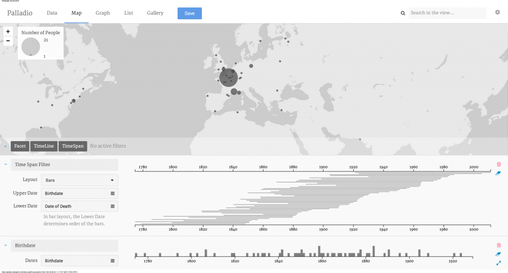

**Fig. 3-1** Mark Braude, *Interface de Palladio*, capture d'écran publiée dans Braude, Mark Braude, "Palladio: Humanities thinking about data visualization", entrée de blogue, 2014.
https://hestia.open.ac.uk/palladio-humanities-thinking-about-data-visualization/ CC-BY 2.0 

#### Les SIG

La seconde catégorie concerne des outils spécialisés pour la cartographie numérique, il s'agit des systèmes d'information géographique (SIG). Ces logiciels complexes et puissants, tel que [QGIS](qgis.org) et [ArcGIS](https://www.arcgis.com/index.html), doivent être installés sur l'ordinateur des chercheur·se·s. Ils requièrent un apprentissage spécialisé en cartographie numérique mais présentent un vaste attirail d'outil pour spécifier chaque aspect technique et visuel de la carte[^3]. Remontant aux années 1960, les SIG ont d'abord été crées pour une utilisation interne au logiciel qui permet des exports de cartes statiques (png ou pdf). Il existe désormais des extensions qui permettent certaines formes de publications interactives sur le web. Excepté pour QGIS, qui est un logiciel libre, il faut également prendre en compte le coût très élevé pour l'emploi de ces logiciels. 

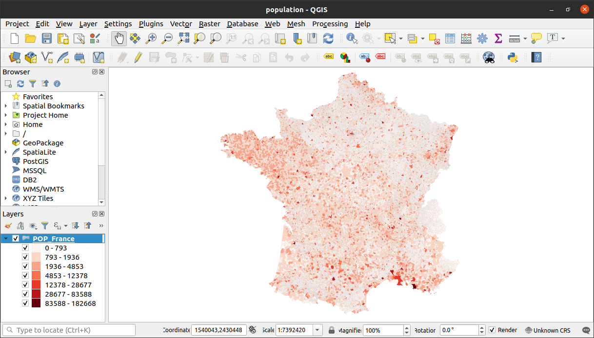

**Fig. 3-2** Lena Krause, *Carte figurant la densité par commune de la population française en 1831*, avec les données de Thomas Thevenin, capture d'écran dans QGIS, 2021.

Une fois que l'on saisit le fonctionnement des SIGs, c'est un outil efficace et utile dans le quotidien de la recherche, notamment pour explorer et cartographier des données géolocalisées. Nous avons par exemple employé QGIS pour visualiser les données du recensement des communes françaises de 1831 qui nous ont été transmises par Thomas Thevenin par exemple ([fig. 3-2](#fig3-2)). 

#### Les librairies de code

La dernière catégorie d'outils que nous souhaitons évoquer concerne les bibliothèques de code informatique, telles que Leaflet.js et D3.js. Leur emploi requiert des connaissances en programmation. Une librairie de code est un recueil de code auquel on peut faire appel pour utiliser des fonctionnalités prédéfinies. Leaflet.js, par exemple, est conçue pour faciliter la création de cartes interactives. Nous en avons testé la fonctionnalité qui permet de créer une carte thermine ([fig. 3-3](#fig3-3)), nous y reviendrons dans la sous-partie sur la cartographie 3.2.1.

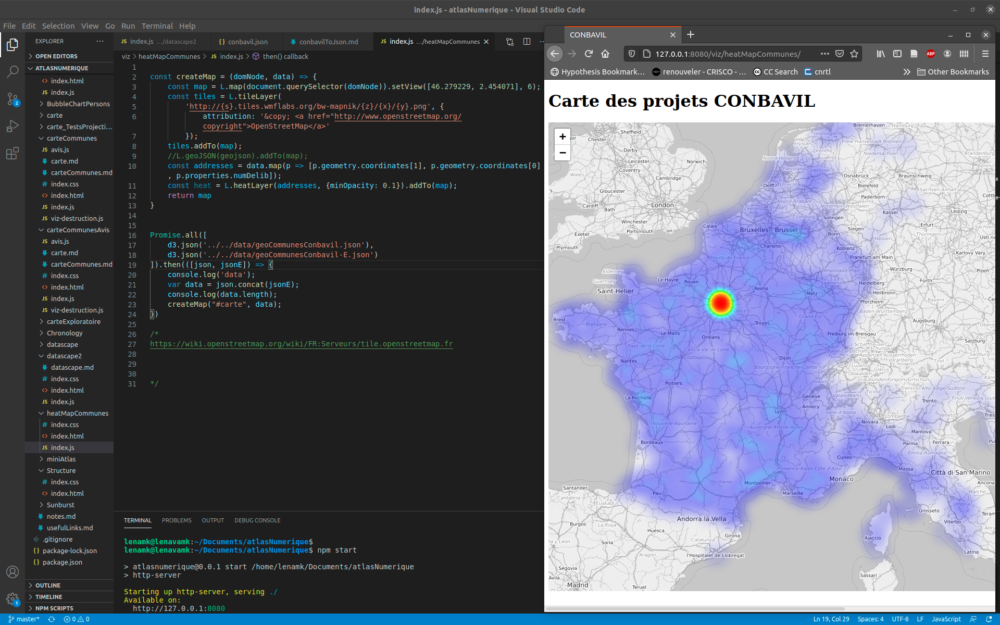

**Fig. 3-3** Lena Krause, *Code Leaflet.js et carte thermique des projets CONBAVIL*, capture d'écran de l'environnement de code et de la carte produite, 2021.

La librairie D3.js se spécialise quant à elle dans la production de *Data-Diven Documents*[^4] (Bostock, 2019a). Initialement parue en 2011, cette librairie permet la manipulation de documents *based on data* (Bostock et al. 2011). Ces graphiques sont pensés et conçus pour le web. Les données sont converties en cartes ou en diagrammes directement dans le navigateur. Nous avons, par exemple, préparé la liste des communes dans CONBAVIL, dont voici un extrait: 

> ```json
> {
>     "properties": {
>       "commune": "Marseille",
>       "numDepartement": "13",
>       "numCommune": "13055",
>       "numDelib": 210
>     },
>     "geometry": {
>       "type": "Point",
>       "coordinates": [5.419240990190953, 43.29248952546808]      ]
>     }
>  } //(extrait, lignes 92 à 106, du fichier geoCommunesConbavil.json produit par l'autrice avec l'assistance de Paué Girard et Arnaud Pichon au Médialab, 2019)
> ```

Chaque commune est un objet avec des propriétés, comme son nom, ses numéros de département et de communes. Nous avons également calculé le nombre de délibérations qui concernent ce lieu (*numDelib*). Par Marseille, il s'agit de 210 délibérations. S'ajoutent à ces informations pour géolocaliser l'objet: les coordonnées de Marseille. À l'échelle à laquelle nous travaillons, le point central suffit. 

Pour créer une visualisation, D3.js parcourt ces données et effectue une opération graphique pour chaque objet. Cela se traduit en instructions, telles que "pour chaque objet, placer un point [rouge] selon ses coordonnées [*x, y*] et définir la taille du point selon sa propriété *numDelib*". On peut également définir les interactions, comme "lorsque la souris passe par dessus le point, afficher le nom de la commune (*Marseille*)". 

Chaque graphique D3.js requiert donc, en amont, des données ordonnées selon ce qu'on veut figurer. Il faut donc structurer ses données et les préparer à l'échelle du graphique à réaliser: barre d'un diagramme, points qui tracent une courbe, surface ou point sur une carte, etc. ([fig. 3-4](#fig3-4)). 

<div>
 <iframe width="100%" height="700" frameborder="0" alt="Mike Bostock, (Galerie d'exemples de visualisations avec D3.js)[https://observablehq.com/@d3/gallery], ObservableHQ, 2020" src="https://observablehq.com/embed/@d3/gallery?cell=*" id="fig3-4" >&nbsp;</iframe>
</div>

**Fig. 3-4** Mike Bostock, Galerie d'exemples de visualisations avec D3.js, ObservableHQ, 2020
iframe https://observablehq.com/@d3/gallery

Nous avons établis plusieurs critères pour sélectionner un outil de visualisation et de cartographie pour CONBAVIL. Nous souhaitions, dès le départ, explorer une pluralité de formes visuelles, de la cartographie aux différentes formes de graphiques et de diagrammes. Nous devons également privilégier un outil qui nous permette de rester proche des données, puisque l'enjeu final relève de la création d'un espace de recherche pour les données de CONBAVIL. Finalement, l'accès web et interactif à ces visualisations s'avère être la solution au potentiel le plus riche. C'est pourquoi nous avons choisi de travailler avec la librairie d3.js, conçue pour le web et qui offre la plus grande flexibilité et variété dans les formes de visualisation de données ainsi que dans les interactions possibles.<!-- @ec lien vers la page des types de visualisations offerts --------- @lmk je ne suis pas sûre de comprendre, n'est-il pas juste au-dessus, fig 3-4? -->

## 3.2 Pratiques de visualisation et de cartographie

Dès les premières recherches engagées dans le cadre de ce travail, il nous semblait essentiel de cartographier CONBAVIL à partir informations spatiales renseignées dans CONBAVIL. Nous avons beaucoup expérimenté avant de parvenir à produire la carte que nous proposons, c'est pourquoi nous commençons par décrire le processus suivi, avant de présenter nos prototypes d’exploration visuelle des données de CONBAVIL. Ceux-ci prennent diverses formes diagrammatiques et chaque proposition présente une vue sur les données. La perspective change selon la caractéristique mise de l’avant par le graphique : la géolocalisation pour la carte, la date de discussion de l’affaire pour la chronologie et le type architectural pour la classification hiérarchique rayonnante. Nous effectuons ensuite un retour critique sur ces visualisations, une étape importante avant d'en arriver la forme-atlas.

### 3.2.1 Premières expérimentations et questions d'échelle

Chaque délibération, c’est-à-dire chaque projet architectural évalué par le Conseil des bâtiments civils lors d'une de ses séances, contient dans sa description les noms de commune, de département et de région, ainsi que le numéro de département. Notre premier essai cartographique est inspiré des travaux de Georges Teyssot et Bernard Lepetit, qui analysaient leurs données à l’échelle des départements. Cela semblait évident pour procéder à une comparaison entre leur travail et les nouvelles données dont nous disposons avec CONBAVIL. 

Le fond de carte sélectionné est un découpage de la France en départements datant de 1831[^5]. Nous l'avons ensuite complétée de façon colorimétrique, exactement comme les autres cartes thématiques que nous avons vues, en indiquant la densité des projets ([fig. 3-5 légende](#fig3-5l)). Notre carte se distingue par son interactivité. On peut passer la souris au-dessus chaque département pour afficher le nombre exact de délibérations concernées. Le clic n’affiche pour le moment que le nom du département mais le chiffre associé apparaît dans la console du navigateur. Comme la carte est réalisée à partir des données de CONBAVIL, il serait aisé d'afficher toutes les délibérations concernées lors de la sélection d'un département ([fig. 3-5](#fig3-5)). 

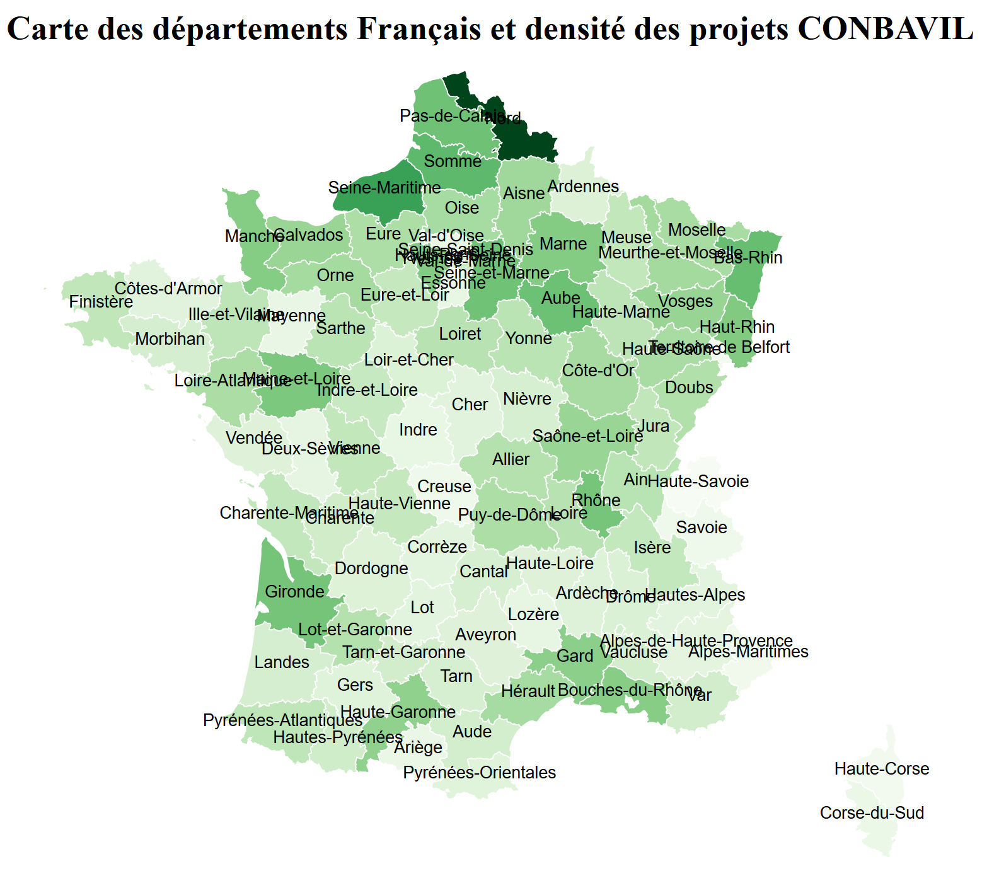


**Fig. 3-5 ** Lena Krause, *Carte des départements français et densité des projets CONBAVIL*, carte interactive réalisée sur ObservableHQ pendant le cours LLCU-498&698 "Digital Humanities Project" donné par Prof. Stéfan Sinclair, Version exportée pour sa diffusion dans notre atlas, iframe, 2018<!--atlas-2021 : ajouter légende dans l'atlas-->

<!--<div><iframe src="" title="Lena Krause, *[Carte des départements français et densité des projets Conbavil](https://www.public.archi/atlas-numerique/viz/carteCommunes/index.html)* (2019), Produite comme prototype dans le cadre du projet *Atlas numérique de l’architecture publique en France (1795-1840)*, Montréal : Université de Montréal " width="640" height="480" style="display:block; margin: 0 auto;">&nbsp;</iframe></div>-->

Malgré le succès de cette première entreprise de cartographie numérique, cette carte nous paraît quelque peu décevante du point de vue herméneutique. À cette échelle, la cartographie des données ne présente qu’un intérêt relatif. La densité de délibérations dans le département du Nord pose quelques questions, toutefois, on ne peut pas vraiment observer de tendance diachronique avec la spatialisation produite ici. Un·e chercheur·se qui travaillerait sur un département français pourrait immédiatement consulter les délibérations qui y sont associées. Outre la dimension visuelle de la requête, le résultat demeurerait cependant équivalent à une recherche par département effectuée dans l'interface de l'INHA. 

#### 30'000+ communes françaises

Nous avons donc choisi de poursuivre nos expérimentations à une plus petite échelle, celle des communes. Avec plus de 30 000 communes françaises, il est presque impensable d'envisager un projet de cartographie thématique sans l'assistance d'un outil informatique. Nous avons d'ailleurs fait l'erreur un peu naïve d'employer le même code pour cartographier les communes que celui pour les département. Ce code dessine le contour de chaque élément puis inscrit son nom en son centre. Comme fond de carte, nous avons employé des données sur les divisions administratives françaises disponibles en ligne[^6]. Le résultat ([fig. 3-6](#fig3-6)) produit un dense nuage de noms qui recouvrent le territoire et dont on entrevoit des extraits en zone liminaire. Pour visualiser le maillage des communes, nous l'avons ouvert avec QGIS ([fig. 3-7](#fig3-7)).

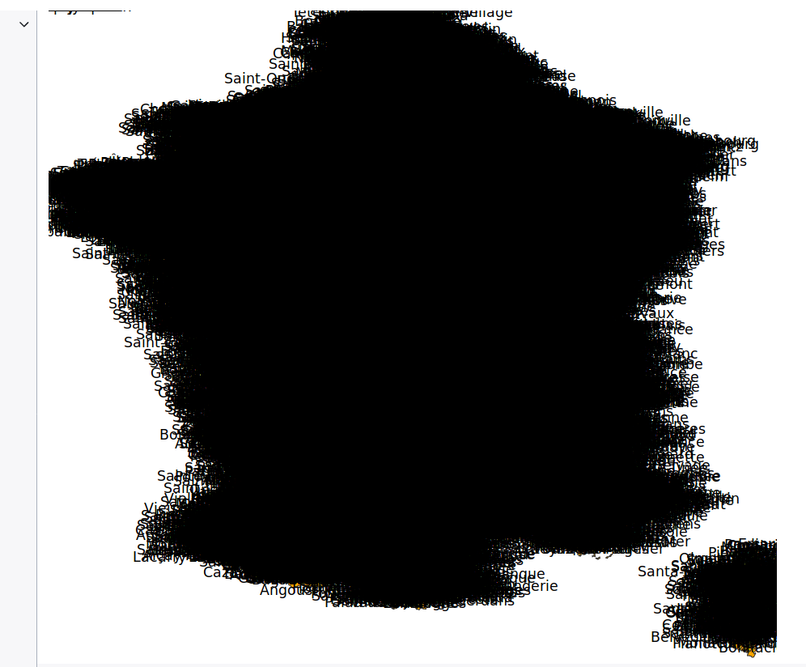

**Fig. 3-6** Lena Krause, *Carte des noms des communes françaises*, capture d'écran de la visualisation réalisée sur [ObservableHQ](https://observablehq.com/d/05c73472e7a61b64), 2021

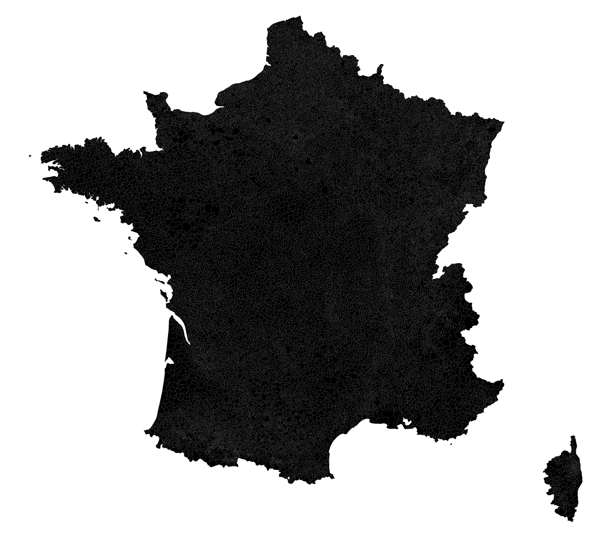

**Fig. 3-7** Lena Krause, *Carte des communes françaises*, capture d'écran de la carte réalisée avec QGIS, 2021

Ce ne sont toutefois pas les 30 000 apparaissent dans CONBAVIL, ainsi que nous l'avons expliqué dans le chapitre précédent ([2.3.2](http://lenamk.site/memoire/Redaction/Chapitre2#232-travail-des-donn%C3%A9es)), nous avons établi la liste des communes dans CONBAVIL, auxquelles nous avons ensuite associé une géolocalisation. Nous avons également décidé qu'en considérant les communes à l'échelle de la France, le centroïde serait une indication plus simple à gérer que la représentation de chaque aire[^7]. Sur la suggestion du Professeur Stéfan Sinclair, nous avons réalisé, avec son aide précieuse, notre première carte ([fig. 5](#fig3-5)) dans l'environnement de code en ligne [*ObservableHQ*](https://observablehq.com/about) . Ces "cahiers numériques" ou *notebooks* sont conçus pour faciliter l'apprentissage et l'emploi de la librairie D3.js, ainsi que pour permettre à tou·te·s de "penser avec des données (ObservableHQ <!-- comment citer: page about-->). Chaque chier est composé de cellules qui peuvent contenir du texte ou du code exécutable. La programmation est ainsi discrétisée en une série linéaire d'instructions pour en faciliter la compréhension et l'utilisation. C'est donc un environnement propice pour l'apprentissage. Nous avons cependant rapidement été contrainte de quitter cet environnement car les données de CONBAVIL qui sont très volumineuses sont lourdes à charger. De plus, pour des problèmes de droits, il n’était pas possible de les rendre accessibles publiquement en ligne, ce qui compliquait la tâche pour les utiliser dans Observable. 

#### Erreurs cartographiques

Nous avons donc commencé à coder nos visualisation nativement, en créant une page web classique composée de fichiers HTML, CSS et Javascript. Nous avons longuement réfléchi à la possibilité d'employer, en plus de d3.js pour la visualisation de données, une librairie de code comme React.js afin de bâtir une interface. Toutefois, le temps d'apprentissage nécessaire ainsi que l'ampleur du travail requis pour coder chaque visualisation nous ont dissuadé de le faire dans le cadre de ce mémoire. Un choix d’autant plus raisonnable que nous avons rencontré bien des complications dans la mise en œuvre de d3.js pour les visualisations, à commencer par un grand nombres de problèmes dans nos tentatives de cartographie numérique.

Nous avons eu la chance de commencer à coder nos visualisations lors d'un séjour de recherche au MédiaLab de SciencesPo Paris. Malgré l'immense aide de Paul Girard, Arnaud Pichon et l'ensemble de l'équipe tech, nous avons rencontré de nombreuses difficultés en cartographie numérique, comme le montrent les quelques exemples suivants que nous avons documentés (fig. 8 - 12). Ces erreurs cartographiques étaient notamment causées par des incohérences dans les fichiers de données géolocalisation et dans la sélection des bonnes projections cartographiques.


**Fig. 3-8** Lena Krause, *Erreur cartographique #1*, capture d'écran, 2019

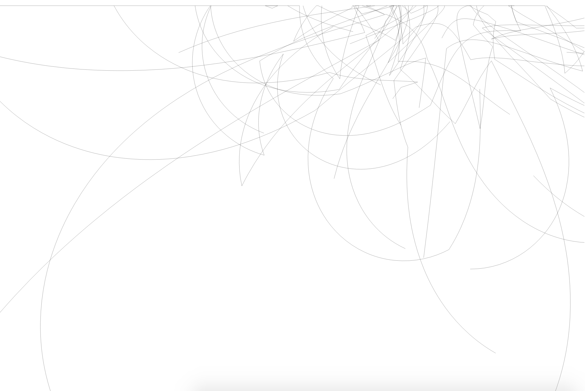

**Fig. 3-9** Lena Krause, *Erreur cartographique #2, capture d'écran, 2019

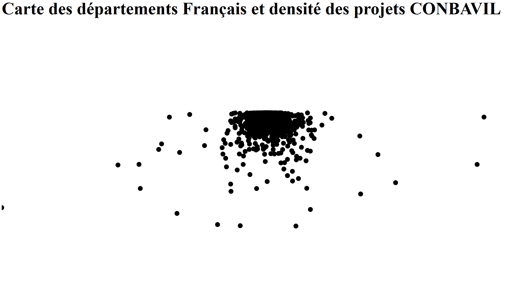

**Fig. 3-10** Lena Krause, *Erreur cartographique #3*, capture d'écran, 2019


**Fig. 3-11** Lena Krause, *Erreur cartographique #4*, capture d'écran, 2019

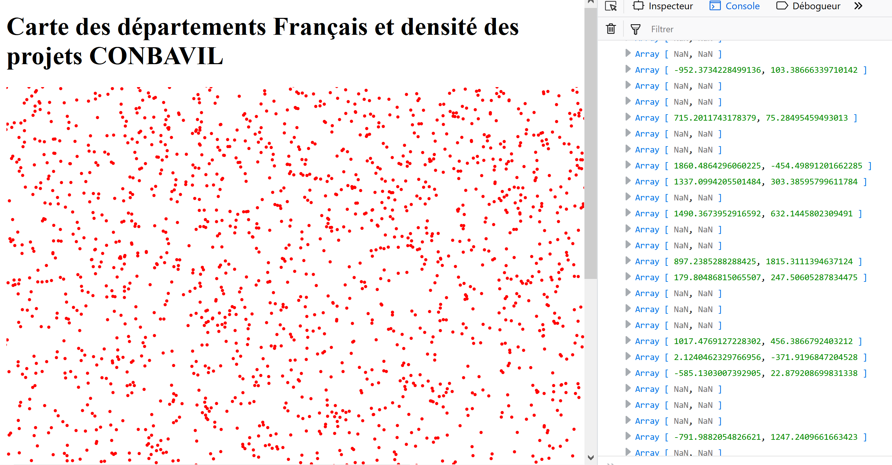

**Fig. 3-12** Lena Krause, *Erreur cartographique #5*, capture d'écran, 2019

Nous sommes finalement parvenue à un résultat correct dans l'encodage et la projection des données ([fig. 13](#fig3-13)). Cette carte, que nous avons espièglement surnommée « varicelle », place un point rouge sur chaque commune présente dans CONBAVIL. Nous avons réemployé le fond de carte de 1831, cette fois non pas comme réceptacle du contenu mais en guise de contenant, tel un guide visuel situe les communes. Si les délimitation des départements a souvent varié pendant l'époque concernée, en particulier sous l’Empire, nous ne disposons pas (encore) d’un fonds de carte vectorisé et géolocalisé qui restitue ces transformations à travers le temps. Si cela enrichirait considérablement la carte, nous sommes au moins satisfaite d'avoir un fond de carte d'époque. 

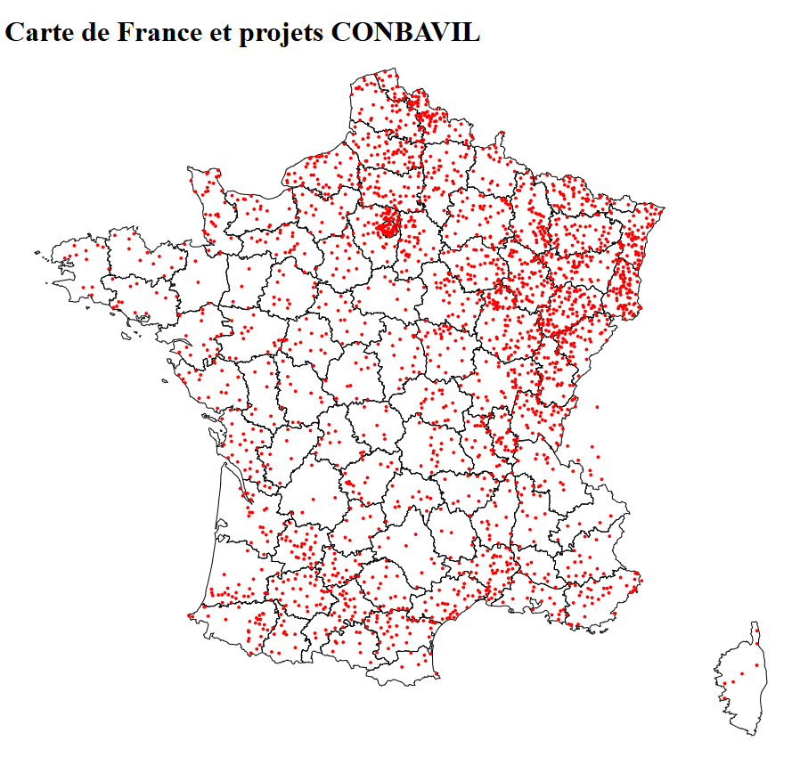

**Fig. 13** Lena Krause, *Carte varicelle CONBAVIL*, capture d'écran, 2019

#### Variables visuelles

Maintenant que chaque commune est figurée par un point, nous devons encore ajuster la taille des points en fonction du nombre de projets en ce lieu. La disproportion de délibérations à Paris a tout d'abord donné naissance à cette carte, dite « nez rouge » ([fig. 14)](#fig3-14). 

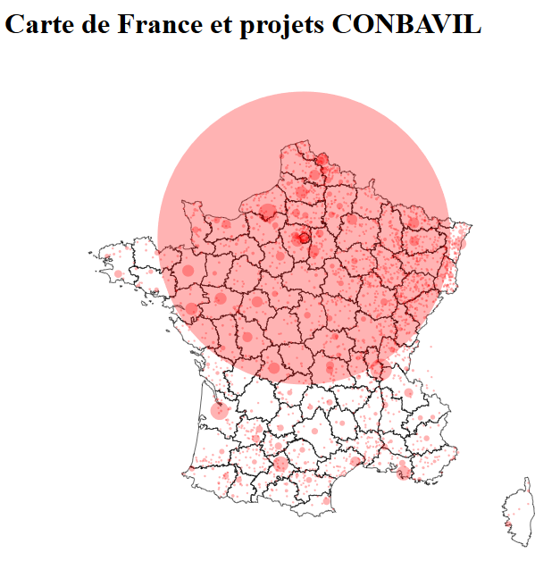

**Fig. 3-14** Lena Krause, *Carte nez rouge CONBAVIL*, capture d'écran, 2019

Nous avons essayé d'ajuster l'échelle, et l'excès dans l'ajustement a créé une autre carte « noyée » par ses contenus (fig. 15). Cette carte, illisible à première vue, possède toutefois un curieux potentiel herméneutique. En effet, cette carte interagit avec la position de la souris. On peut ainsi l'explorer en la survolant. Chaque cercle se révèle en changeant de couleur lorsqu'il est "actif", c'est-à-dire lorsque la souris passe dessus. Ainsi, tel un explorateur dans un grotte sombre, la souris fait office de lampe de poche qui révèle les contenus entremêlés. <!-- iframe de la carte exploratoire-->


**Fig. 3-15** Lena Krause, *Carte spéléologique de CONBAVIL*, capture d'écran, 2019

<!-- iframe de la carte exploratoire atlas-2021-->

Au cours de ce processus, nous avons également expérimenté avec d'autres librairies de code, comme leaflet.js. Cette librairie de cartographie interactive facilite grandement la tâche et permet « facilement » de créer des cartes.

#### Carte thermique

Entre deux échecs cartographiques, nous avons choisi de tester la fonctionnalité *heat map* ou carte thermique disponible dans la librairie[^8]. Le résultat donne une vue « empâtée » où l'on ne peut rien distinguer ni sélectionner. Nous avons essayé d'ajuster l'échelle, mais le rendu revenait à l'effet « nez rouge parisien » ([fig. 3-3](#fig3-5)) ou « beurrait épais » la surface de la France ([fig. 3-16](#fig3-16)). Malgré la simplicité du code, qui inclut un fond de carte géographique et une fonctionnalité de zoom, le manque d'interactivité avec les données nous a dissuadé de continuer l'emploi de cette librairie, certes pratique, mais un peu moins adaptée à nos préoccupations de recherche. <!-- add iframe-->


**Fig. 3-16** Lena Krause, *Carte thermique CONBAVIL*, capture d'écran, 2019

<!-- add iframe atlas-2021-->

### 3.2.2 Prototypes

Les prototypes suivants sont des visualisations plus abouties ou plus « finies »que les exemples précédents. Il demeure que de nombreux ajustements à ces cartes interactives sont encore souhaitables et ont d’ailleurs été imaginés, parfois même codés mais sans être tout à fait fonctionnels. Leur état a été restreint par des contraintes temporelles. Même si chaque visualisation pourrait encore évoluer, dans l’éventualité d’une opportunité de les retravailler, elles servent de premier modèle pour démontrer le potentiel de la visualisation interactive de données, notamment pour renouveler l'utilisation de CONBAVIL.

#### Carte

Notre prototype de carte figure chaque commune par un point dont la taille est proportionnelle aux nombre d’affaires la concernant ([fig. 3-17)](#git3-17). Cette fois, l'équilibre entre la taille des points se veut plus balancé, même si Paris demeure « écrasante ». L'échelle linéaire est calculée à partir de la racine carrée du nombre de délibérations, afin que la surface des cercles respecte le ratio plutôt que de l'augmenter exponentiellement lorsqu'il est transformé en aire. Le fond de carte situe les communes tout en restant dans une relative abstraction, ce qui favorise la lisibilité de la carte. Les limites départementales offrent un repère géographique tout en rappelant le contexte historique. 

<div>
 <iframe src="https://public.archi/atlas-2021/viz/carteCommunes/index.html" title="Lena Krause, *[Carte des départements français et densité des projets Conbavil](https://public.archi/atlas-2021/viz/carteCommunes/index.html)*, prototype de l'*Atlas numérique de l’architecture publique en France (1795-1840)*, iframe, 2019" alt="Fig. 3-17: https://www.public.archi/atlas-numerique/viz/carteCommunes/index.html" width="100%" height="700" frameborder="0" style="display:block; margin: 0 auto;" id="fig3-17">&nbsp;</iframe>
</div>

**Fig. 3-17** Lena Krause, *[Carte des départements français et densité des projets Conbavil](https://public.archi/atlas-2021/viz/carteCommunes/index.html)*, prototype de l'*Atlas numérique de l’architecture publique en France (1795-1840)*, iframe, 2019

Cette carte permet ainsi de mener, pour la première fois, une analyse visuelle, spatiale et quantitative des données de CONBAVIL. Une étude primaire révèle que son agencement est le reflet de la hiérarchie administrative française. Le plus grand nombre des affaires traitées par le Conseil se situent dans la capitale administrative du pays, Paris. Les projets majeurs sont regroupés dans les chefs-lieux des départements, tandis que les autres communes répertoriées font seulement l’objet de quelques délibérations, habituellement pour des affaires de moindre envergure. Ce constat fait écho à notre critique des cartes produites par Georges Teyssot et Gilbert Érouard. Cependant, l’interactivité de la carte lui confère un tout autre potentiel. L’utilisateur·rice peut sélectionner un ou plusieurs lieux et afficher les affaires concernées[^9]. La consultation interactive invite à explorer les projets en fonction de leur distribution spatiale. La carte n’est plus une fin en soi, mais devient un moyen de plonger dans les données et les affaires.

La prédominance des projets à Paris nécessiterait un changement d'échelle. Théoriquement parlant, on pourrait définir des représentations pour plusieurs échelles, par exemple:

1.  vue sur l'ensemble de la France métropolitaine et ses environs: offrir le choix entre la distribution par département ([fig. 3-5](#fig3-5)) ou ou par commune ([fig. 3-17](#fig3-17))
2. vue d'un département ou d'une région: distribution par commune
3. vue des grandes villes: distribution par arrondissement ou par adresse[^10]

Contrairement à la librairie Leaflet dont nous venons de voir exemple ([fig. 3-16](#fig3-16)), changer d'échelle cartographique avec le zoom n'est pas encore une fonctionnalité évidente dans D3.js. À cause de la complexité de leurs fonctionnements respectifs, nous n'avons pas cherché à croiser les librairie. Considérant que D3.js grandit exponentiellement et qu'il existe un grand nombre de contributeur·rice·s qui partagent leur code en ligne, notamment sur ObservableHQ, il se pourrait que la solution soit implémentable ou presque. Il serait également possible de lier plusieurs cartes d3.js, de façon à permettre des transitions d'une échelle à l'autre. 

#### Chronologie 

Le deuxième prototype cible les données temporelles. À partir du code proposé par Mike Bostock, créateur de la bibliothèque D3.js (2019b), nous avons généré une chronologie des séances du Conseil qui présente le nombre de projets évalués à chaque occurrence ([fig. 3-18](#fig3-18)). Ce graphique permet ainsi de rendre compte de la fréquence des séances du Conseil et de la quantité d’affaires traitées au fil du temps. Grâce à la fonction de zoom, l’utilisateur peut modifier l’axe chronologique et examiner de manière détaillée des intervalles temporels plus restreints. En dessous de cette visualisation, la légende, qui est elle-même un graphique, sert de repère. Elle situe la section visualisée et propose un autre moyen de parcourir la chronologie. 

<div>
 <iframe width="100%" height="600" frameborder="0" style="display:block; margin: 0 auto;" src="https://public.archi/atlas-2021/viz/chronologie/index.html" title="Lena Krause, [*Chronologie des séances du Conseil des bâtiments civils*](https://public.archi/atlas-2021/viz/chronologie/index.html), prototype de l'*Atlas numérique de l’architecture publique en France (1795-1840)*, iframe, 2019" alt="Fig. 3-18: https://www.public.archi/atlas-numerique/viz/chronologie/index.html" id="fig3-18">&nbsp;</iframe>
</div>

**Fig. 3-18** Lena Krause, [*Chronologie des séances du Conseil des bâtiments civils*](https://public.archi/atlas-2021/viz/chronologie/index.html), prototype de l'*Atlas numérique de l’architecture publique en France (1795-1840)*, iframe, 2019

Malgré tout l’intérêt qu’offre ces manipulations, l’illusion de continuité que cette figure pourrait donner à l’utilisateur constitue, à notre avis, un problème important. En effet, le graphique génère une courbe qui relie les événements entre eux. C’est la raison pour laquelle nous avons choisi une courbe en escalier[^11], qui crée des paliers entre chaque élément, pour essayer de discrétiser l’information, c’est-à-dire la séparer en des unités distinctes. Le problème persiste néanmoins en partie, car il n’est pas possible de distinguer les séances consécutives ayant le même nombre de délibérations. En outre, on ne peut pas visualiser les interruptions dans les sources : par exemple, il n’y a pas de séance saisie dans la base de données entre le 8 octobre 1833 et le 3 janvier 1834, mais la ligne continue suggère un nombre stable de délibérations pendant toute la période ([fig. 3-19](#fig3-19)).


**Fig. 3-19** Lena Krause, *Chronologie des séances du Conseil des bâtiments civils* (détail), capture d'écran du prototype de l'*Atlas numérique de l’architecture publique en France (1795-1840)*, 2019

Pour obvier à ces inconvénients, nous avons conçu un diagramme en bâtons ([fig. 3-20](#fig3-20)). Dans cette visualisation, chaque barre représente une séance et sa hauteur le nombre de délibérations. Le nombre est également figuré par la couleur pour faciliter la lecture dans le brouhaha visuel causé par le grand nombre d'éléments visualisés ([légende fig. 3-20](#fig3-20l)). La sélection d’une barre par un clic active l’affichage des délibérations concernées. Le repérage de la séance exacte à laquelle une affaire a été évaluée offre un contexte important, car le Conseil a parfois traité plus de cinquante dossiers au cours d’une même séance, tandis que d’autres sont consacrées exclusivement à l’étude d’un seul projet. Toutefois, cette visualisation présente encore un problème évident de lisibilité. 

<div>
 <iframe width="100%" height="600" frameborder="0" style="display:block; margin: 0 auto;" src="https://public.archi/atlas-2021/viz/barChart/" title="Lena Krause, [*Séances du Conseil des bâtiments civils*](https://public.archi/atlas-2021/viz/barChart/), prototype de l'*Atlas numérique de l’architecture publique en France (1795-1840)*, iframe, 2019" alt="Fig. 3-20: https://www.public.archi/atlas-numerique/viz/carteCommunes/index.html" id="fig3-20">&nbsp;</iframe>
</div>


**Fig. 3-20** Lena Krause, [*Séances du Conseil des bâtiments civils*](https://public.archi/atlas-2021/viz/barChart/), prototype de l'*Atlas numérique de l’architecture publique en France (1795-1840)*, iframe, 2019

Limitée par son affichage sur la largeur d’un écran d’ordinateur, il nous est impossible d’y faire apparaître de façon claire les quelques 4 000 séances du Conseil tenues entre 1795 et 1840. La fonction de zoom ne permet pas de changer d’échelle, uniquement d’élargir les dimensions de l’image. Malgré un travail rigoureux des couleurs, la lecture du graphique reste difficile. La solution idéale serait de parvenir à fusionner les deux graphiques en une seule visualisation, qui serait composée des barres et d’un axe chronologique interactif. Il serait également bénéfique d’ajouter quelques grands repères mettant en relation les activités du Conseil avec leur contexte historique, mais seule une connaissance fine des dynamiques politiques et administratives de l’époque permettrait des interprétations concluantes. 

Consulter cette visualisation soulève plusieurs questions, tout d'abord pour savoir ce qu'on peut, ou non, déduire des fluctuations de l'activité du conseil. Les séances sont parfois consacrées à une seule affaires, le nombre varie cependant beaucoup, allant régulièrement jusqu'à vingt affaires et avec un pic de 49 délibérations la séance du 29 juin 1818. Quel est le contrôle effectif du conseil, le nombre de membres augmente-il au fur et à mesure de l'accroissement des affaires? La charge de travail du conseil nous renseigne sur le contexte dans lequel chaque délibération a lieu. Cette information se retrouve dans les procès-verbaux, dans lesquels on parcourt le contenu de la séance jusqu'à trouver l'affaire qui nous concerne. On sait donc si la délibération a occupé toute la séance ou si elle s'insère parmi un grand nombre d'affaires examinées. Toutefois, cet élément de contexte est perdu dans la version en ligne de la base de données. Cette chronologie permet le de restituer tout en offrant un nouveau regard sur les archives.

Pour affiner le questionnement, l'envie émerge de faire varier les paramètres et ainsi tester des hypothèses. Quel serait l'impact si on distingue Paris des provinces? L'effet "nez rouge", précédemment identifié sur la carte, doit avoir un impact majeur sur les séances, d'autant plus qu'en tant que capitale, les travaux de Paris sont sous une surveillance plus étroite de la part du Ministère de l'Intérieur et donc du Conseil des bâtiments civils. Un option de filtre sur les données permettrait l'étude en temps réel de ces questions. Nous pourrions également filtrer par type d'affaire, afin de distinguer les affaires architecturales des plans d'alignement et des mémoires d'ouvrages qui, une fois de plus, concernent la ville de Paris. La visualisation nous apporte de nouvelles connaissances sur les données mais donne également naissance à de nouvelles questions. Ce caractère multidimensionnel nous amène à penser sous quels autres angles nous pourrions aborder les données. 

#### Typologie

Finalement, nous avons puisé dans les informations d’ordre typologique compilées dans CONBAVIL. Les chercheur·se·s chargé·e·s du dépouillement de ces données ont catégorisé les affaires évaluées par le Conseil selon leur type architectural, en se référant au *Thésaurus de la désignation des œuvres architecturales et des espaces aménagés* (Vergain, 2015)[^12]. Ce dernier classe les productions architecturales selon une typologie allant jusqu’à huit niveaux de détail. Par exemple, dans la catégorie « génie civil » figure la sous-catégorie « ouvrage d’art », qui elle-même contient « pont », « égout » ou « quai ». Ce système arborescent peut judicieusement être visualisé dans la version interactive du graphique circulaire à plusieurs niveaux, ou *Sunburst* (Bostock, 2018a), que nous avons élaboré ([fig. 3-21](#3-21)). Chaque niveau est composé de catégories dont la largeur figure les proportions respectives. Étant limité à deux niveaux apparents, le diagramme maintient une grande lisibilité tout en donnant accès à un contenu plus détaillé par la voie de l’interactivité (Bostock, 2018b). Cette visualisation des données de CONBAVIL fournit ainsi une représentation visuelle du *Thésaurus*, qui, jusqu’à présent, ne pouvait être parcouru qu’en suivant une structure hiérarchique d’hyperliens.

<div>
 <iframe width="100%" height="960" frameborder="0" style="display:block; margin: 0 auto;" src="https://public.archi/atlas-2021/viz/sunburst/" title="Lena Krause, [*Répartition des projets CONBAVIL par type architectural*](https://public.archi/atlas-2021/viz/sunburst/), prototype de l'*Atlas numérique de l’architecture publique en France (1795-1840)*, iframe, 2019" alt="Fig. 3-21: http://atlas.lenamk.site/viz/sunburst/" id="fig3-21">&nbsp;</iframe>
</div>

**Fig. 3-21** Lena Krause, [*Répartition des projets CONBAVIL par type architectural*](https://public.archi/atlas-2021/viz/sunburst/), prototype de l'*Atlas numérique de l’architecture publique en France (1795-1840)*, iframe, 2019

Notre soleil interactif CONBAVIL présente donc une visualisation du contenu de la base de données par type architectural. Le fait de cliquer sur une catégorie permet de faire apparaître le niveau de profondeur suivant et le retour en arrière s’effectue en cliquant au centre du graphique. En glissant le curseur sur une catégorie, on peut faire apparaître le nombre de délibérations qui y sont associées. Rapidement, on constate que plus de la moitié des délibérations sont contenues dans trois catégories principales : « urbanisme », « architecture religieuse » et « architecture judiciaire, pénitentiaire ou de police ». La section « urbanisme » contient toutes les délibérations liées aux plans d’alignement des villes, car le Conseil était également responsable de l’ouverture des rues pour l’assainissement et l’embellissement des espaces publics (Château-Dutier 2016: T1,151-179). La prépondérance de l’architecture religieuse s’explique quant à elle par le grand nombre de réaffectations de bâtiments nationaux en écoles, préfectures et tribunaux, notamment (Woolf 1987: 30-31).

### 3.2.3 Observations critiques

Ces prototypes invitent à une toute nouvelle forme d'exploration des données CONBAVIL. Ils présentent des sortes de vues distantes (Moretti 2008) sur les données, même s'il faut revenir à la notion de « figuration » pour préciser la nature de ces vues. En effet, la carte comme le soleil sont des graphiques cumulatifs, ce qui signifie que certaines délibérations y figurent plusieurs fois si elles sont associées à plusieurs lieux ou types architecturaux. Cette décision provient, entre autres, d’une incertitude dans les données, qui ne signalent pas de hiérarchie en cas d’attribution multiple. Ce ne sont donc pas des vues distantes « neutres », où chaque donnée est représentée une seule fois, mais bien une figuration centrée sur des caractéristiques des données. Il faut donc employer certaines précautions avant d'émettre des analyses d'ensemble sur leurs contenus. Cependant, l'enjeu étant de créer des visualisations exploratoires, il nous a semblé pertinent d’offrir le plus grand nombre de points d’entrée possibles menant à la découverte des données qui y sont contenues.

Il faut également garder à l’esprit que la carte, par exemple, ne représente pas le phénomène bâtisseur, mais reflète plutôt les délibérations du Conseil. La taille des points dépend donc du nombre de mentions lors des séances et non de la quantité de chantiers ouverts. Vice-versa, nous devons également souligner la présence de silences dans nos visualisations. La carte se limite au territoire avoisinant la France métropolitaine. Certains points plus éloignés, comme Tanger au Maroc, sont à peine visible. Il faudrait consciemment le chercher pour le trouver. De plus, les délibérations concernant l'Outre-mer sont introuvables. Il faudrait, par exemple, effectuer un montage cartographique pour placer les départements d'outre-mer. De même, il manque les affaires administratives et les délibérations qui ne sont pas associées à un lieu. Nous avions pensé créer une petite île, un territoire symbolique, pour visualiser les affaires sans lieux. Ces ajouts permettraient de présenter une géographie plus complète de CONBAVIL. 

Nous n’avons identifiés que trois délibérations « lointaines ». Elles concernent une même affaire située sur l'Île de la Réunion : la construction d'une prison pour les condamnés politiques. Nous « paraphrasons » les données ci-dessous[^13], car en sus de leur absence de notre carte, elles sont un exemple intéressant d'un programme architectural très particulier. Nous souhaitons rendre visible, et non effacer, ces contenus spécifiques qui se distinguent par une diversité, par exemple, géographique. Pour ce faire, il faudra procéder à d'autres itération de prototypage, afin de progressivement trouver des solutions, qu'elles soient de l'ordre visuel ou technique, pour inclure d'avantage de délibérations, jusqu'à figurer toutes celles qui seraient jugées « pertinentes », dans nos visualisations. 

> [conbavil14195](https://www.inha.fr/conbavil/notice.php?pv=14195) --> 1837-01-03, *Prison pour les condamnés politiques*, Ilse Bourbon, La Réunion. Adoption avec Réserve, Caristie. Report: manquent programme, devis descriptif et estimatif. Construction d'une prison
>
> *La nature de l'édifice et la situation géographique (climat) rendent le programme indispensable pour juger du projet. Le jugement rendu sera conjectural. L'absence d'enceinte et d'un chemin de ronde, indispensables en métropole, ne s'imposent peut-être pas. L'élévation des bâtiments sur 3 niveaux n'est pas souhaitable (discipline). Le toit devrait être très saillant (ombre). Une seule salle pour réfectoire et ateliers paraît insuffisante.*
>
> [conbavil01540](https://www.inha.fr/conbavil/notice.php?pv=01540) --> 1837-01-27, Salazie, Ile Bourbon, La Rénion. Adoption, Caristie, en présence d'un ingénieur en chef anonyme et de Claude Du Campe de Rosamel (Ministre de la Marine). Rivière Le Mât. Construction d'un bagne/caserne
>
> *A la demande du ministre de la Marine, et en l'absence de l'auteur, le rapporteur chargé de corriger le projet. Présente plusieurs variantes:- choix du site: 1 cirque naturel dans le quartier de Salazie, 'la hute du petit diable' au bord de la rivière du Mât.- prison séparée de la caserne, bâtiment d'1 niveau sur rez-de-chaussée, chambres individuelles ou jumelées, plus spacieuses que dans le 1° projet (cube d'air nécessaire dans ce climat chaud); ateliers multiples pour 'offrir aux détenus les moyens de trouver dans le travail 1 adoucissement à l'ennui de leur captivité'.*
>
> [conbavil13612](https://www.inha.fr/conbavil/notice.php?pv=13612) --> 1837-08-28, Isle Bourbon, La Réunion. Adoption, Caristie, réclamation 3500F pour la construction d'une prison 

Johanna Drucker distingue les représentations statiques qui référencent ou visualisent une information connue, et ce qu’elle appelle des « générateurs de connaissances » (*knowledge generators*). Ces derniers sont dynamiques et créent des ouvertures dans leur utilisation qui possèdent le potentiel de créer de nouveaux savoir (Drucker 2013: 65). Giorgio Caviglia avec son projet *Mapping the Republic of Letters* (2014), suggère de ne pas considérer les visualisations 

> comme des fins en soi, destinées à présenter de façon attrayante les résultats d’une recherche ou même à être analysées en tant que telles ; mais plutôt comme une matière pour l’élaboration intellectuelle – mouvante et incarnée dans divers modes d’inscription, mobilisant dans un même temps les nouveaux outils et des séquences de pratiques et des protocoles de travail existants. Les images produites ne sont ainsi pas uniquement conçues comme des outils d’interprétation, mais aussi de tri, de paramétrage, voire même d’enrichissement et de transformation des données … (De Mourat 2014: n.p.)

## 3.3 Éditorialisation d'un atlas numérique

Pour atteindre ce degré épistémologique, nos visualisations doivent reliées et rassemblées. C'est par leur mise en relation des visualisations qu'elles formeront une interface qui travaille l'interprétation "mais aussi [le] tri, [le] paramétrage, voire même [l]'enrichissement et [la] transformation des données" (De Mourat 2014: n.p.). 

Nous allons donc explorer comment fonctionnement de la librairie D3.js permet de coder une mécanique interactive entre nos visualisations. 

Nous verrons ensuite... 

[refaire numéros figures]

### 3.3.1 Mécanique interactive entre visualisations

Comme nous l'avons expliqué précédemment (3.1.3), les visualisations créées avec D3.js se construisent par rapport aux données qui les "drive" (data-driven documents). Chaque visualisation figure des données (*data*) en fonction de ses propriétés, par exemple *y* une localisation et *x* le nombre de délibérations qui y sont associées. Dans le code de la carte, l'énoncé fonctionne de la façon suivante: 

> Pour chaque *d* dans *data* --> pour chaque point sur la carte
>
> - calculer *x* //calculer le ratio entre le nombre de délibérations et l'échelle de représentation
> - afficher *y* avec un point de taille *x* //afficher le point de la bonne taille
> - ...

Grâce à cette série d'instructions, un utilisateur peut changer le contenu de *data* et la visualisation se mettra à jour pour figurer le contenu de *data*. La meilleure façon de comprendre ce fonctionnement revient à le tester. Voici donc deux exemples de mise à jour en temps réel des données dans des visualisations. 

#### Types d'affaires: construire ou réparer?

Nous avons créé cette visualisation en réponse à la question posée par Françoise Boudon et Werner Szambien concernant le pourcentage des dossiers de construction et de réparation présentés au conseil pendant dix ans (q5 de la liste présentée dans le chapitre 2). Pour calculer un pourcentage des dossiers de constructions et de réparation pendant dix ans, nous travaillons avec la propriété qui désigne le type d'intervention.  Contrairement aux types architecturaux, ces interventions sont catégorisées par les chercheur·se·s du Centre André-Chastel mais elle ne sont pas normalisées en une hiérarchie ou un vocabulaire prédéfini. Il y en a donc un très grand nombre, dont par exemple : "travaux, construction, nouvelle affectation, réparation, transformation, entretien, transport, agrandissement, reconstruction, ouverture de rue, aménagement de place, aménagement de quai, pavage, démolition, ... ". Puisque nous avons conçu cette visualisation comme exercice en réponse à la question de Françoise Boudon et Werner Szambien, nous avons réparti les données de CONBAVIL en trois types d'intervention: "construction", "réparation" et "autre".

L'intervalle de temps n'étant pas déterminé de façon spécifique, nous avons pris le parti d'expérimenter et de créer une visualisation où l'utilisateur·rice sélectionne l'intervalle de son choix, grâce à une petite chronologie interactive. La chronologie prend la forme d'une simple ligne du temps qui s'échelonne de 1795 à 1840. Les délimitation de la sélection temporelle sont figurées par deux curseurs, Déplacer les curseurs modifier la sélection, la partie bleue de la chronologie, également indiquée par la fourchette d'années, dont la valeur par défaut est "1805 - 1815". 

La visualisation en camembert figure, en temps réel, la répartition entre les trois types d'intervention parmi les délibérations de cette période (fig . XXXX). Grâce au fonctionnement "animé" par les données de d3.js, la modification de la chronologie entraîne la mise à jour du graphique, qui recalcule à chaque fois le nombre de délibérations par type, puis le pourcentage que cela représente pour le figurer à l'écran.

<div>
 <iframe src="https://www.public.archi/atlas-2021/viz/BoudonSzambien/index.html#slider" title="Lena Krause, [*Exemple d’interactivité entre deux visualisations : carte et avis du Conseil*](https://public.archi/atlas-2021/viz/carteAvis/index.html) (2019), Produite comme prototype dans le cadre du projet *Atlas numérique de l’architecture publique en France (1795-1840)*, Montréal : Université de Montréal " height="550" id="fig3-27">&nsbp;</iframe>
</div> 

Fig ....

L'interactivité du graphique invite à étudier l'évolution d'un phénomène à travers le temps. Nous avons comparé plusieurs fourchettes de dix ans pour formuler une réponse à la question de recherche. La première, de 1795 à 1805, représente la première décennie du Conseil des bâtiments civils. Le premier Empire se forme en 1804, mais pour garder le format en décade, la deuxième fourchette s'étend de 1805 à 1815. Ensuite, 1815 à 1825 et 1830 à 1840 réfèrent aux dix premières années de la Restauration et de la Monarchie, respectivement. Nous avons rassemblé nos résultats dans le tableau suivant (fig.XXX), particulièrement pour éclairer pour les lecteur·rice·s de la version papier de cet atlas[^34]. 

|              | 1795-1805 (2570) | 1805-1815 (5252) | 1815-1825 (9858) | 1830-1840 (5316) |
| ------------ | ---------------- | ---------------- | ---------------- | ---------------- |
| Construction | 5% (122)         | 18% (966)        | 18% (1767)       | 23% (1234)       |
| Réparation   | 12% (315)        | 10% (472)        | 10% (943)        | 4% (220)         |
| Autre        | 83% (2133)       | 72% (3814)       | 72% (7148)       | 73% (3862)       |

Fig.... 

Vu ainsi, nous pouvons constater une augmentation du pourcentage de construction et une réduction du nombre de réparations. Cette classification en trois catégorie s'avère toutefois être une simplification excessive et on ne peut pas analyser ces résultats de cette visualisation face à la quantité de délibérations classées dans "autre". Il serait possible de répartir les données selon les types d'interventions qui sont fréquemment utilisés dans la base puis de rassembler les varias dans "autre". L'idéal serait de produire une typologie normée des types d'intervention, doté par exemple d'une logique hiérarchique. Nous pourrions ainsi classer "entretien" comme une sous-catégorie de "réparation" et "nouvelle affectation" une sous-catégorie de "construction" et ainsi de suite.

#### Les avis du conseil: Paris vs provinces

Notre deuxième expérimentation avec les interactions entre plusieurs visualisations émanent des questions sur les "rapports Paris-Province" (Garric dans Boudon 2009: 5) ainsi que des hypothèses concernant la sévérité du Conseil envers les architectes et projets provinciaux (. 


concernant le rapport entre Paris et les province, particulièrement

Garric --> rapport Paris province

Pour le moment, ces liens dynamiques sont implémentés entre la carte et un graphique des avis du Conseil. Initialement, tous les lieux sont sélectionnés et le graphique figure l’ensemble des affaires. On peut ensuite modifier la sélection de lieux, ce qui entraîne un ajustement du graphique des avis. Et, inversement, la sélection d’un avis se reflète automatiquement sur la carte[12](http://revuecaptures.org/article-dune-publication/constellations-de-données-historiques#footnote12_ajhxl80). On peut ainsi observer de façon spatiale, grâce à ces liens, les dispositions du Conseil face aux projets soumis. Aussi, la dynamique entre les visualisations permet l’étude de phénomènes par la recherche des corrélations : par exemple, les membres du Conseil étaient réputés intransigeants avec les architectes de province jugés « peu capables » (Château-Dutier, 2016, T2: 591), allant jusqu’à corriger leurs projets à grands coups de crayon sur les plans fournis. Nous pouvons rechercher ce phénomène dans l’atlas, en modifiant la sélection des avis et des lieux, afin d’identifier d’éventuelles régions où le taux de refus ou de modification serait plus élevé.


Est-ce que le Conseil des bâtiments civils était vraiment plus défavorable aux projets à l'extérieur de la capitale? 

calcul de pourcentages: https://percentagecalculator.net/

précautions: une des dimensions de ce rapport à travers les avis du conseil 

- pas de plus sévérité qui se manifeste dans les provinces 
- au contraire, puisqu'il y a plus de refus dans les objets parsiens (importance des projets, montant des dépenses engagées)
- proportion supérieure des projets adoptés avec réserve (volonté de s'en remettre aux autorités locales pour trancher sur les problèmes dans le rapport)


|                         | Tout (26954)                                            | Tout sauf Paris (19543)            | Uniquement Paris (4756)          |
| ----------------------- | ------------------------------------------------------- | ---------------------------------- | -------------------------------- |
| Refus                   | 1103 --> un peu moins de 5%                             | 719  --> **3.5%**                  | 282  --> presque **6%**          |
| Ajournements            | 3927 --> ~15%                                           | 3099  --> 15%                      | 441--> près de 10%               |
| Adoption                | 12107  --> presque 45%                                  | 8942  --> 45%                      | 2084 --> près de 45% (43.8)      |
| Adoptions avec réserve  | 4461  --> 16%                                           | 3561  --> 18%                      | 489 --> poil + que 10%           |
| Sans avis               | 5550  --> juste au dessus de 20%                        | 3367 --> **17%**                   | 1476   --> **31%**               |
| *À propos du graphique* | *contient 27'178 valeurs dont 194 avis complémentaires* | *19688 (145 avis complémentaires)* | *4772 (16 avis complémentaires)* |


<div>
 <iframe src="https://public.archi/atlas-2021/viz/carteAvis/index.html" title="Lena Krause, [*Exemple d’interactivité entre deux visualisations : carte et avis du Conseil*](https://public.archi/atlas-2021/viz/carteAvis/index.html) (2019), Produite comme prototype dans le cadre du projet *Atlas numérique de l’architecture publique en France (1795-1840)*, Montréal : Université de Montréal " width="100%" height="700" frameborder="0" style="display:block; margin: 0 auto;" id="fig3-27">&nsbp;</iframe>
</div> 

**Fig. 3-XXX** Lena Krause, [*Exemple d’interactivité entre deux visualisations : carte et avis du Conseil*](https://public.archi/atlas-2021/viz/carteAvis/index.html), prototype de l'*Atlas numérique de l’architecture publique en France (1795-1840)*, iframe, 2019


### 3.3.2 Composition théorique

Pour bien saisir les enjeux entourant la conception d'un instrument de recherche, nous complétons notre analyse des formes d'utilisations actuelles de CONBAVIL (ch 2.2) en pensant à l'accès aux données avec la notion de *rich-propect browsing* (Ruecker et al. 2011: 3-4). L'assemblage des visualisations et des cartes évoque quant à lui l'atlas, dont il faut alors définir la forme dans l'espace numérique. Finalement, en ce qui cocnerne la manipulation des données, ainsi que d'éventuels enrichissements, transformations et réutilisations, nous mobilisons les questions éditoriales dans l'espace numérique et arrivons ainsi à l'éditorialisation de la base de données.

#### Interfaces

Au sein d'une réflexion sur les *Lieux de savoir*, Christian Jacob s'intéresse à l'instrumentation de la recherche (2013). Il questionne l'ergonomie des outils disponibles, notamment pour la manipulation de données et leur exploitation intellectuelle. Le défi identifié revient à développer des environnements logiciels au sein desquels on pourra expérimenter avec les données. Ceux-ci offriraient les moyens de varier la focale, de passer du local au global et inversement, mais aussi de passer d'une visualisation à l'autre. Il s'agit d' « élaborer des outils spécifiques et pointus, répondant à des logiques intellectuelles particulières, notamment le potentiel d'instruments de visualisation qui [...] permettraient de mettre à l'épreuve des hypothèses de travail en temps réel » ( Jacob 2013: cf lien ./1180). Ces réflexions résident au cœur de notre démarche pour la conception d'un instrument de recherche.

Les logiciels et outils numériques ont un fonctionnement dont les détails et la matérialité est, en quelque sorte, invisible. Lorsqu'un logiciel "roule" sur un ordinateur, les instructions codées qu'il continent s'enchaînent dans le *back-end*, en arrière plan. Ces instructions et étapes ne se révèle sur l'écran de l'ordinateur, l'interface ou le *front-end*, que si cela a été spécifiquement prédéfini. Le code définit le fonctionnement du logiciel, mais l'interface détermine ce que l'utilisateur voit. Forme de médiation entre les tâches et les comportements, l'interface "discipline, contraint et détermine ce qui peut être fait dans tout environnement numérique" (Drucker 2013: 139). Pour interagir un logiciel, on passe par les éléments de l'interfaces — boutons, objets cliquables, etc. On peut alors penser la structure d'une interface sous deux aspects. Le premier provient du milieu éditorial: la mise en page. La composition de l'interface, similaire à la page d'un livre, est un espace graphique à organiser et à structurer. L'emplacement et l'aspect visuel de ses composantes définit le cadre de sa consultation. La seconde analogie confère à l'interface une forme plus dynamique. La notion de "mise en scène", plus théâtrale, détermine les enchaînements et les transitions dans les informations affichées. On comprend ainsi que l'interface conditionne un environnement pour l'action (Drucker 2013: 139).

Les chercheur·se·s Stan Ruecker, Milena Redzikowska et Stéfan Sinclair ont théorisé le design d'interfaces visuelles pour le patrimoine culturel numérique. Il·elle·s analysent d'abord les formes classiques d'interfaces d'extraction ou de récupération (*retrieval interface*). Celles-ci, similaires à l'interface actuelle pour la recherche dans CONBAVIL, aident l'utilisateur·rice à effectuer des requêtes dans les données. L'interface présente une formulaire pour la sélection de données qui répondent à certains critères. La machine envoie les spécifications au *back-end* , qui renvoie les données correspondantes à montrer à l'utilisation dans l'interface. Ruecker, Redikowska et Sinclair démontrent les restrictions que pose ce type d'interface dans le potentiel de recherche dans les données. Dans de nombreux cas, l'utilisateur ne peut pas voir certaines informations utiles et disponibles concernant, par exemple, les liens entre les items: les regroupements possibles, d'éventuels séquençages ou motif s dessinés par leur mise en relation (Ruecker et al. 2011: 2). 

Cet article se poursuit toutefois avec la théorisation d'une forme d'interface « d'exploration riche en perspectives » ou *rich-prospect browsing*. Celle-ci serait dotée d'une série de principes conducteurs qui visualisent les possibilités, ou *affordances*, pour la recherche dans l'interface (Ruecker et al. 2011: 3-4). Ces principes incluent notamment l'affichage de grands formats ou d'une grande quantité de données structurées dans une logique perceptible par l'utilisateur·rice. L'interface doit également fournir un maximum d'information pour la navigation dans l'interface et situer l'utilisateur·rice dans son exploration des données. Telle une carte routière, l'utilisateur·rice peut se servir de ces informations pour savoir où il se trouve. Il visualise les parcours possibles et s'oriente dans son exploration des données.

Lors de la création de nos visualisation et dans la conception de notre interface, nous nous questionnons sur la possibilité de produire un instrument de recherche qui produirait une richesse et une diversité dans l'interprétation dans les données. Il s'agit de nourrir une tension ainsi qu'une continuité entre les possibilités de découvertes et d'interprétations. Serait-ce possible de créer une interface dont les affordances me nous mènent pas nécessairement où on avait prévu, mais dans des espaces où on savait qu’on pouvait aller? En proposant des nouvelles perspectives incongrues, on pourrait ainsi tomber sur une dimension pertinente de l’objet qui nous intéresse. 

#### La forme-atlas

Nous avons également été inspirée par le concept d' "atlas" pour penser notre instrument de recherche. Christian Jacob définit l’atlas géographique comme un « dispositif qui permet de concilier le tout et le détail. Il est régi par une logique cumulative et analytique, qui conduit de la vision globale aux images partielles » (1992: 97). La forme-atlas est associée à une variété de formes visuelles : cartes, mais aussi graphiques, chronologies, illustrations, et même des reproductions d'œuvres d'art. 

Au cours de nos recherches, nous avons découvert et consulté des atlas français du XIXe siècle. Détailler les évolutions de cette forme éditoriale serait un travail qui dépasse largement l'envergure de ce mémoire. Nous signalons plutôt quelques exemplaires pour montrer certaines caractéristiques que nous avons pu y observer. L'*Atlas de la République française* publié en 1802, est composé de 102 feuilles indiquant les départements, les arrondissements communaux, les justices de paix actuelles et les anciens cantons (fig. 3-22: 6971). Son rôle est défini dans le titre comme « servant à l'intelligence du Tableau Général de la nouvelle division de la France ». Avec un contenu plutôt « classique » pour un atlas, il présente une série de cartes des départements ainsi qu'une carte de France divisée en département. S'y adjoignent des tableaux des populations et la « nouvelle division en justices de paix, [qui] change entièrement celle des anciens cantons [et qu']il importe de connaître l'effet de cette division ».


**Fig. 3-22** Pierre Grégoire Chanalaire (1758-1817) et P.C. Herbin, *Atlas de la République Française composé de 102 feuilles indiquant les départements, les arrondissements communaux, les justices de paix actuelles, les anciens cantons...* 2 parties en 1 vol. in-4 obl. (XIII-114 p.) dont 1 atlas (cartes) ; in-4 oblong, Paris : Impr. de la République, 1802
https://catalogue.bnf.fr/ark:/12148/cb36279296k

La *Statistique générale et particulière de la France et de ses colonies, avec une nouvelle description topographique, physique, agricole, politique, industrielle et commerciale de cet état; etc.* Sept Volumes in-8°, avec une Collection de 19 Tableaux et 9 Grandes cartes enluminées, ...., continent un liste de cartes et de tableaux. Si les cartes se rapprochent des autres exemplaires précédents, les tableaux statistiques nous ont impressionnée par la quantité de chiffres qui y sont minutieusement rapportés, notamment dans le *Tableau général par ordre alphabétique de départemens, des naissances, mariages et décès qui on eu lieu en France pendant l'an IX* (fig. 3-24: 6991).

**Fig. 3-23** J.-B. Poirson et Tardieu l'aîné (graveur), *Tableau général par ordre alphabétique de départemens, des naissances, mariages et décès qui on eu lieu en France pendant l'an IX* dans Pierre-Étienne Herbin de Halle (1773-18..), Jean-Baptiste Poirson (1760-1831), *Statistique générale et particulière de la France et de ses colonies...*, 7 vol. in-8 ° et un atlas in-4 °, Paris : F. Buisson, 1803, p.53
https://catalogue.bnf.fr/ark:/12148/cb36280157f

À la fin du XIXe, ces grandes listes statistiques évoluent vers des formes visuelles et statistiques qui nous sont plus familières, comme dans l'*Atlas de statistique graphique de la ville de Paris...* publié entre 1889 et 1981 par Jacques Bertillon. 


**Fig. 3-24** Jacques Bertillon (1851-1922), *Vente en gros de la volaille et du gibier aux halles centrales*, dans Jacques Bertillon (1851-1922), *Atlas statistique graphique de la ville de Paris...*, 2 volumes, in-fol. (vol. 1) et in-4 (vol. 2), Paris: Service de la statistique municipale, 1889, folio 34.
https://gallica.bnf.fr/ark:/12148/btv1b52510505s/f34.item 


**Fig. 3-25** Jacques Bertillon (1851-1922), *Paris 1888. Octroi de Paris_ Produits par bureaux et par nature de recettes*, dans Jacques Bertillon (1851-1922), *Atlas statistique graphique de la ville de Paris...*, 2 volumes, in-fol. (vol. 1) et in-4 (vol. 2), Paris: Service de la statistique municipale, 1889, folio 37.
https://gallica.bnf.fr/ark:/12148/btv1b52510505s/f37.item 

Aujourd'hui, l'atlas se transforme encore, il se métamorphose sur le web et notamment lors de son emploi par des artistes ou par des historien·ne·s de l’art [^14]. Dans ce domaine, il peut devenir, selon Georges Didi-Huberman, une « forme visuelle du savoir » comportant « [un] paradigme *esthétique* de la forme visuelle, et [un] paradigme *épistémique* du savoir » (2011: 12). Cet outil crée des zones interstitielles, des intervalles heuristiques dans son ouverture inépuisables aux possibles. Sa réception est une activité non linéaire : on ne *lit* pas mais on *consulte* un atlas. Cette particularité, qui introduit le multiple, le divers et l'hybridité, autorise l’émergence d’une forme de « connaissance par l’imagination » grâce à « la puissance intrinsèque du *montage* qui consiste à découvrir […] des liens que l’observation directe est incapable de discerner » (Didi-Huberman 2017: 13). 

En tant que forme éditoriale, l'atlas répond donc aux critères d'instrument de recherche que nous souhaitons créer. Sous sa forme numérique, nous l'élaborons comme un dispositif dont on peut manipuler le contenu. Au-delà de liens entre les éléments, l'interactivité des visualisations comme de l'atlas réduit la tentation de faire d'en faire des preuves. La forme mouvante reflète la construction, *constructedness*, de l'image. Un arrêt sur image devient un choix conscient qu'il faut argumenter et que l'on peut critiquer. Cet atlas numérique expérimente donc avec une nouvelle forme d'épistémologie visuelle, spatiale et numérique.

#### Éditorialisation

Le travail envisagé est un acte éditorial, afin de une forme à l’objet en question : la base de données CONBAVIL. Nous définition l'acte de créer une nouvelle interface pour cette base de données sous la forme d’un atlas comme un processus de production et de structuration d'un espace numérique, c'est-à-dire de l'éditorialisation (Vitalit-Rosati 2016: 8). Cette démarche se caractérise par sa nature processuelle, expérimentale et surtout multiple (Vitali-Rosati, 2016: 68). Un atlas dont les cartes se transforment sous l'action de l'utilisateur produit de nouvelles formes d'autorités complexes à démêler. L'éditorialisation questionne également les formes d'autorité et les formes de productions du savoir dans l'espace numérique. Notre atlas est bâti à partir d'un grand nombre de contributions. Ce ne sont pas juste des sources ou des références, mais des contributions matérielles sur lesquelles se base l'instrument de recherche[^15]. À travers l'interactivité des cartes et de l'atlas, on peut questionner les rôles pour notamment se demander qui est-ce qui produit le savoir: où s'arrête la contribution de la personne qui a conçu l'atlas ou des producteur·rice·s des données, et où commence celle de la personne qui le consulte? La production de connaissance n'est pas associée à un·e auteur·rice, mais prend plutôt la forme d'une série de contributions (Vitali-Rosati 2016: 10).

La conception même d'un atlas et de chacune des visualisations a considérablement évolué avec l’apparition des logiciels et outils informatiques. D’après les historiennes Claire Lemercier et Claire Zalc, "il n’est plus question de publier chaque tableau ou graphique péniblement obtenu, mais plutôt de les utiliser pour avancer dans une recherche, quitte à n’en montrer au lecteur final que quelques-uns" (2008: n.p.). Comparativement aux grandes équipes de chercheur·se·s, ingénieur·e·s, informaticien·ne·s, cartographes et perforateur·rice·s de cartes, indispensables aux grandes enquêtes collectives menées dans les années 70, il est de nos jours possible de réduire le personnel, le temps, les connaissances et les coûts nécessaires à la création de cartes (Lemercier, 2008)[^16]. Cela favorise particulièrement l’expérimentation, tant avec les formes et les variables graphiques qu’avec les calculs et les statistiques privilégiés pour la cartographie thématique. Aussi, les nombreuses itérations possibles au cours du processus de production nous invitent à repenser chaque élément jusqu’à ce qu’il convienne aux besoins du projet.

La forme de ce mémoire nous présente également un aperçu des multiples formes de l'éditorialisation. Nous l'avons écrit en format *Markdown* (.md) plutôt que dans un éditeur de texte comme *Word* ou *LibreOffice*. Ces derniers sont issus de la logique de la machine à écrire: des pages sur lesquelles on appose un texte. La finalité de ce format est l'impression sur des feuilles de papier. En contrepartie, le *Markdown* se concentre d'abord sur le texte, qu'il s'agit de baliser avec des indicateurs pour déterminer le style de paragraphe (titre, sous-titre, paragraphe ou citation, par exemple) et le style de caractère (italique, sous-ligné, etc.). C'est uniquement à l'export que ce contenu s'adapte à la forme désirée, qu'elle soit numérique comme pour la publication comme une page web ou qu'elle mène à la production d'un PDF pour l'impression. Le contenu du mémoire a ainsi été pensé pour qu'il se déroule dans une continuité entre le texte, les images et les *iframes*. Un *iframe*, pour *inline frame*, s'insère dans la continuité du texte numérique. À la différence d'une image, il s'agit d'une "fenêtre" sur une autre page web. Son contenu se charge réellement, ce qui lui permet d'être interactif et donc exploré par l'utilisateur. 

Lorsque nous insérons un *iframe* d'une de nos visualisations dans le texte, cette visualisation prend une nouvelle forme et un nouveau sens. L'exploration des visualisation par un lecteur produit, à son tour, de nouvelles interprétations[^17]. À la différence d'une citation, les visualisations offrent un accès aux données qui peuvent ainsi être interrogées et explorées. L'argumentaire s'alterne entre le texte et les contenus interactifs dans ce mémoire pensé pour être lu et consulté en ligne. Si l'utilisation d'*iframes* présente des défis pour la publication scientifique[^18], elle offre surtout de riches perspectives sur de nouvelles façon de publier et de partager son travail. Ce mémoire contribue donc également aux expérimentations autour de nouveaux formats éditoriaux qui intègrent les données aux publications académique[^19].

### 3.3.3 Assemblage pratique

Concrètement, nos visualisations sont tout d'abord regroupées dans un même espace éditorial. Leur publication commune forme notre proposition actuelle pour un *Atlas numérique de l'architecture publique en France (1795 -1840)*, accessible à l'adresse URL suivante: https://www.public.archi/atlas-2021/. Cette adresse présente l'exemplaire de notre atlas associé à ce mémoire de maîtrise. Un exemplaire antérieur, publié en 2020, se trouve sur https://www.public.archi/atlas-numerique/. En tant que contenu dans l'espace numérique, l'atlas est associé à un *repository*, un dépôt mais aussi un référentiel du code informatique: https://github.com/imglab/atlasNumerique. 

#### L'atlas des données

Sous sa forme actuelle, notre atlas offre un accès aux visualisations que nous avons codées. Cependant, notre vision pour cet atlas va bien au-delà de ce que nous avons eu le temps de coder au cours de ce travail. Comme nous l'avons démontré, il est possible d'intégrer des liens dynamiques dans le code, de façon à relier les différentes composantes de l'atlas. Nous pouvons donc concevoir une interface qui rassemble les différentes perspectives sur les données, c'est-à-dire les visualisations, dans un même espace ([fig. 3.28](#fig3-28)). 


**Fig. 3-28** Lena Krause, *Modélisation de l’atlas*, prototype de l'*Atlas numérique de l’architecture publique en France (1795-1840)*, 2019

Puisque chaque graphique est initialement créé à partir du même jeu de données, nous pouvons mettre en place un système qui reproduit la sélection d’un sous-ensemble (d’un intervalle chronologique, d’un lieu ou d’une catégorie architecturale) dans les autres visualisations. Formellement, cela requiert deux ajouts techniques. 

D'une part, nous avons besoin d'un gestionnaire de données, dans le *back end*, qui serait comme le chef d'orchestre des différentes visualisations. Il dirigerait l'atlas pour que son contenu soit harmonisé. Nommons le Zeus, puisqu'il va régner sur l'ensemble de l'atlas et qu'il va avoir de nombreux enfants. Zeus dicte quelles données doivent figurer dans l'atlas. Omniscient, il peut contenir l'ensemble ou une sélection des données de CONBAVIL. En codant toutes les visualisations de façon à ce qu'elles soient des enfants de Zeus, elle peuvent se mettre à jour et s'harmoniser pour figurer la nouvelle valeur de Zeus. 

> Exemples de valeurs possibles pour Zeus: 
>
> - toutes les données de CONBAVIL
> - uniquement Paris
> - uniquement les affaires entre 1815 à 1830
> - uniquement les délibérations qui mentionnent la présence d'un ingénieur 
> - uniquement les prisons
> - n'importe quelle combinaison de critères sur les données

D'autre part, pour que les visualisations soient informées du changement de valeur de Zeus, il faut prévoir un système de communication entre les visualisations: un *event emitter*[^55]. Puisque c'est un messager, nous l'avons nommé Hermès. Prenons pour exemple, un changement de la sélection temporelle dans la chronologie. Alors qu'elle figurait initialement toutes les données de CONBAVIL, l'utilisateur zoome pour étudier de plus près l'intervalle de 1815 à 1830. La chronologie utilise Hermes pour alerter Zeus de son changement de valeur. Une fois Zeus "filtré" pour ne concerner que l'intervalle de 1815 à 1830, Hermes émet un message à l'ensemble des visualisations pour les informer qu'elles doivent se mettre à jour[^56]. La typologie et la carte ne figureront alors elles aussi que les types architecturaux et les communes dans CONBAVIL entre 1815 et 1830.

Ce système permet qu'une sélection de l'utilsateur·rice agisse comme un filtre sur les données. La sélection s'applique et se transfère sur toutes les autres visualisation. L'utilisateur·rice voit immédiatement l'effet de sélection, comme un phénomène qui se déroule sous l'action de sa souris. Il devient possible d'analyser les tendances typologiques dans une aire géographique particulière, et ce, à travers le temps. On révéleraitt ainsi, par exemple, certaines caractéristiques de l'engrenage de l'architecture publique en France. 

Offrant d’abord un aperçu global, l'atlas se transforme au fur et à mesure du parcours interactif en des perspectives de plus en plus détaillées, qui descendent en profondeur jusqu’à la consultation d’une seule affaire. Chaque action de l’utilisateur, guidée par ses hypothèses et par ses réflexions, façonne donc la constellation que forment les données dans l’atlas. La manipulation aide la chercheuse ou le chercheur à analyser le contenu de CONBAVIL et l’invite à émettre des hypothèses sur sa signification. Visualiser les relations entre les différentes couches de l'atlas et les manipuler produit des possibilités inédites pour la recherche.

#### Imaginaires d'un atlas numérique 

Implémenter Hermes et Zeus à l’échelle de l'atlas augmente de façon exponentielle le nombre de constellations de données que l’utilisateur peut découvrir. De l’association entre ces innombrables possibilités et l’imagination de l’utilisateur émerge un dispositif qui active « la puissance intrinsèque du *montage* » évoquée précédemment (Didi-Hubermann, 2011: 13). L’espace de l’atlas s’organise autour d’une structure éditoriale déterminée par son autrice, tout en se transformant en fonction de l’action de son utilisateur. Si la consultation d’un atlas papier est contrainte par les éléments structurels et les repères de l’ouvrage imprimé, les lecteur·rice·s sont libres de naviguer au sein de son contenu, de suivre la proposition des éditeur·rice·s ou de se laisser porter par la sérendipité de consulter l’atlas au hasard des pages. Et ces mêmes possibilités se présentent dans notre proposition d’atlas numérique : l’utilisateur est libre d’explorer le contenu à sa guise, malgré un cadre défini d’actions possibles dans l’interface. La sérendipité, quant à elle, est permise lors des déambulations du curseur dans l’interface, lors de la sélection aléatoire d’un sous-ensemble de données, ou encore lors de l’affichage à l’écran d’une constellation de données produite au hasard[^57].

Nous imaginons l'interface de notre atlas comme une grande table de montage, sur laquelle l'utilisateur place les vues qui l'intéressent. Stéphan Sinclair et Geoffrey Rockwell ont implémenté une grande partie de ces idées dans l'interface de lecture et d'analyse de textes numériques, [Voyant](https://voyant-tools.org/?corpus=austen) (2016). L'interface, également codée avec D3.js, présente une multiplicité de vues sur le texte pour lesquelles l'utilisateur ajuste les dimensions à l'écran en fonction de son intérêt de recherche (fig XXXX). On peut changer leur emplacement dans l'interface et paramétrer leur contenu. 

<div>
 <iframe src="https://voyant-tools.org/?corpus=austen" title="Lena Krause, [*Exemple d’interactivité entre deux visualisations : carte et avis du Conseil*](https://public.archi/atlas-2021/viz/carteAvis/index.html) (2019), Produite comme prototype dans le cadre du projet *Atlas numérique de l’architecture publique en France (1795-1840)*, Montréal : Université de Montréal " height="550" id="fig3-27">&nsbp;</iframe>
</div> 

Fig 3.... Stéfan Sinclair et Geoffrey Rockwell, *Voyant tool*, iframe de l'interface avec le corpus *Austen*, 2021
https://voyant-tools.org/?corpus=austen

L'interface de voyant éditorialise les données qu'on lui téléverse. Elle offre de nombreuses possibilités pour la recherche et cela inclut l'export sous tous les formats imaginables: un URL qui mène directement vers la vue choisie par l'utilisateur, une façon d'intégrer (*embed*) la visualisation comme outil dans une autre page web, export des données ou export bibliographique qui permet de citer cette vue. Notre atlas proposerait donc ces fonctionnalités d'éditorialisation, dans la gestion de l'interface comme dans les possibilités d'export. 

Contrairement à *Voyant* qui est un outil fonctionnel pour tout texte numérique, notre atlas se dédie, comme un instrument de recherche, aux données de CONBAVIL. Cela nous semble nécessaire, pour le moment, car il n'existe pas de normes aussi clairement définies et employées dans les données en histoire de l'art[^58]. Chaque base de donnée décrit ses objets différemment, au point où CONBAVIL n'a, par exemple, pas pu être téléversée dans l'application destinée à rassembler les ressources documentaires produites par l'INHA: *[AGORHA](https://www.inha.fr/fr/ressources/outils-documentaires/acces-global-et-organise-aux-ressources-en-histoire-de-l-art-agorha.html)*[^59]. La spécificité, la complexité et la richesse des données de CONBAVIL nous motive a concevoir une interface de recherche qui lui serait consacrée. De plus, en tant qu'instrument de recherche spécifique pour CONBAVIL, nous pouvons éditorialiser les données, aussi dans le sens de permettre aux chercheur·se·s d'enrichir les données. Le contenu de la base de données pourrait ainsi être nettoyé[^60], étendu et mit à jour au fur et à mesure des contributions. 

####  Concrétisation effective et limites 

Si notre vision pour l'atlas découle de moyens informatiques réels et disponibles actuellement, sa concrétisation présenterait un niveau de complexité élevé. Tout d'abord, chacun de nos prototypes fonctionne de façon complexe. La quantité de données qui y sont figurées requiert des grandes dimensions. Les visualisations seraient probablement illisible si elles sont limitées à un sixième de l'interface par exemple. Les interactions internes aux prototypes nous ont aussi donné du fil à retordre, et malgré le temps investi dans leur création, nous remarquons toujours et encore des bugs, comme par exemple dans la carte (fig. XXXXX): les délibérations des communes à l'extérieur de la France actuelle ne s'affichent pas. Nous avons une version de la carte sur laquelle cette erreur n'apparaît pas, mais la correction de ce type de bug est si chronophage que nous avons accepté qu'il y aurait de tels bugs dans notre prototype. 

Ensuite, peut-on réellement implémenter Zeus et Hermès? Notre utilisation d'Hermes dans la *Carte avec les avis* (fig, XXXX) révèle le nombre de cas à prendre en compte et l'immense engrenage qui serait nécessaire pour que toutes les interactions agissent sur toutes les visualisations.   

vision de l'atlas, quelle suite? 

question complexité  

- chacune des visualisations est complexe à manipuler
- est-ce possible d'implémenter Zeus et Hermès de façon fluide? il y aurait beaucoup de cas à résoudre pour des questions de figuration et de représentation 
  - comment figurer ce qui n'est pas renseigné ...  
- comment fait-on autorité dans un cadre aussi mouvant? 


base de données : 

- produire accès riche =/= formulaire . 
- mettre les données en ordre
- essayer de comprendre les récits qu'elles produisent 
- 


Il serait tentant de penser que l’interactivité de l’atlas déconstruit des enjeux de pouvoir dans le champ du savoir. Il ne faut toutefois pas oublier les choix effectués lors de sa production. Du point de vue du contenu, les archives sont produites par des instances dans un contexte historique déterminé, à savoir une administration française issue de la première moitié du XIXe siècle pour le Conseil des bâtiments civils. La base de données, pour sa part, est issue du travail de chercheur·se·s au tournant du XXIe siècle. Les connaissances obtenues à partir de ces données ne représentent donc pas une vérité, mais plutôt un point de vue[16](http://revuecaptures.org/article-dune-publication/constellations-de-données-historiques#footnote16_5pi61ps). En ce qui concerne l’interface de l’atlas, son élaboration se base sur diverses institutions, telles que Open Street Map pour le géoréférencement ou le thésaurus architectural de l’Inventaire général du patrimoine culturel. Ces références formatent le contenu selon des ontologies du savoir précises, des perspectives dont il n’est pas impossible de remettre la pertinence en cause. Par exemple, la toponymie contemporaine peut s’avérer problématique dans le cadre d’études historiques. Il faut donc garder à l’esprit les formes de pouvoir et d’autorité qui subsistent dans la production du savoir de notre atlas. 

C’est la raison pour laquelle nous souhaitons encourager la réutilisation et l’appropriation de son code en le publiant sous une licence libre[17](http://revuecaptures.org/article-dune-publication/constellations-de-données-historiques#footnote17_bnrpj0k). L’objectif est de faciliter les ajouts, les modifications et les contre-propositions, ainsi que la réutilisation du code pour d’autres projets. Nous savons que cela nécessite un niveau de littératie numérique encore peu répandu parmi les chercheur·se·s en histoire de l’art. Cependant, grâce à l’accessibilité et à la transparence de notre dispositif, nous invitons celles et ceux qui seraient intéressé·e·s à se former par la pratique, ou du moins à développer une compréhension plus fine du code afin de pouvoir, éventuellement, y apposer un regard critique.

Si la construction de notre atlas est un processus en constante évolution, nous pensons avoir démontré le potentiel de la cartographie et de la visualisation pour transformer l’étude d’une base de données. L’interface visuelle et interactive de l’atlas numérique offre une approche inédite du contenu des archives du Conseil des bâtiments civil et permet de renouveler la recherche en faisant usage des méthodes numériques disponibles aujourd’hui. À la manière du millefeuille topographique imaginé par Dario Gamboni, l’atlas plonge l’utilisateur dans "[des] profondeur[s] qui invite[nt] à l’excavation " (2008: 6). Il reste cependant ancré dans des préoccupations contemporaines à ses sources, afin de se distancier d’éventuels anachronismes que l’écart entre les archives du XIXe siècle et les nouvelles technologies du web appliquées à une base de données pourraient générer. S’il n’est pas toujours évident de savoir comment se servir de données dans la recherche en histoire de l’art, la cartographie et la visualisation se révèlent être des instruments précieux dans le contexte numérique.

## Conclusion


## Notes

12

Pour les communes actuellement françaises, elles sont documentées dans CONBAVIL selon leur nom actuel. Nous avons donc établit la concordance entre ces noms et les entités géographiques et administratives dans le fichier de [Grégoire David](https://france-geojson.gregoiredavid.fr/). Pour les autre, nous avons utilisé le service [Nominatim d’Open Street Map](https://nominatim.openstreetmap.org/).

[^1]: Créée en 1976, la *Rencontre des historiens du Limousin* est une expérience originale de collaboration entre historien·ne·s. Sous la direction de Louis Pérouas, ces chercheur·se·s ont procédé au dépouillement de milliers d’archives afin de mener une étude sur la prénomination dans la région pendant près d’un millénaire (Pérouas 1984).
[^2]: Le millefeuille comme analogie des multiples couches temporelles dans une représentation topographique est une analogie imagine par Dario Gamboni dans son article *Mille fleurs ou millefeuille? Pour un inventaire à* n *dimensions* (Gamboni 2008)
[^3]: Pour apprendre à utiliser un SIG ainsi que pour approfondir nos connaissances en cartographie numérique, nous avons participé à l'école d'été d'internationale du GRHS et du PIREH: "Méthodes et outils numériques : la cartographie informatique en histoire", organisée du 25 au 29 juin 2018 par P. Bastien, B. Deruelle, S. Lamassé, L. Robichaud, UQAM, Université de Sherbrooke et Paris 1 Panthéon-Sorbonne. ↩
[^4]: Le nom, D3, vient des 3 "D" de *Data-Driven Documents*. ↩
[^5]: Le fond de carte provient de l’école d’été "Méthodes et outils numériques : la cartographie informatique en histoire", 2018 à l’UQAM (GRHS - PIREH), à laquelle nous avons participé.
[^6]: Nous avons utilisé [un fichier de données mis en ligne par Grégoire David](https://france-geojson.gregoiredavid.fr/) en 2018. Ce dernier partage, au format GeoJSON, les cartes des régions, départements, arrondissements, cantons et communes de France à partir des données publiées par l’IGN et l’INSEE.
[^7]: Le centroid est le centre géométrique d'une surface. Il est calculé mathématiquement et est fréquemment employé en cartographie, pour inscrire le nom des zones géographiques par exemple.
[^8]: Avec l'aide, toujours et encore, du très excellent Arnaud Pichon
[^9]: L’affichage du contenu textuel de la base de données est encore limité dans l’interface, mais il est disponible, pour le moment, dans la console du navigateur
[^10]: Si près de 5000 fiches dans CONBAVIL disposent d'une adresse, elle ne permet pas nécessairement de les géolocaliser.
[^11]: [La documentation de D3.js](https://github.com/d3/d3-shape#curveLinear) présente clairement les différents types de courbes et leurs biais respectifs.
[^12]: Puisque la base de données Conbavil a été créée en s’appuyant sur une version antérieure du thésaurus (*Thésaurus de l’architecture,* 2000), des ajustements mineurs ont dû être effectués

[^13]: Nous employons le terme paraphrase puisqu'il ne s'agit pas des données complètes et puisque nous avons remanié les contenus pour faciliter leur lecture.
[^14]: En ce qui concerne les atlas numériques produit par des artistes, nous référons nos lecteur·rice·s à l'article d'Enrico Marchese et Chistelle Proulx, "Cartographier les internets" (2020).
[^15]: L'atlas ne peut pas prendre forme sans les données ou le code que nous utilisons. Si toute recherche et tout savoir sont les produits de ceux qui les précèdes, l'intensité et la multiplicité des contributions est démultipliée dans l'espace numérique.
[^16]: Soulignons toutefois que, malgré l’apport des outils numériques, notre  travail n’aurait pu être effectué sans les contributions de nombreux·ses chercheur·e·s, informaticien·e·s et spécialistes, notamment : Emmanuel  Château-Dutier, Stéfan Sinclair, Paul Girard, toute l’équipe du MédiaLab SciencesPo, ainsi que les nombreux auteurs des bibliothèques de code,  dont Mike Bostock pour la bibliothèque D3.js.
[^17]: Cela s'applique principalement à l'édition web du mémoire. Pour la version "papier", nous avons choisi de produire un volume d'illustration séparé, pour que le·a lecteur·rice puisse organiser sa lecture de façon à avoir le texte et les illustrations sous les yeux. Cette alternative s'avère nécessaire puisqu'il faut déposer une version imprimée du mémoire. Somme toute, écrire dans cet environnement inhabituel et effectuer le travail éditorial supplémentaire requis pour cette double édition nous a donc paru nécessaire malgré les défis que cela représentait.
[^18]:  Nous relevons présentement ce défi avec l'équipe de la revue *Capture*, dans lequel nous avons publié un article, partiellement issu de ce chapitre de notre mémoire (Krause 2020). L'intégration des *iframes* est prévue au printemps 2021, à l'issue d'une longue année d'expérimentation autour des enjeux que comportent ce nouveau format: http://revuecaptures.org/article-dune-publication/constellations-de-donn%C3%A9es-historiques.
[^19]: Le terme "*Data paper*" est parfois employé pour décrire de tels articles, comme dans l'appel à communication pour la conférence DHNord2021: https://www.meshs.fr/page/dhnord2021-aac...dhnord2021.---3. Cette conférence pourra certainement éclaircir le sens et les formes des *data papers* dans la recherche en sciences humaines et sociales.
[^55]: Nous l'utilisons pour la carte des avis du Conseil (et nous l'avons vraiment appelé 'hermes' dans le code): https://www.npmjs.com/package/eventemitter3
[^56]: Si les visualisations sont constamment aux aguêts conscernant l'action de l'utilisateur, c'est-à-dire qu'elles réagissent de façon immédiate à leur survol par la souris par exemple, elles ont besoin de ce petit "coup de pouce" de la part d'Hermes quand il s'agit de s'actualiser par rapport aux données qui la composent (Zeus).
[^57]: Nous avons le projet de coder un algorithme qui choisirait des variables dans l’atlas pour créer un sous-ensemble aléatoire de données. En  sélectionnant l’option « constellation aléatoire », l’utilisateur trouverait ainsi un point d’entrée arbitraire à partir duquel commencer son exploration du contenu.
[^58]: Non seulement *Voyant* accepte un simple copier-coller d'un texte, mais, en plus, dans le domaine de la littérature, les normes d'encodage sont beaucoup plus communes, comme l'utilisation de la Text Encoding Initiative: XML-TEI par exemple (https://tei-c.org/).
[^59]: AGORHA, pour Accès Global et Organisé aux Ressources en Histoire de l'Art: https://www.inha.fr/fr/ressources/outils-documentaires/acces-global-et-organise-aux-ressources-en-histoire-de-l-art-agorha.html
[^60]: Le nettoyage de données consiste en leur normalisation, comme nous l'avons fait pour systématiser l'incertitude quant à l'attribution de la typologie et des communes par exemple
[^33]: 
[^34]: Pour comprendre l'effet interactif, il reste largement préférable d'utiliser la visualisation, disponible à l'adresse suivante: https://www.public.archi/atlas-2021/viz/BoudonSzambien/index.html#q5